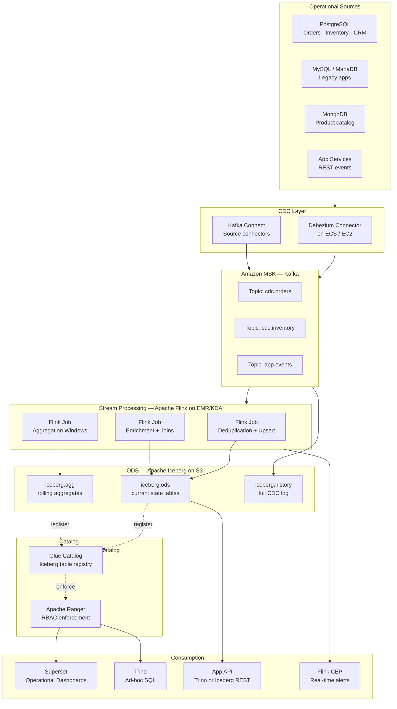
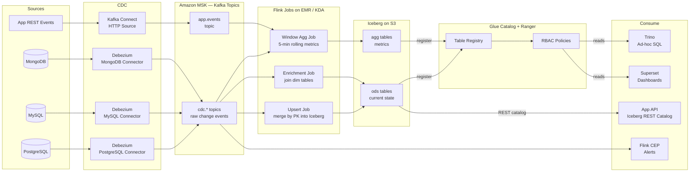
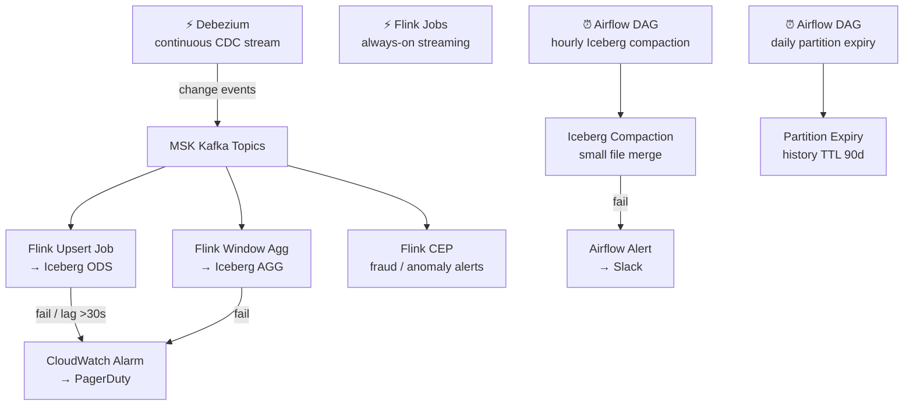

# 7.2 — Operational Analytics · AWS OSS on Cloud

**Stack:** PostgreSQL · Debezium · Amazon MSK (Kafka) · Apache Flink · Apache Iceberg · Trino · Superset
**Processing:** Streaming-first · sub-15-second latency
**Buy vs Build:** Build (cloud-native OSS, full control)

---

## Architecture Overview



---

## Data Flow



---

## Zone Design

```
s3://<company>-ops-iceberg/
│
├── ods/
│   └── {domain}/{entity}/         -- Iceberg table (current state)
│       Flink upsert on primary key; MOR (Merge-on-Read) for low latency
│
├── agg/
│   └── {domain}/{metric}/{grain}/ -- Iceberg table (rolling aggregates)
│       Flink window: tumbling 1-min, 5-min, 1-hr
│
└── history/
    └── cdc/{topic}/year=YYYY/month=MM/day=DD/
        Raw Kafka CDC events archived; Iceberg partitioned by ingestion time
```

---

## Security Model

```
┌──────────────────────────────────────────────────────┐
│           Apache Ranger + IAM                         │
│                                                       │
│  Role                  Access Level    Layer          │
│  ──────────────────    ────────────    ──────────     │
│  debezium-connector    Produce only    MSK topics     │
│  flink-job-role        Read + Write    Kafka + S3     │
│  ops-engineer          Read + Write    All Iceberg    │
│  data-analyst          Read only       ods · agg      │
│  app-service           Read only       ods (row-level)|
│  superset-user         Read only       agg            │
│                                                       │
│  Column masking → Ranger masking policies on Trino    │
│  Row filtering  → Trino row-level filter in Ranger    │
│  Encryption     → KMS SSE-S3 on all Iceberg data      │
│  mTLS           → MSK inter-broker + client auth      │
└──────────────────────────────────────────────────────┘
```

---

## Orchestration



---

## Component Map

| Component | Tool / Service | Notes |
|-----------|---------------|-------|
| OLTP Source | PostgreSQL / MySQL / MongoDB | Binlog / WAL / Oplog enabled |
| CDC Engine | Debezium on ECS / EC2 | Kafka Connect framework |
| Message Broker | Amazon MSK (Kafka 3.x) | Multi-AZ; m5.2xlarge brokers |
| Stream Processor | Apache Flink on EMR / KDA | Upsert, enrichment, window agg |
| ODS Store | Apache Iceberg on S3 | MOR tables; PK-based upsert |
| Aggregate Store | Apache Iceberg on S3 | Tumbling windows 1-min / 5-min |
| Table Catalog | AWS Glue Data Catalog | Iceberg catalog backend |
| Access Control | Apache Ranger | RBAC + column masking on Trino |
| Query Engine | Trino on EKS / EMR | Iceberg connector; ad-hoc SQL |
| BI / Dashboards | Apache Superset | Connects to Trino |
| App-facing API | Iceberg REST Catalog + Trino | HTTP query for microservices |
| CEP Alerts | Flink CEP | Pattern matching → SNS |
| Compaction | Iceberg + Spark/Flink job | Hourly small-file merge |
| Orchestration | Apache Airflow on MWAA | Compaction, maintenance DAGs |
| Monitoring | CloudWatch + Prometheus | Flink metrics, Kafka lag |

---

## Comparison vs 7.1 (AWS Managed)

| Dimension | 7.2 AWS OSS | 7.1 AWS Fully Managed |
|-----------|------------|----------------------|
| CDC Engine | Debezium | AWS DMS |
| Message Bus | Kafka (MSK) | None (DMS direct) |
| Stream Processor | Apache Flink | DMS + Redshift stored proc |
| ODS Store | Iceberg on S3 | Redshift schemas |
| Latency | ~5–15 s | ~60 s |
| Open Format | Yes (Iceberg) | No (Redshift proprietary) |
| Ops Overhead | High | Low |
| Cost at Scale | Lower (S3 storage) | Higher (Redshift nodes) |
| Multi-engine | Yes (Trino + Flink + Spark) | No (Redshift only) |

---

## When to Choose This Implementation

✅ Need sub-15-second end-to-end latency  
✅ Multi-engine consumption (Flink + Trino + Spark)  
✅ Open table format required (vendor portability)  
✅ Team has Kafka and Flink expertise  
✅ Large data volumes where S3+Iceberg is cheaper than Redshift  

❌ No Kafka/Flink expertise → use 7.1 (managed DMS + Redshift)  
❌ Need HTAP (same store for OLTP + OLAP) → use 7.7 (SingleStore)  
❌ Fully managed preference → use 7.1
