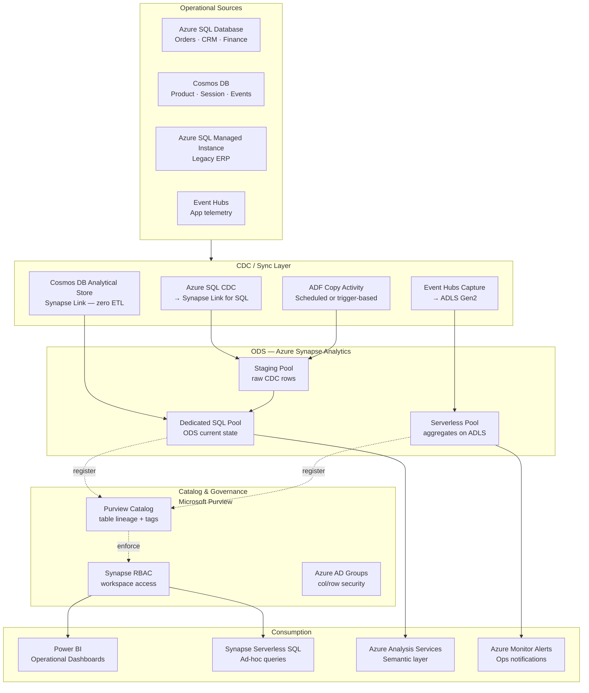
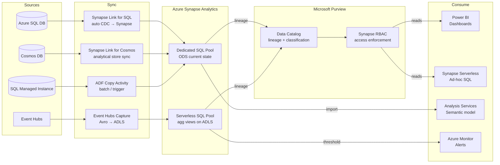
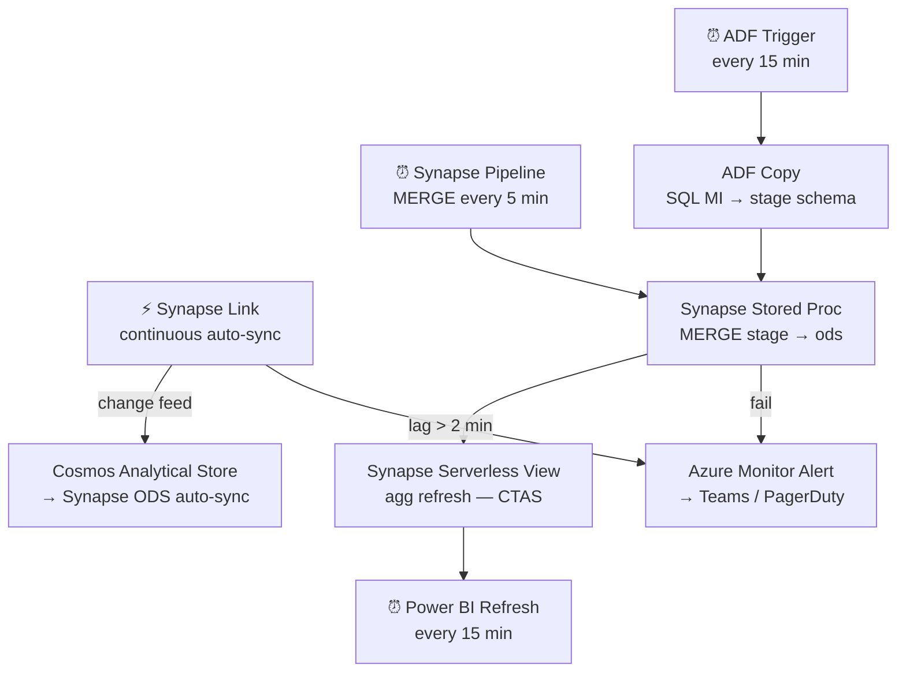

# 7.3 — Operational Analytics · Azure Fully Managed

**Stack:** Azure SQL · Azure Cosmos DB · Synapse Link · Azure Synapse Analytics · Power BI
**Processing:** Streaming / Near-Real-Time · HTAP + ODS pattern
**Buy vs Build:** Buy (fully managed, no infra to operate)

---

## Architecture Overview



---

## Data Flow



---

## Zone Design

```
ADLS Gen2: adls://<company>-ops/
│
├── landing/
│   └── {source}/{entity}/year=YYYY/month=MM/day=DD/
│       Event Hubs Capture (Avro) + ADF raw copies
│
├── ods/
│   └── {domain}/{entity}/                -- Parquet; Synapse external tables
│       Updated by Synapse Link or ADF trigger
│
└── agg/
    └── {domain}/{metric}/{grain}/        -- Parquet; Synapse Serverless views
        Power BI DirectQuery target

Synapse Dedicated SQL Pool (ods_db):
  └── schema: ods   → current state tables (CTAS + MERGE)
  └── schema: stage → raw CDC rows from Synapse Link
```

---

## Security Model

```
┌──────────────────────────────────────────────────────┐
│         Microsoft Purview + Azure AD + Synapse RBAC   │
│                                                       │
│  Azure AD Group / SP      Access Level   Layer        │
│  ──────────────────────   ────────────   ──────────   │
│  sg-ops-engineer          Read + Write   All pools    │
│  sg-ops-analyst           Read only      ods · agg    │
│  sg-bi-consumer           Read only      agg (PBI)    │
│  sg-app-service           Read only      ods (cols)   │
│  synapse-link-svc-prin    Write only     stage schema  │
│                                                       │
│  Column masking  → Synapse Dynamic Data Masking        │
│  Row security    → Synapse Row-Level Security (RLS)    │
│  Encryption      → Azure KMS (CMK) on ADLS + Synapse  │
│  Network         → Private Endpoint + Managed VNet     │
└──────────────────────────────────────────────────────┘
```

---

## Orchestration



---

## Component Map

| Component | Azure Service | Notes |
|-----------|--------------|-------|
| OLTP Source (relational) | Azure SQL Database | CDC enabled; Synapse Link connector |
| OLTP Source (NoSQL) | Cosmos DB | Analytical store enabled; zero ETL to Synapse |
| Legacy OLTP | SQL Managed Instance | ADF CDC connector or bulk copy |
| App Events | Event Hubs + Capture | Avro to ADLS Gen2 |
| CDC / Sync | Synapse Link for SQL / Cosmos | Auto-sync; no ETL pipeline needed |
| Batch Ingestion | Azure Data Factory | Fallback for unsupported sources |
| ODS Store | Synapse Dedicated SQL Pool | MERGE-based current state |
| Aggregate Layer | Synapse Serverless SQL Pool | Views on Parquet in ADLS |
| Catalog | Microsoft Purview | Auto-scan + lineage + classification |
| Access Control | Synapse RBAC + Azure AD | DDM + RLS in Synapse |
| BI / Dashboards | Power BI Premium | DirectQuery + Import mode |
| Semantic Layer | Azure Analysis Services | Tabular model on top of Synapse |
| Ad-hoc SQL | Synapse Serverless SQL | Pay-per-query on ADLS Parquet |
| Alerting | Azure Monitor + Action Groups | Metric/log alerts → Teams/PagerDuty |
| Encryption | Azure Key Vault + CMK | ADLS + Synapse encrypted at rest |

---

## Comparison vs 7.4 (Azure OSS)

| Dimension | 7.3 Azure Fully Managed | 7.4 Azure OSS |
|-----------|------------------------|---------------|
| CDC Engine | Synapse Link (zero ETL) | Debezium on AKS |
| Message Bus | None (Synapse Link) | Event Hubs (Kafka API) |
| Stream Processor | Synapse pipelines | Apache Flink on AKS |
| ODS Store | Synapse Dedicated Pool | Delta Lake on ADLS |
| Latency | ~1–5 min | ~5–15 s |
| Ops Overhead | Low | High |
| Cost Model | DTU/vCore + DWU | AKS + Event Hubs + compute |
| Open Format | No (Synapse proprietary) | Yes (Delta Lake) |

---

## When to Choose This Implementation

✅ Azure is primary cloud with Azure SQL + Cosmos DB sources  
✅ Power BI is the primary BI tool  
✅ Want zero CDC pipeline maintenance (Synapse Link)  
✅ Purview already deployed for governance  
✅ Sub-5-minute latency is acceptable  

❌ Need sub-30-second latency → use 7.4 (Flink on AKS)  
❌ Open format required → use 7.4 (Delta Lake)  
❌ Sources outside Azure SQL / Cosmos DB ecosystem → use 7.4 (Debezium)
