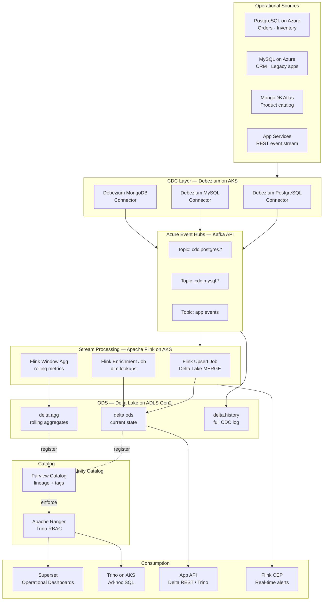
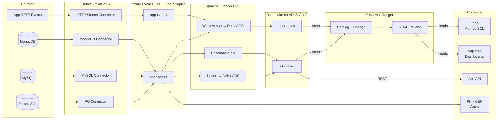
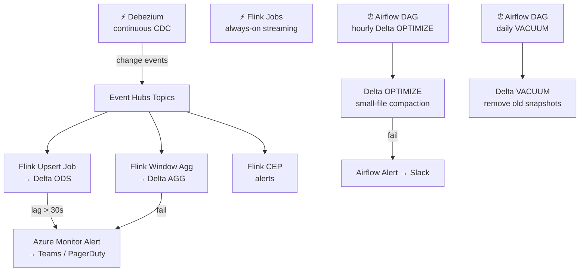

# 7.4 — Operational Analytics · Azure OSS on Cloud

**Stack:** PostgreSQL · Debezium · Azure Event Hubs · Apache Flink on AKS · Delta Lake · Trino · Apache Superset
**Processing:** Streaming-first · sub-15-second latency
**Buy vs Build:** Build (OSS on Azure cloud infrastructure)

---

## Architecture Overview



---

## Data Flow



---

## Zone Design

```
ADLS Gen2: adls://<company>-ops-delta/
│
├── ods/
│   └── {domain}/{entity}/             -- Delta table (current state)
│       Flink MERGE on primary key; CDF (Change Data Feed) enabled
│
├── agg/
│   └── {domain}/{metric}/{grain}/     -- Delta table (rolling aggregates)
│       Flink tumbling window: 1-min, 5-min, 1-hr
│
└── history/
    └── cdc/{topic}/year=YYYY/month=MM/day=DD/
        Raw Event Hubs events archived as Delta; TTL 90 days
```

---

## Security Model

```
┌──────────────────────────────────────────────────────┐
│         Apache Ranger + Azure AD + ADLS ACLs          │
│                                                       │
│  Azure AD SP / Group     Access Level  Layer          │
│  ──────────────────────  ────────────  ──────────     │
│  debezium-sp             Produce only  Event Hubs     │
│  flink-job-sp            Read + Write  Event Hubs + ADLS |
│  ops-engineer            Read + Write  All Delta      │
│  data-analyst            Read only     ods · agg      │
│  app-service-sp          Read only     ods (cols)     │
│  superset-sp             Read only     agg            │
│                                                       │
│  Column masking → Ranger masking on Trino queries     │
│  Row filtering  → Trino row-level filter policies     │
│  Encryption     → Azure KMS (CMK) on ADLS Gen2        │
│  mTLS           → Event Hubs SASL_SSL + AKS mTLS      │
└──────────────────────────────────────────────────────┘
```

---

## Orchestration



---

## Component Map

| Component | Tool / Service | Notes |
|-----------|---------------|-------|
| OLTP Sources | PostgreSQL / MySQL / MongoDB on Azure | WAL / binlog / oplog enabled |
| CDC Engine | Debezium on AKS (Kafka Connect) | Connector pods per source |
| Message Broker | Azure Event Hubs (Kafka API) | Kafka-compatible; managed |
| Stream Processor | Apache Flink on AKS | Upsert, enrichment, window agg |
| ODS Store | Delta Lake on ADLS Gen2 | MERGE on PK; CDF enabled |
| Aggregate Store | Delta Lake on ADLS Gen2 | Tumbling window output |
| Table Catalog | Azure Purview + Delta log | Auto-scan; lineage tracking |
| Access Control | Apache Ranger on Trino | RBAC + column masking |
| Query Engine | Trino on AKS | Delta Lake connector |
| BI / Dashboards | Apache Superset | Connects via Trino SQLAlchemy |
| App-facing API | Trino JDBC / Delta REST | HTTP query for microservices |
| CEP Alerts | Flink CEP | Pattern match → Azure Service Bus |
| Compaction | Delta OPTIMIZE + VACUUM via Airflow | Hourly small-file merge |
| Orchestration | Apache Airflow on AKS | Maintenance + batch DAGs |
| Monitoring | Azure Monitor + Prometheus + Grafana | Flink, Event Hubs, AKS metrics |

---

## Comparison vs 7.3 (Azure Managed)

| Dimension | 7.4 Azure OSS | 7.3 Azure Fully Managed |
|-----------|--------------|------------------------|
| CDC Engine | Debezium | Synapse Link (zero ETL) |
| Message Bus | Event Hubs (Kafka API) | None / Synapse Link |
| Stream Processor | Apache Flink | Synapse pipelines |
| ODS Store | Delta Lake on ADLS | Synapse Dedicated Pool |
| Latency | ~5–15 s | ~1–5 min |
| Open Format | Yes (Delta Lake) | No (Synapse proprietary) |
| Ops Overhead | High (AKS + Debezium) | Low |
| Cost at Scale | Lower (ADLS storage) | Higher (DWU cost) |

---

## When to Choose This Implementation

✅ Need sub-15-second end-to-end latency  
✅ Open table format required (Delta Lake)  
✅ Sources outside Azure SQL / Cosmos DB (PostgreSQL, MySQL, MongoDB)  
✅ Team has Flink + Kafka expertise  
✅ Trino multi-engine consumption required  

❌ No Flink/Kafka expertise → use 7.3 (Synapse Link)  
❌ Power BI DirectQuery preferred → use 7.3 (Synapse)  
❌ Fully managed preference → use 7.3
