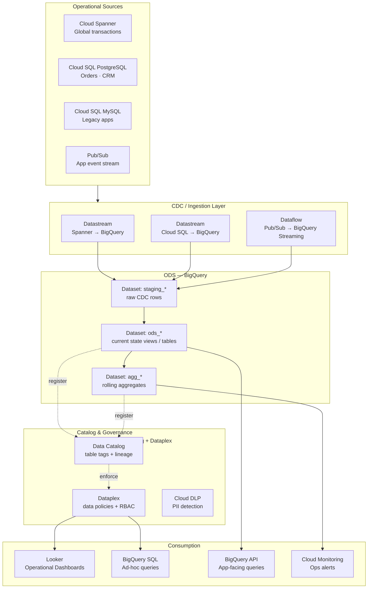
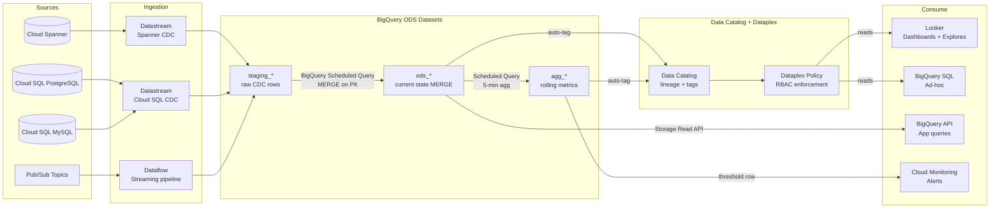
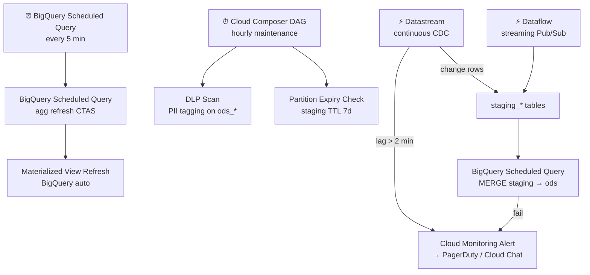

# 7.5 — Operational Analytics · GCP Fully Managed

**Stack:** Cloud Spanner · Datastream (CDC) · BigQuery · Looker · Cloud Data Catalog
**Processing:** Streaming / Near-Real-Time · ODS-into-BigQuery pattern
**Buy vs Build:** Buy (fully managed, no infra to operate)

---

## Architecture Overview



---

## Data Flow



---

## Zone Design

```
BigQuery project: <company>-ops-analytics
│
├── Dataset: staging_{source}
│   └── {table}                      -- raw CDC rows from Datastream
│       Partitioned by _metadata_timestamp
│
├── Dataset: ods_{domain}
│   └── {entity}                     -- current state (MERGE via Scheduled Query)
│       Partitioned by updated_at; clustered by primary key
│
└── Dataset: agg_{domain}
    └── {metric}_{grain}             -- rolling aggregates (5-min, 1-hr)
        Partitioned by window_start; Materialized Views where possible

GCS: gs://<company>-datastream-staging/
    └── {source}/{table}/            -- Datastream intermediate (auto-managed)
```

---

## Security Model

```
┌──────────────────────────────────────────────────────┐
│         Dataplex + IAM + BigQuery Column Security     │
│                                                       │
│  IAM Role / SA              Access Level  Dataset     │
│  ──────────────────────     ────────────  ──────────  │
│  datastream-sa              Write only    staging_*   │
│  dataflow-sa                Write only    staging_*   │
│  ops-engineer@              Read + Write  All         │
│  ops-analyst@               Read only     ods_* agg_* │
│  bi-consumer@               Read only     agg_*       │
│  app-service-sa             Read only     ods_* (cols)|
│                                                       │
│  Column security → BigQuery Policy Tags (Data Catalog)|
│  Row security    → BigQuery Row Access Policies       │
│  Encryption      → CMEK on all BigQuery datasets      │
│  VPC             → VPC-SC perimeter on project        │
└──────────────────────────────────────────────────────┘
```

---

## Orchestration



---

## Component Map

| Component | GCP Service | Notes |
|-----------|------------|-------|
| OLTP Source (global) | Cloud Spanner | Datastream native connector |
| OLTP Source (relational) | Cloud SQL PostgreSQL / MySQL | Datastream CDC connector |
| App Events | Pub/Sub | Dataflow streaming ingest |
| CDC Engine | Datastream | Fully managed CDC; no Debezium needed |
| Stream Ingest | Dataflow (Apache Beam) | Pub/Sub → BigQuery streaming |
| ODS Store | BigQuery Datasets | staging + ods + agg; serverless |
| Merge Logic | BigQuery Scheduled Queries | MERGE on PK every 5 min |
| Aggregates | BigQuery Materialized Views | Incremental refresh; auto-managed |
| Catalog | Google Cloud Data Catalog | Auto-scan; policy tags for PII |
| Governance | Dataplex | Data policies + RBAC on datasets |
| PII Detection | Cloud DLP | Auto-tag sensitive columns |
| BI / Dashboards | Looker | LookML semantic model on BigQuery |
| Ad-hoc SQL | BigQuery SQL console / API | Serverless; pay per TB scanned |
| App-facing API | BigQuery Storage Read API | High-throughput row reads |
| Alerting | Cloud Monitoring + Alerting | Metric thresholds → PagerDuty |
| Encryption | CMEK (Cloud KMS) | Per-dataset key management |

---

## Comparison vs 7.6 (GCP OSS)

| Dimension | 7.5 GCP Fully Managed | 7.6 GCP OSS |
|-----------|----------------------|-------------|
| CDC Engine | Datastream | Debezium on GKE |
| Message Bus | None (Datastream direct) | Pub/Sub (Kafka API) |
| Stream Processor | Dataflow (Beam) | Apache Flink on GKE |
| ODS Store | BigQuery | Iceberg on GCS |
| Latency | ~1–5 min | ~5–15 s |
| Ops Overhead | Low | High |
| Cost Model | BigQuery slot + streaming | GKE + Pub/Sub + compute |
| Open Format | No (BigQuery proprietary) | Yes (Iceberg) |
| BI Tool | Looker | Superset |

---

## When to Choose This Implementation

✅ GCP is primary cloud with Cloud SQL / Spanner sources  
✅ Looker is the primary BI tool  
✅ BigQuery is already the analytical standard  
✅ Want zero CDC pipeline maintenance (Datastream)  
✅ Sub-5-minute latency is acceptable  

❌ Need sub-30-second latency → use 7.6 (Flink on GKE)  
❌ Open table format required → use 7.6 (Iceberg)  
❌ Sources outside GCP (on-prem PostgreSQL, MySQL) → use 7.6 or 7.8
