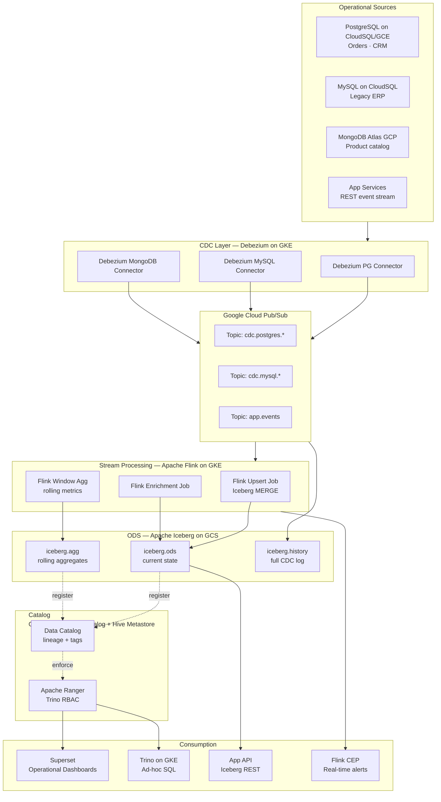
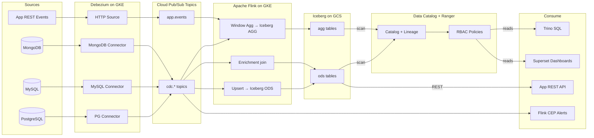
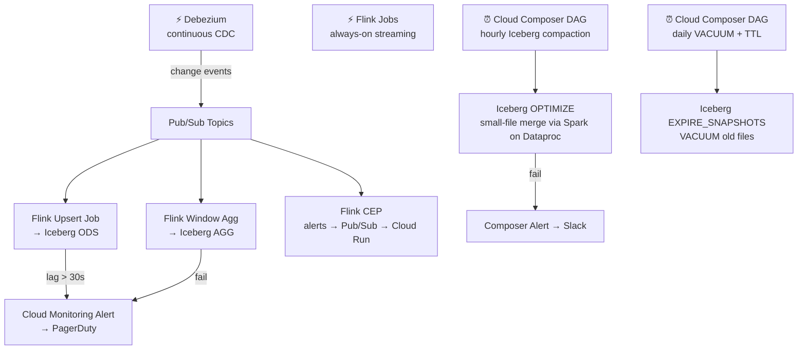

# 7.6 — Operational Analytics · GCP OSS on Cloud

**Stack:** PostgreSQL · Debezium · Pub/Sub · Apache Flink on GKE · Apache Iceberg on GCS · Trino · Apache Superset
**Processing:** Streaming-first · sub-15-second latency
**Buy vs Build:** Build (OSS on GCP cloud infrastructure)

---

## Architecture Overview



---

## Data Flow



---

## Zone Design

```
GCS: gs://<company>-ops-iceberg/
│
├── ods/
│   └── {domain}/{entity}/             -- Iceberg table (current state)
│       MOR (Merge-on-Read) for low-latency upserts
│       Flink upsert on primary key
│
├── agg/
│   └── {domain}/{metric}/{grain}/     -- Iceberg table (rolling aggregates)
│       Flink tumbling window: 1-min, 5-min, 1-hr
│
└── history/
    └── cdc/{topic}/year=YYYY/month=MM/day=DD/
        Raw Pub/Sub CDC events; TTL 90 days via GCS lifecycle
```

---

## Security Model

```
┌──────────────────────────────────────────────────────┐
│         Apache Ranger + IAM + GCS ACLs                │
│                                                       │
│  GCP SA / Group          Access Level  Layer          │
│  ──────────────────────  ────────────  ──────────     │
│  debezium-sa             Publish only  Pub/Sub        │
│  flink-job-sa            Read + Write  Pub/Sub + GCS  │
│  ops-engineer@           Read + Write  All Iceberg    │
│  data-analyst@           Read only     ods · agg      │
│  app-service-sa          Read only     ods (cols)     │
│  superset-sa             Read only     agg            │
│                                                       │
│  Column masking → Ranger masking policies on Trino    │
│  Row filtering  → Trino row-level filter in Ranger    │
│  Encryption     → CMEK (Cloud KMS) on GCS buckets     │
│  mTLS           → Pub/Sub HTTPS + GKE Workload ID     │
└──────────────────────────────────────────────────────┘
```

---

## Orchestration



---

## Component Map

| Component | Tool / Service | Notes |
|-----------|---------------|-------|
| OLTP Sources | PostgreSQL / MySQL / MongoDB on GCP | WAL / binlog / oplog enabled |
| CDC Engine | Debezium on GKE (Kafka Connect) | Connector pods per source type |
| Message Broker | Google Cloud Pub/Sub | Managed; Kafka-compatible via Pub/Sub Lite |
| Stream Processor | Apache Flink on GKE | Upsert, enrichment, window agg |
| ODS Store | Apache Iceberg on GCS | MOR tables; PK upsert |
| Aggregate Store | Apache Iceberg on GCS | Tumbling window output |
| Table Catalog | Google Cloud Data Catalog + HMS | Auto-scan; Iceberg catalog backend |
| Access Control | Apache Ranger on Trino | RBAC + column masking |
| Query Engine | Trino on GKE | Iceberg connector |
| BI / Dashboards | Apache Superset | Connects via Trino |
| App-facing API | Iceberg REST Catalog + Trino | HTTP query for microservices |
| CEP Alerts | Flink CEP | Pattern match → Pub/Sub → Cloud Run |
| Compaction | Iceberg + Spark on Dataproc | Hourly via Cloud Composer |
| Orchestration | Cloud Composer (Airflow) | Maintenance + compaction DAGs |
| Monitoring | Cloud Monitoring + Prometheus + Grafana | Flink, GKE, Pub/Sub metrics |

---

## Comparison vs 7.5 (GCP Managed)

| Dimension | 7.6 GCP OSS | 7.5 GCP Fully Managed |
|-----------|------------|----------------------|
| CDC Engine | Debezium | Datastream |
| Message Bus | Pub/Sub | None (Datastream direct) |
| Stream Processor | Apache Flink | Dataflow (Beam) |
| ODS Store | Iceberg on GCS | BigQuery |
| Latency | ~5–15 s | ~1–5 min |
| Open Format | Yes (Iceberg) | No (BigQuery proprietary) |
| Ops Overhead | High (GKE + Debezium) | Low |
| Cost at Scale | Lower (GCS storage) | Higher (BigQuery slot cost) |

---

## When to Choose This Implementation

✅ Need sub-15-second end-to-end latency  
✅ Open table format required (vendor portability)  
✅ Sources outside GCP-native (on-prem PostgreSQL, external MySQL)  
✅ Team has Flink + Kafka/Pub/Sub expertise  
✅ Trino multi-engine consumption required  

❌ No Flink expertise → use 7.5 (Datastream + Dataflow)  
❌ Looker on BigQuery preferred → use 7.5  
❌ Fully managed preference → use 7.5
