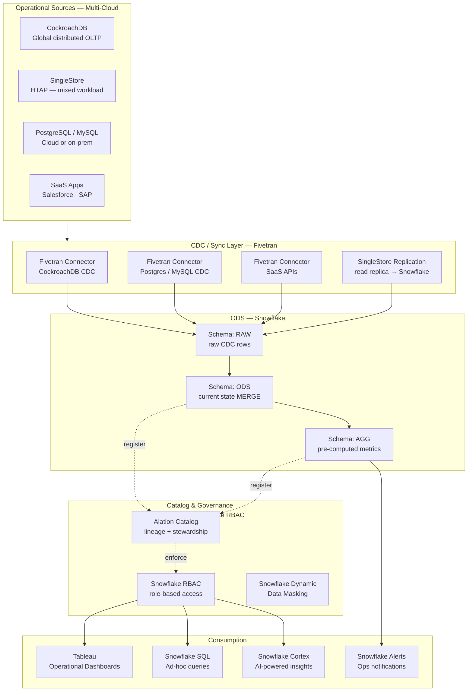
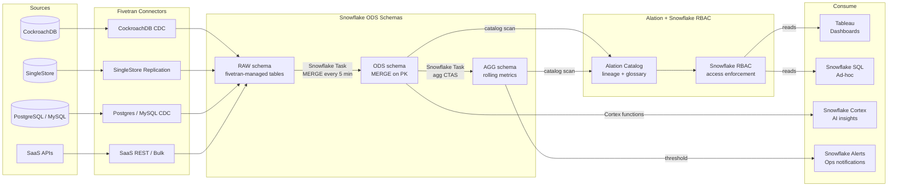
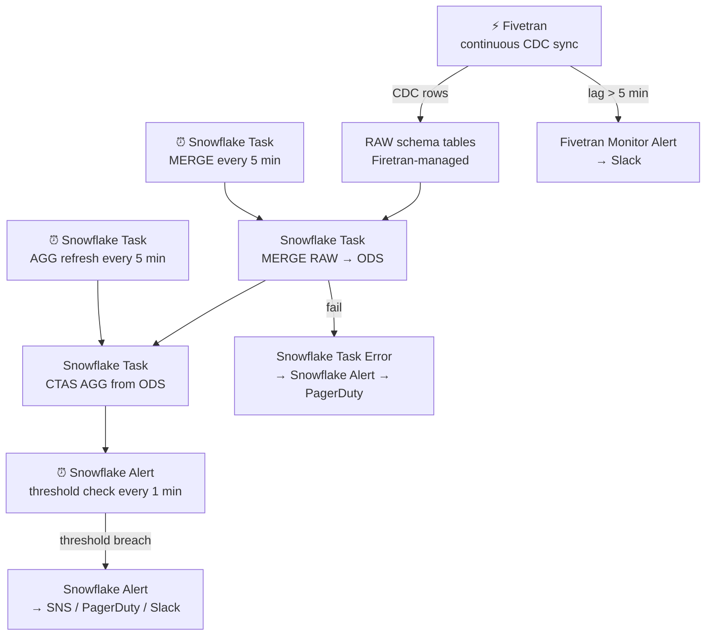

# 7.7 — Operational Analytics · Multi-Cloud Fully Managed

**Stack:** CockroachDB / SingleStore · Fivetran · Snowflake · Tableau · Alation
**Processing:** Streaming / Near-Real-Time · HTAP + ODS pattern
**Buy vs Build:** Buy (fully managed SaaS, cloud-agnostic)

---

## Architecture Overview



---

## Data Flow



---

## Zone Design

```
Snowflake Database: OPS_ANALYTICS
│
├── Schema: RAW
│   └── {source}_{table}              -- Fivetran-managed; auto-created
│       Fivetran handles CDC + schema evolution
│
├── Schema: ODS
│   └── {domain}_{entity}             -- current state (MERGE by PK)
│       Snowflake Task: MERGE RAW → ODS every 5 min
│       Clustered by primary key + updated_at
│
└── Schema: AGG
    └── {domain}_{metric}_{grain}     -- rolling aggregates
        Snowflake Task: CTAS every 5 min
        Dynamic Tables for auto-refresh available

CockroachDB / SingleStore:
    → HTAP: analytical queries can also run directly on SingleStore read replica
```

---

## Security Model

```
┌──────────────────────────────────────────────────────┐
│         Snowflake RBAC + Alation + Dynamic Masking    │
│                                                       │
│  Snowflake Role         Access Level   Schema         │
│  ──────────────────     ────────────   ──────────     │
│  FIVETRAN_ROLE          Write only     RAW            │
│  OPS_ENGINEER           Read + Write   All schemas    │
│  DATA_ANALYST           Read only      ODS · AGG      │
│  BI_CONSUMER            Read only      AGG            │
│  APP_SERVICE            Read only      ODS (cols)     │
│  SYSADMIN               Admin          All            │
│                                                       │
│  Column masking → Snowflake Dynamic Data Masking      │
│  Row security   → Snowflake Row Access Policies       │
│  Encryption     → Snowflake Tri-Secret Secure (BYOK)  │
│  Network        → Private Link per cloud region       │
└──────────────────────────────────────────────────────┘
```

---

## Orchestration



---

## Component Map

| Component | Tool / Service | Notes |
|-----------|---------------|-------|
| OLTP Source (global) | CockroachDB | Multi-region distributed; Fivetran CDC connector |
| OLTP Source (HTAP) | SingleStore | Mixed OLTP + OLAP; direct queries possible |
| OLTP Source (standard) | PostgreSQL / MySQL | Fivetran log-based CDC |
| SaaS Sources | Salesforce, SAP, Workday | Fivetran pre-built connectors |
| CDC / Sync | Fivetran | Managed CDC; handles schema drift |
| ODS Store | Snowflake | Multi-cloud (AWS/Azure/GCP); RAW + ODS + AGG schemas |
| Merge Logic | Snowflake Tasks | MERGE on PK every 5 min |
| Aggregates | Snowflake Tasks + Dynamic Tables | CTAS or incremental Dynamic Tables |
| Catalog | Alation | Business glossary + lineage across all sources |
| Access Control | Snowflake RBAC + Row Access Policies | Role hierarchy + DDM |
| BI / Dashboards | Tableau | Live or extract connection to Snowflake |
| AI Insights | Snowflake Cortex AI | ML functions on ODS data |
| Ad-hoc SQL | Snowflake SQL Worksheets | Multi-cloud serverless |
| Alerting | Snowflake Alerts + SNS/PagerDuty | Threshold-based ops notifications |
| Monitoring | Fivetran Monitor + Snowflake Query History | Sync lag + query performance |

---

## Comparison vs 7.8 (Hybrid OSS Self-Hosted)

| Dimension | 7.7 Multi-Cloud Managed | 7.8 Hybrid OSS Self-Hosted |
|-----------|------------------------|---------------------------|
| CDC Engine | Fivetran (managed) | Debezium (self-operated) |
| Message Bus | None (Fivetran direct) | Kafka (self-hosted) |
| Stream Processor | Snowflake Tasks | Apache Pinot / Druid |
| ODS Store | Snowflake | Apache Pinot / Druid |
| Latency | ~5 min (Fivetran) | ~1–5 s (Pinot/Druid) |
| Query Latency | Seconds (Snowflake) | Sub-second (Pinot/Druid) |
| Ops Overhead | Low | Very High |
| Cost Model | SaaS subscription | Infrastructure + ops |
| Open Format | No (Snowflake) | Yes (Parquet/native) |

---

## When to Choose This Implementation

✅ Multi-cloud environment (AWS + Azure + GCP sources)  
✅ CockroachDB or SingleStore already deployed for OLTP  
✅ Snowflake is the analytical standard across the org  
✅ Fivetran already used for other pipelines  
✅ 5-minute latency is acceptable for operational analytics  

❌ Need sub-second query latency → use 7.8 (Pinot/Druid)  
❌ Need sub-minute data freshness → use 7.8 (Kafka + Pinot)  
❌ Open source / no vendor lock-in required → use 7.8
