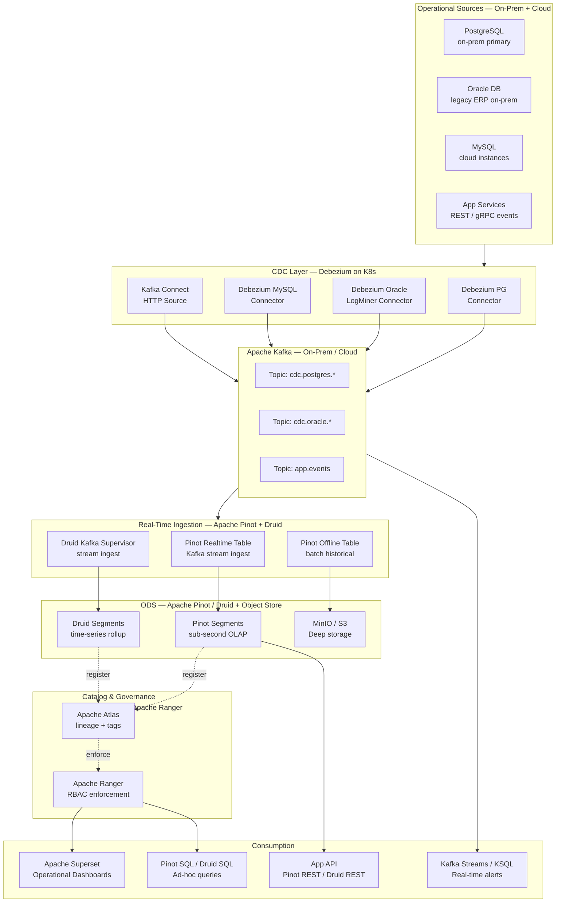
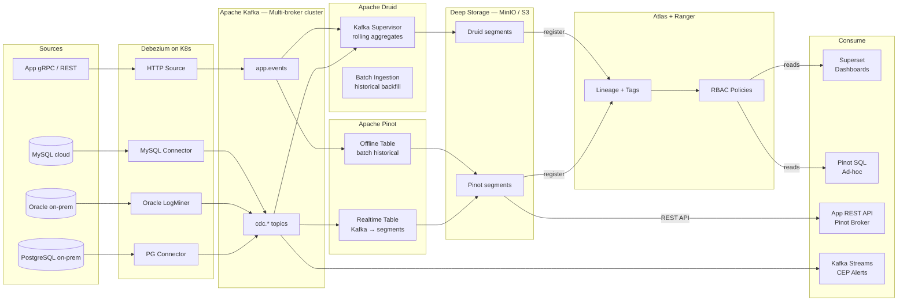
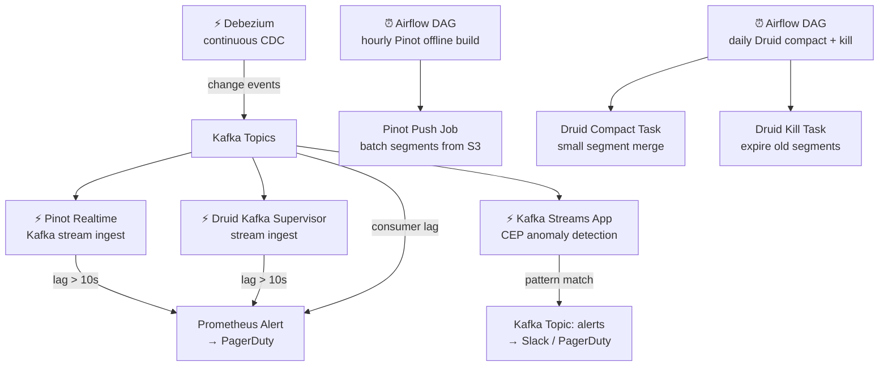

# 7.8 — Operational Analytics · Hybrid OSS Self-Hosted

**Stack:** PostgreSQL · Debezium · Apache Kafka · Apache Pinot / Apache Druid · Apache Superset · Apache Ranger
**Processing:** Streaming-first · sub-second query latency · full self-hosted
**Buy vs Build:** Full Build (on-prem + cloud hybrid, maximum control)

---

## Architecture Overview



---

## Data Flow



---

## Zone Design

```
MinIO / S3 (deep storage):
│
├── pinot-segments/
│   └── {table}/REALTIME/{date}/     -- Pinot realtime segments (Kafka-consumed)
│   └── {table}/OFFLINE/{date}/      -- Pinot offline segments (batch)
│
├── druid-segments/
│   └── {datasource}/{interval}/     -- Druid time-series segments
│       Granularity: MINUTE / HOUR / DAY
│
└── kafka-archive/
    └── {topic}/year=YYYY/month=MM/day=DD/
        Raw Kafka topics archived (Kafka Connect S3 Sink); TTL 90d

Kafka (on-prem cluster):
  └── Partitions: 12–48 per topic (based on throughput)
  └── Retention: 7 days (raw topics) / 30 days (agg topics)

Pinot:
  └── REALTIME table: Kafka direct consume; sub-second ingest
  └── OFFLINE table: batch merge for historical accuracy
  └── Hybrid table: unified query across both
```

---

## Security Model

```
┌──────────────────────────────────────────────────────┐
│         Apache Ranger + Kerberos + mTLS               │
│                                                       │
│  Role / Principal        Access Level  System         │
│  ──────────────────────  ────────────  ──────────     │
│  debezium/kafka          Produce only  Kafka topics   │
│  pinot-server            Read + Write  MinIO segments │
│  druid-middlemanager     Read + Write  MinIO segments │
│  ops-engineer            Admin         All systems    │
│  data-analyst            Read only     Pinot · Druid  │
│  app-service             Read only     Pinot REST API │
│  superset                Read only     Pinot · Druid  │
│                                                       │
│  Column masking → Ranger Pinot/Druid policies         │
│  Row filtering  → Ranger row-level filters            │
│  Encryption     → TLS in-transit; AES-256 at-rest     │
│  Auth           → Kerberos (on-prem) + mTLS (cloud)   │
│  Kafka          → SASL/SCRAM + TLS inter-broker       │
└──────────────────────────────────────────────────────┘
```

---

## Orchestration



---

## Component Map

| Component | Tool / Service | Notes |
|-----------|---------------|-------|
| OLTP Sources | PostgreSQL / Oracle / MySQL (on-prem + cloud) | WAL / LogMiner / binlog |
| CDC Engine | Debezium on K8s (Kafka Connect) | Oracle LogMiner for legacy ERP |
| Message Broker | Apache Kafka (self-hosted, multi-broker) | ZooKeeper or KRaft mode |
| OLAP Engine (realtime) | Apache Pinot | Sub-second SQL on streaming data |
| OLAP Engine (time-series) | Apache Druid | Time-series rollup + retention |
| Deep Storage | MinIO (on-prem) or S3 (cloud) | Segment persistence for Pinot + Druid |
| Catalog | Apache Atlas | Lineage, tags, business glossary |
| Access Control | Apache Ranger | RBAC + column masking for Pinot/Druid |
| Query Interface | Pinot Broker SQL / Druid SQL | ANSI SQL; sub-second responses |
| BI / Dashboards | Apache Superset | Native Pinot + Druid datasources |
| App-facing API | Pinot Broker REST API | JSON response; < 100 ms p99 |
| CEP Alerts | Kafka Streams / ksqlDB | Pattern detection → alert topic |
| Compaction | Druid Compact Task + Pinot Offline merge | Daily via Airflow |
| Orchestration | Apache Airflow on K8s | Batch ingestion + maintenance |
| Monitoring | Prometheus + Grafana | Pinot JMX, Druid metrics, Kafka lag |
| Auth (on-prem) | Kerberos + LDAP | Integrated with AD/LDAP |

---

## Comparison vs 7.7 (Multi-Cloud Managed)

| Dimension | 7.8 Hybrid OSS | 7.7 Multi-Cloud Managed |
|-----------|---------------|------------------------|
| CDC Engine | Debezium | Fivetran |
| Message Bus | Kafka (self-hosted) | None (Fivetran direct) |
| ODS / OLAP Store | Apache Pinot / Druid | Snowflake |
| Query Latency | Sub-second (Pinot) | Seconds (Snowflake) |
| Data Freshness | ~1–5 s | ~5 min |
| Open Format | Yes | No (Snowflake) |
| Ops Overhead | Very High | Low |
| On-Prem Support | Yes (full) | No |
| Cost at Scale | Infrastructure cost | SaaS subscription |
| Oracle CDC | Yes (LogMiner) | Fivetran Oracle (limited) |

---

## When to Choose This Implementation

✅ On-prem operational sources that cannot send data to cloud SaaS  
✅ Oracle legacy ERP requiring LogMiner CDC  
✅ Sub-second query latency required (Pinot)  
✅ Data residency / sovereignty constraints prevent cloud SaaS  
✅ Team has deep Kafka + Pinot/Druid operational expertise  
✅ High cardinality, high-throughput time-series analytics  

❌ No Kafka/Pinot/Druid expertise → use 7.7 (Fivetran + Snowflake)  
❌ Cloud-first, no on-prem → use 7.1 (AWS) / 7.3 (Azure) / 7.5 (GCP)  
❌ Sub-5-minute latency is sufficient → use 7.7 (lower ops overhead)
