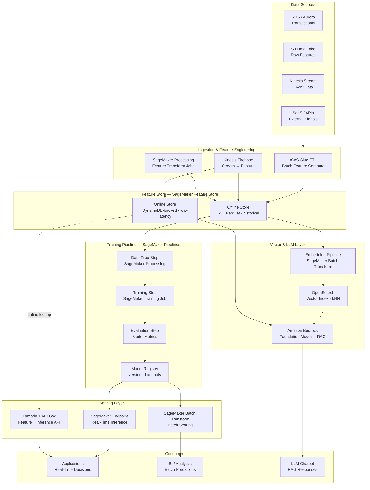
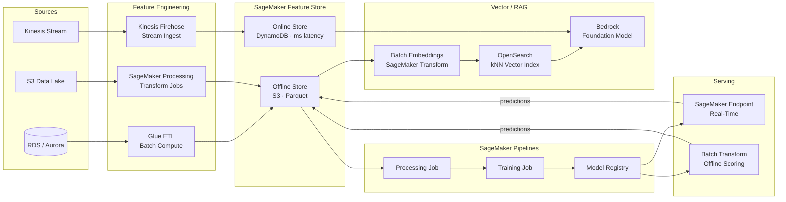
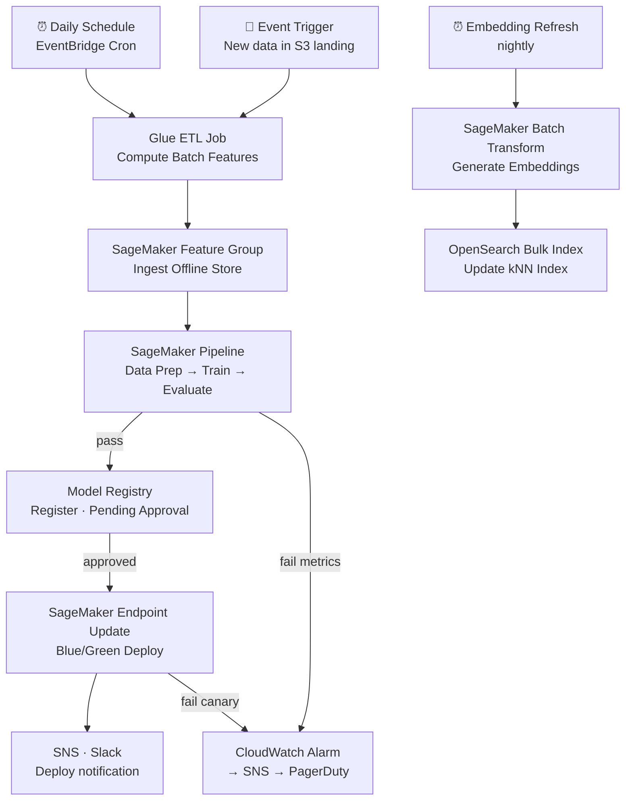

# 8.1 — AI/ML Data Platform · AWS Fully Managed

**Stack:** SageMaker Feature Store · SageMaker Pipelines · SageMaker Model Registry · OpenSearch (vector) · Amazon Bedrock · S3  
**Processing:** Batch (training) + Real-Time (online serving) — Hybrid  
**Buy vs Build:** Buy (fully managed, no infra to operate)

---

## Architecture Overview



---

## Data Flow



---

## Storage Zone Design

```
s3://<company>-ml-platform/
│
├── raw-features/
│   └── {domain}/{entity}/year=YYYY/month=MM/day=DD/
│       └── Parquet · pre-transform signals
│
├── feature-store/                          ← SageMaker Feature Store offline
│   └── {account-id}/sagemaker/
│       └── {feature-group-name}/
│           └── year=YYYY/month=MM/day=DD/hour=HH/
│               └── *.parquet
│
├── training-datasets/
│   └── {experiment-id}/{run-id}/
│       ├── train/    · validation/    · test/
│       └── metadata.json
│
├── model-artifacts/
│   └── {model-name}/{version}/
│       └── model.tar.gz · metrics.json
│
├── embeddings/
│   └── {collection}/{batch-date}/
│       └── *.parquet (id + vector)
│
└── predictions/
    └── {model-name}/{run-date}/
        └── batch-output/
```

---

## Security Model

```
┌──────────────────────────────────────────────────────────────┐
│             AWS IAM + SageMaker Domain Access Control         │
│                                                              │
│  IAM Role / User        Access Level        Scope            │
│  ─────────────────────  ──────────────────  ──────────────── │
│  ml-engineer            Full               All zones + jobs  │
│  data-scientist         Read + Execute     Feature Store · Training │
│  ml-ops                 Read + Deploy      Model Registry · Endpoints │
│  feature-consumer       Read only          Online Store API  │
│  llm-app                Invoke only        Bedrock · Endpoints │
│  bi-analyst             Read only          Predictions output │
│                                                              │
│  SageMaker Domain       → network isolation per team         │
│  VPC Endpoints          → private S3 / SageMaker access      │
│  KMS                    → SSE on all S3 + Feature Store      │
│  Model Card             → bias/fairness tracking per model   │
└──────────────────────────────────────────────────────────────┘
```

---

## Orchestration



---

## Component Map

| Component | AWS Service | Notes |
|-----------|-------------|-------|
| Object Storage | S3 | Feature Store offline, training data, model artifacts |
| Batch Feature Compute | AWS Glue ETL | PySpark jobs; scheduled via EventBridge |
| Stream Feature Compute | Kinesis Firehose + Lambda | Near-real-time feature materialization |
| Feature Store (Offline) | SageMaker Feature Store | S3-backed; Athena queryable |
| Feature Store (Online) | SageMaker Feature Store | DynamoDB-backed; <10ms p99 lookup |
| Training Pipeline | SageMaker Pipelines | DAG of Processing → Training → Evaluation steps |
| Training Jobs | SageMaker Training | Managed Spot instances; distributed XGBoost/PyTorch |
| Model Registry | SageMaker Model Registry | Version tracking; approval workflow |
| Real-Time Serving | SageMaker Endpoints | Auto-scaling; multi-model endpoints |
| Batch Scoring | SageMaker Batch Transform | S3 in → S3 out; large-scale scoring |
| Embedding Generation | SageMaker Batch Transform | Text → vectors using hosted embedding model |
| Vector Store | Amazon OpenSearch | kNN plugin; HNSW index |
| Foundation Models / RAG | Amazon Bedrock | Claude / Titan / Llama; RAG via OpenSearch retrieval |
| API Layer | AWS Lambda + API Gateway | Online feature + inference routing |
| Orchestration | SageMaker Pipelines + EventBridge | Native ML DAG; cron scheduling |
| Monitoring | SageMaker Model Monitor | Data drift + prediction quality checks |
| Experiment Tracking | SageMaker Experiments | Linked to Pipelines runs |
| Secrets / Keys | AWS KMS + Secrets Manager | Encryption + credential management |
| Audit | CloudTrail + CloudWatch | API audit + metric dashboards |

---

## Comparison vs 8.2 — AWS OSS

| Dimension | 8.1 AWS Fully Managed | 8.2 AWS OSS on Cloud |
|-----------|----------------------|----------------------|
| Feature Store | SageMaker Feature Store | Feast on RDS/Redis |
| Training Orchestration | SageMaker Pipelines | Apache Airflow (MWAA) |
| Experiment Tracking | SageMaker Experiments | MLflow on EC2/ECS |
| Model Registry | SageMaker Model Registry | MLflow Model Registry |
| Vector Store | Amazon OpenSearch | Qdrant / Weaviate on EC2 |
| LLM / RAG | Amazon Bedrock | LangChain + self-hosted or OpenAI API |
| Serving | SageMaker Endpoints | BentoML / Triton on EC2/EKS |
| Ops Burden | Low — fully managed | Medium — manage OSS infra |
| Cost Model | Pay per use (SageMaker pricing) | EC2 + managed overhead |
| Portability | AWS lock-in | OSS portable |
| Best For | AWS-committed teams, speed to value | Cost-sensitive, multi-cloud ambition |
