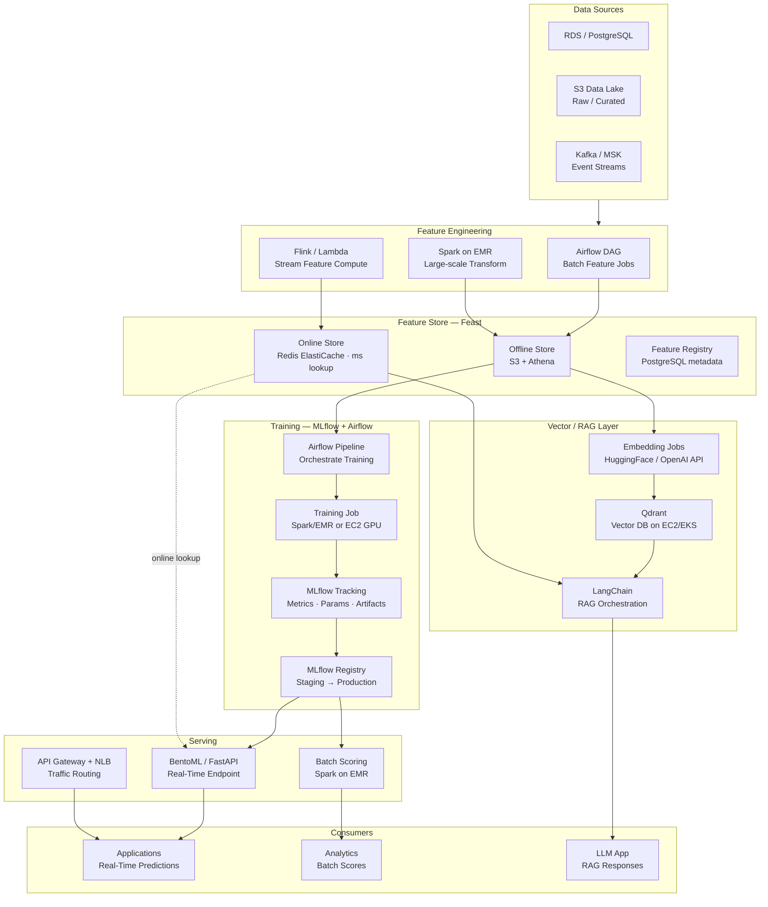
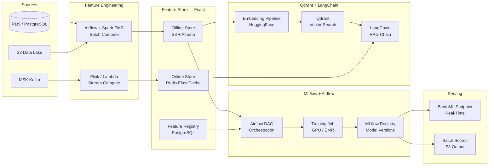
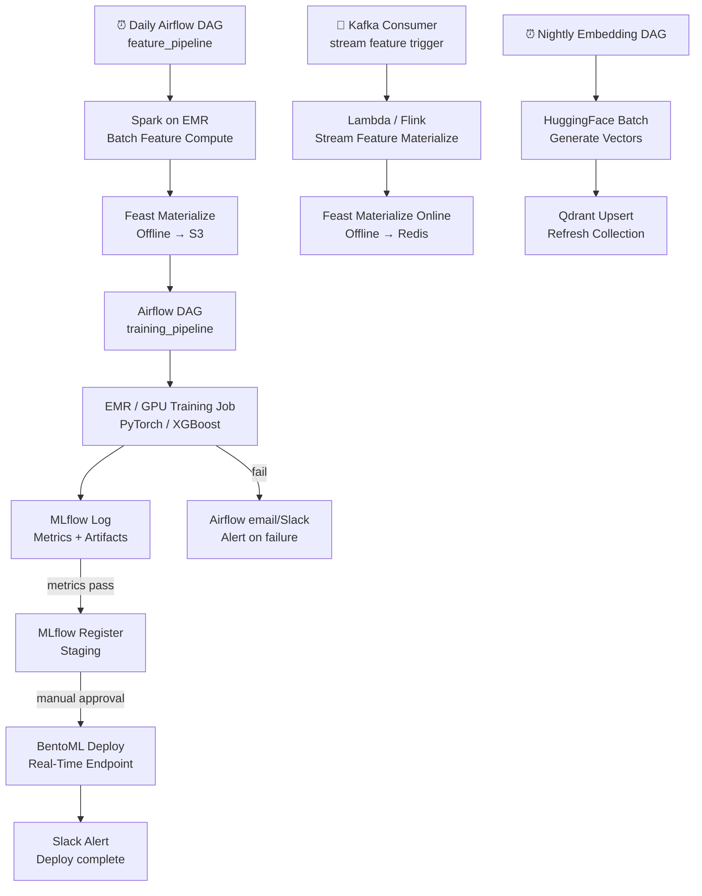

# 8.2 — AI/ML Data Platform · AWS OSS on Cloud

**Stack:** Feast · MLflow · Apache Airflow (MWAA) · Qdrant · LangChain · S3 · Redis  
**Processing:** Batch (training) + Real-Time (online serving) — Hybrid  
**Buy vs Build:** Build (OSS on AWS-managed infrastructure)

---

## Architecture Overview



---

## Data Flow



---

## Storage Zone Design

```
s3://<company>-ml-oss/
│
├── raw-features/
│   └── {source}/{entity}/year=YYYY/month=MM/day=DD/
│       └── Parquet · raw signals
│
├── feast-offline/                          ← Feast Offline Store
│   └── {feature_view}/{entity}/
│       └── year=YYYY/month=MM/day=DD/
│           └── *.parquet
│
├── training-datasets/
│   └── {model-name}/{experiment-id}/
│       ├── train.parquet
│       ├── validation.parquet
│       └── test.parquet
│
├── mlflow-artifacts/                       ← MLflow artifact store
│   └── {experiment-id}/{run-id}/
│       └── artifacts/  (model + plots + metrics)
│
├── embeddings/
│   └── {collection}/{run-date}/
│       └── *.parquet (id + vector + metadata)
│
└── batch-predictions/
    └── {model-name}/{score-date}/
        └── predictions.parquet
```

---

## Security Model

```
┌──────────────────────────────────────────────────────────────┐
│           IAM + Feast ACL + MLflow Auth + Qdrant API Keys     │
│                                                              │
│  IAM Role / Group       Access Level        Scope            │
│  ─────────────────────  ──────────────────  ──────────────── │
│  ml-engineer            Full               All S3 · MLflow · Feast │
│  data-scientist         Read + Write       Offline Store · MLflow Experiments │
│  ml-ops                 Deploy only        MLflow Registry · BentoML │
│  feature-consumer       Read only          Online Store (Redis) │
│  llm-app                API key            Qdrant · LangChain endpoint │
│  analyst                Read only          Batch predictions S3 │
│                                                              │
│  Redis AUTH             → ElastiCache in-transit TLS + auth  │
│  Qdrant API Keys        → per-collection access control      │
│  MLflow Auth            → Basic auth / LDAP on EC2 deploy    │
│  KMS                    → SSE on all S3 zones                │
│  VPC                    → Qdrant · Redis · MLflow in private subnet │
└──────────────────────────────────────────────────────────────┘
```

---

## Orchestration



---

## Component Map

| Component | Tool / Service | Notes |
|-----------|---------------|-------|
| Object Storage | Amazon S3 | All zones: features, training, artifacts, predictions |
| Batch Feature Compute | Apache Spark on Amazon EMR | PySpark; EMR Serverless for cost efficiency |
| Stream Feature Compute | AWS Lambda + MSK (Kafka) | Near-real-time materialization into Redis |
| Feature Store (Offline) | Feast + S3 + Athena | Feast registry in PostgreSQL on RDS |
| Feature Store (Online) | Feast + Redis ElastiCache | Sub-10ms feature lookup for inference |
| Training Orchestration | Apache Airflow (MWAA) | DAG per model; trigger on new data |
| Training Jobs | EMR Spark / EC2 GPU (p3/p4) | XGBoost, PyTorch, Scikit-learn |
| Experiment Tracking | MLflow Tracking Server | Hosted on EC2; artifacts in S3 |
| Model Registry | MLflow Model Registry | Staging → Production promotion workflow |
| Real-Time Serving | BentoML on EKS | Containerized; auto-scales on HPA |
| Batch Scoring | Spark on EMR | S3 in → S3 out |
| Embedding Pipeline | HuggingFace Transformers | GPU batch transform on EC2 |
| Vector Store | Qdrant on EKS | Persistent volume; HNSW index |
| RAG Orchestration | LangChain | Retrieval chain: Qdrant → LLM (OpenAI or Bedrock) |
| API Gateway | AWS NLB + API Gateway | Route real-time + RAG traffic |
| Monitoring | Prometheus + Grafana on EKS | Model latency, drift metrics |
| Alerts | Airflow email + Slack Webhook | Pipeline failure notifications |
| Encryption | AWS KMS + Redis TLS | At-rest and in-transit |

---

## Comparison vs 8.1 — AWS Fully Managed

| Dimension | 8.2 AWS OSS on Cloud | 8.1 AWS Fully Managed |
|-----------|---------------------|----------------------|
| Feature Store | Feast + Redis | SageMaker Feature Store |
| Training Orchestration | Airflow (MWAA) | SageMaker Pipelines |
| Experiment Tracking | MLflow | SageMaker Experiments |
| Model Registry | MLflow Registry | SageMaker Model Registry |
| Vector Store | Qdrant on EKS | Amazon OpenSearch |
| LLM / RAG | LangChain + OpenAI/Bedrock | Amazon Bedrock native |
| Serving | BentoML on EKS | SageMaker Endpoints |
| Ops Burden | Medium — manage OSS infra | Low — fully managed |
| Portability | High — runs anywhere | AWS lock-in |
| Cost Model | EC2 + EKS + EMR | SageMaker per-hour pricing |
| Best For | Multi-cloud ambition, OSS flexibility | AWS-first, fast time to value |
