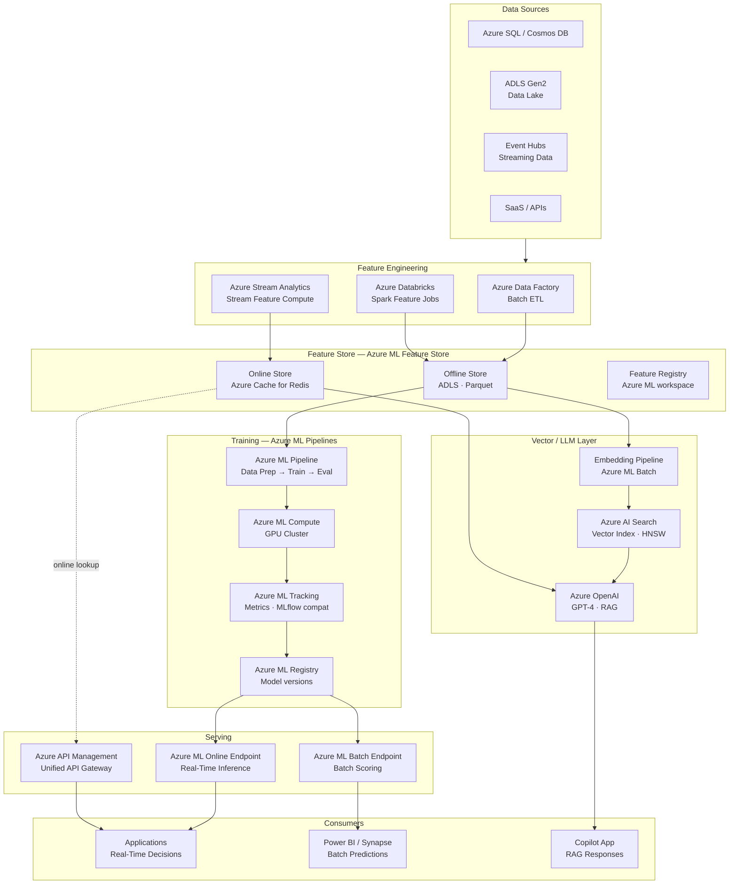
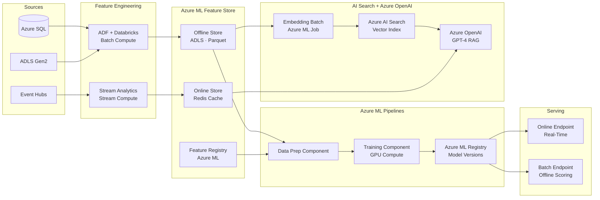
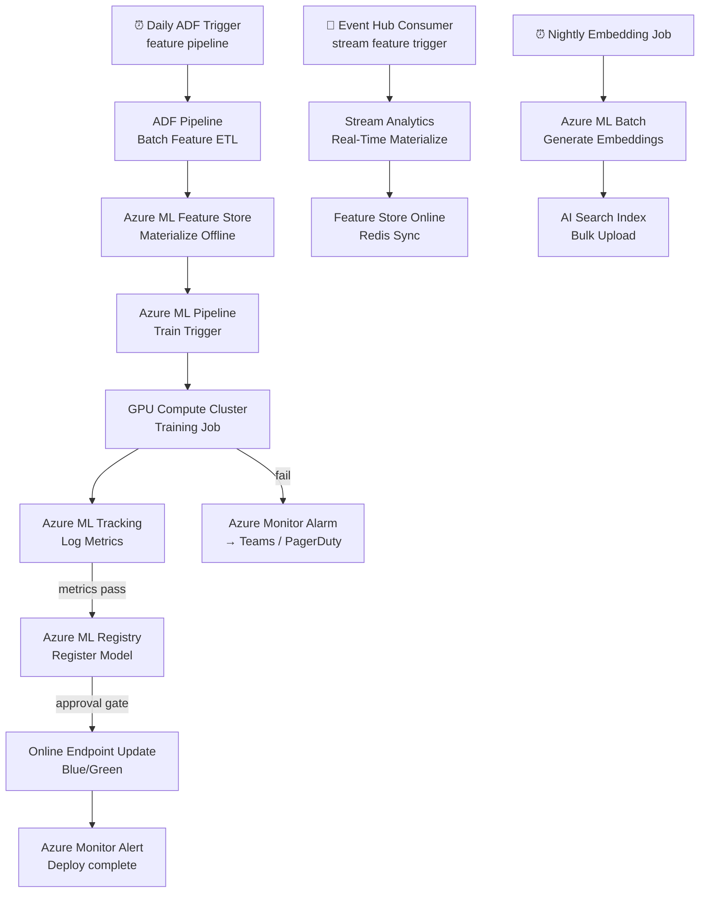

# 8.3 — AI/ML Data Platform · Azure Fully Managed

**Stack:** Azure Machine Learning Feature Store · Azure ML Pipelines · Azure AI Search (vector) · Azure OpenAI · ADLS Gen2  
**Processing:** Batch (training) + Real-Time (online serving) — Hybrid  
**Buy vs Build:** Buy (fully managed, no infra to operate)

---

## Architecture Overview



---

## Data Flow



---

## Storage Zone Design

```
adls://<company>-ml-platform/
│
├── raw-features/
│   └── {domain}/{entity}/year=YYYY/month=MM/day=DD/
│       └── Parquet · raw signals
│
├── feature-store/                          ← Azure ML Feature Store offline
│   └── {feature_set}/{version}/
│       └── year=YYYY/month=MM/day=DD/
│           └── *.parquet
│
├── training-datasets/
│   └── {model-name}/{run-id}/
│       ├── train/  · validation/  · test/
│       └── metadata.json
│
├── model-artifacts/                        ← Azure ML artifact store
│   └── {model-name}/{version}/
│       └── model/  + mlflow-model/
│
├── embeddings/
│   └── {index-name}/{run-date}/
│       └── *.parquet (id + vector + content)
│
└── batch-predictions/
    └── {model-name}/{score-date}/
        └── predictions.parquet
```

---

## Security Model

```
┌──────────────────────────────────────────────────────────────┐
│      Azure RBAC + Azure ML Workspace Access Control           │
│                                                              │
│  AAD Group / Role       Access Level        Scope            │
│  ─────────────────────  ──────────────────  ──────────────── │
│  ml-engineer            AzureML Contributor All workspace    │
│  data-scientist         AzureML Data Scientist Experiments · Features │
│  ml-ops                 AzureML Operator    Endpoints · Registry │
│  feature-consumer       Reader + Redis AUTH Online Store only │
│  ai-app                 Cognitive Services User OpenAI · AI Search │
│  analyst                Reader              Batch predictions ADLS │
│                                                              │
│  Azure Private Link     → AML workspace + ADLS private       │
│  Managed Identity       → no credential secrets in code      │
│  Azure Key Vault        → model secrets · API keys           │
│  Customer-Managed Keys  → CMK encryption on ADLS + Redis     │
│  Microsoft Defender     → threat protection on ADLS          │
└──────────────────────────────────────────────────────────────┘
```

---

## Orchestration



---

## Component Map

| Component | Azure Service | Notes |
|-----------|--------------|-------|
| Object Storage | ADLS Gen2 | Hierarchical namespace; all zones |
| Batch Feature ETL | Azure Data Factory | Linked services to Azure SQL, ADLS |
| Spark Feature Compute | Azure Databricks | Delta Lake integration; job clusters |
| Stream Feature Compute | Azure Stream Analytics | Windowed aggregations → Redis |
| Feature Store (Offline) | Azure ML Feature Store | ADLS-backed; Spark queryable |
| Feature Store (Online) | Azure Cache for Redis | Enterprise tier; TLS + AUTH |
| Training Orchestration | Azure ML Pipelines | Component-based DAG; reusable steps |
| Compute | Azure ML Compute Cluster | GPU (NC/NDs series); autoscale 0→N |
| Experiment Tracking | Azure ML (MLflow-compatible) | Metrics, params, artifacts per run |
| Model Registry | Azure ML Registry | Cross-workspace model sharing |
| Real-Time Serving | Azure ML Online Endpoints | Managed K8s; traffic splitting |
| Batch Scoring | Azure ML Batch Endpoints | Parallelized scoring on compute cluster |
| Embedding Pipeline | Azure ML Batch Job | text-embedding-ada-002 or custom |
| Vector Store | Azure AI Search | Vector + hybrid (BM25 + kNN) |
| LLM / RAG | Azure OpenAI (GPT-4) | RAG via AI Search semantic ranking |
| API Management | Azure API Management | Rate limit, auth, routing |
| Monitoring | Azure Monitor + App Insights | Endpoint latency, drift detection |
| Governance | Azure Purview | ML asset lineage integration |
| Encryption | Azure Key Vault + CMK | Secrets + customer-managed key |

---

## Comparison vs 8.4 — Azure OSS on Cloud

| Dimension | 8.3 Azure Fully Managed | 8.4 Azure OSS on Cloud |
|-----------|------------------------|----------------------|
| Feature Store | Azure ML Feature Store | Feast + Redis on AKS |
| Training Orchestration | Azure ML Pipelines | Apache Airflow on AKS |
| Experiment Tracking | Azure ML (MLflow compat) | MLflow on AKS |
| Model Registry | Azure ML Registry | MLflow Model Registry |
| Vector Store | Azure AI Search | Qdrant on AKS |
| LLM / RAG | Azure OpenAI | LangChain + OpenAI API |
| Serving | Azure ML Online Endpoints | BentoML on AKS |
| Ops Burden | Low — fully managed | Medium — manage AKS workloads |
| Portability | Azure lock-in | OSS portable |
| Cost Model | Azure ML compute pricing | AKS + VM pricing |
| Best For | Azure-committed, enterprise scale | Cost control, OSS flexibility |
