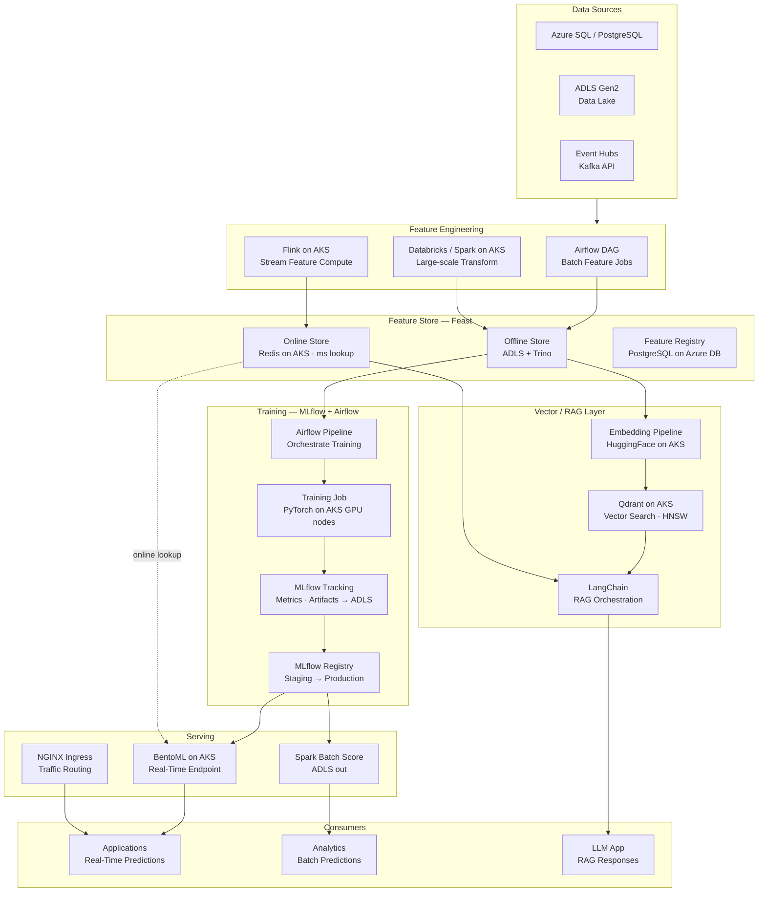
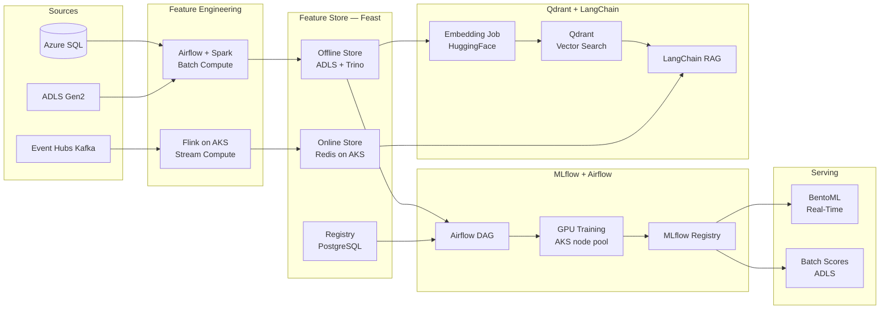
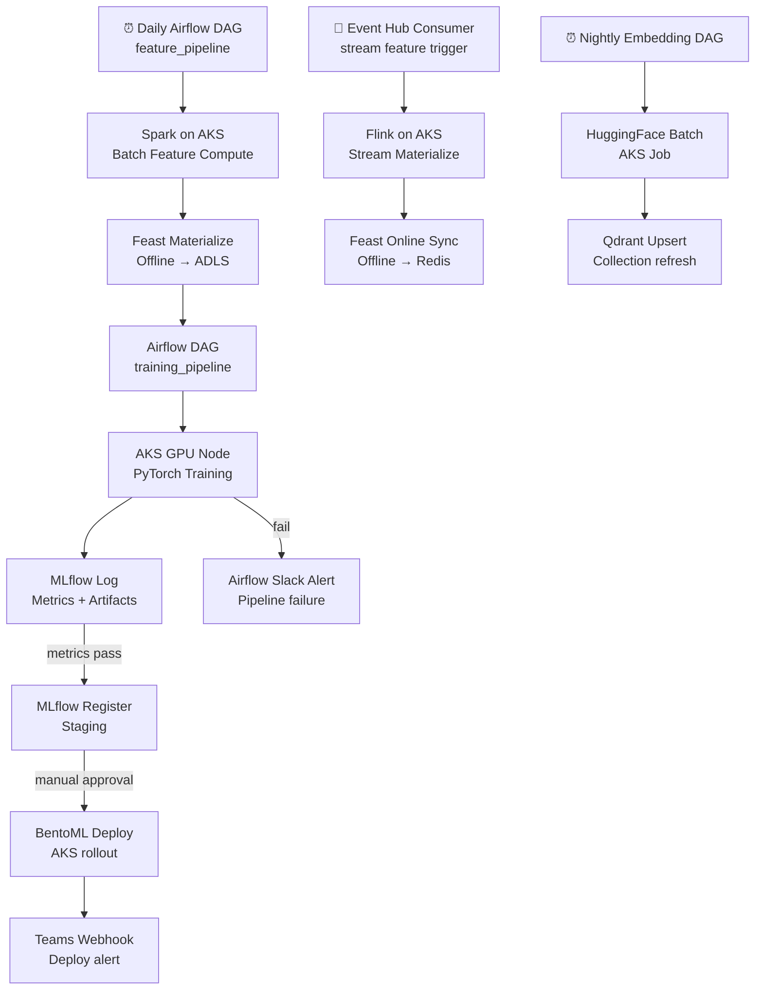

# 8.4 — AI/ML Data Platform · Azure OSS on Cloud

**Stack:** Feast · MLflow · Apache Airflow · Qdrant · LangChain · ADLS Gen2 · AKS · Redis  
**Processing:** Batch (training) + Real-Time (online serving) — Hybrid  
**Buy vs Build:** Build (OSS on Azure-managed infrastructure)

---

## Architecture Overview



---

## Data Flow



---

## Storage Zone Design

```
adls://<company>-ml-oss/
│
├── raw-features/
│   └── {source}/{entity}/year=YYYY/month=MM/day=DD/
│       └── Parquet
│
├── feast-offline/                          ← Feast Offline Store
│   └── {feature_view}/{entity}/
│       └── year=YYYY/month=MM/day=DD/
│           └── *.parquet
│
├── training-datasets/
│   └── {model-name}/{experiment-id}/
│       ├── train.parquet
│       ├── validation.parquet
│       └── test.parquet
│
├── mlflow-artifacts/                       ← MLflow artifact store (ADLS)
│   └── {experiment-id}/{run-id}/
│       └── artifacts/
│
├── embeddings/
│   └── {collection}/{run-date}/
│       └── *.parquet (id + vector + metadata)
│
└── batch-predictions/
    └── {model-name}/{score-date}/
        └── predictions.parquet
```

---

## Security Model

```
┌──────────────────────────────────────────────────────────────┐
│        Azure AD + Feast RBAC + MLflow Auth + Qdrant API Keys  │
│                                                              │
│  AAD Group              Access Level        Scope            │
│  ─────────────────────  ──────────────────  ──────────────── │
│  ml-engineer            Full ADLS + AKS     All zones        │
│  data-scientist         Contributor         Feast Offline · MLflow │
│  ml-ops                 Deploy              MLflow Registry · BentoML │
│  feature-consumer       Reader + Redis AUTH Online Store     │
│  llm-app                API Key             Qdrant collection │
│  analyst                Reader              Batch predictions ADLS │
│                                                              │
│  Redis TLS + AUTH       → in-transit encryption              │
│  Qdrant API Keys        → per-collection isolation           │
│  MLflow Auth            → AAD OIDC integration               │
│  Azure Key Vault        → secrets for all OSS services       │
│  AKS Network Policy     → pod-level traffic isolation        │
└──────────────────────────────────────────────────────────────┘
```

---

## Orchestration



---

## Component Map

| Component | Tool / Service | Notes |
|-----------|---------------|-------|
| Object Storage | ADLS Gen2 | Hierarchical namespace; all zones |
| Batch Feature Compute | Apache Spark on AKS | Spark Operator; auto-scaling executor pods |
| Stream Feature Compute | Apache Flink on AKS | Flink Operator; Kafka source via Event Hubs |
| Feature Store (Offline) | Feast + ADLS + Trino | Trino query engine for ad-hoc feature exploration |
| Feature Store (Online) | Feast + Redis on AKS | Redis Operator; TLS + persistence |
| Feature Registry | Feast + PostgreSQL (Azure DB) | Managed PostgreSQL; HA failover |
| Training Orchestration | Apache Airflow on AKS | Helm chart; CeleryExecutor |
| Training Jobs | PyTorch on AKS GPU pool | NC/ND GPU nodes; distributed training |
| Experiment Tracking | MLflow Tracking on AKS | ADLS artifact store; PostgreSQL backend |
| Model Registry | MLflow Model Registry | Staging → Production promotion |
| Real-Time Serving | BentoML on AKS | Kubernetes deployment; HPA autoscale |
| Batch Scoring | Apache Spark on AKS | Same Spark Operator cluster |
| Embedding Pipeline | HuggingFace Transformers on AKS | GPU job; ADLS output |
| Vector Store | Qdrant on AKS | StatefulSet; persistent volume |
| RAG Orchestration | LangChain | Qdrant retriever + OpenAI / Azure OpenAI |
| Ingress | NGINX Ingress Controller | BentoML + RAG endpoint routing |
| Monitoring | Prometheus + Grafana on AKS | Scrape BentoML, Feast, MLflow metrics |
| Secrets | Azure Key Vault + CSI Driver | Mounted as env vars into pods |

---

## Comparison vs 8.3 — Azure Fully Managed

| Dimension | 8.4 Azure OSS on Cloud | 8.3 Azure Fully Managed |
|-----------|----------------------|------------------------|
| Feature Store | Feast + Redis on AKS | Azure ML Feature Store |
| Training Orchestration | Airflow on AKS | Azure ML Pipelines |
| Experiment Tracking | MLflow on AKS | Azure ML (MLflow compat) |
| Model Registry | MLflow Registry | Azure ML Registry |
| Vector Store | Qdrant on AKS | Azure AI Search |
| LLM / RAG | LangChain + OpenAI API | Azure OpenAI native |
| Serving | BentoML on AKS | Azure ML Online Endpoints |
| Ops Burden | Medium — manage AKS workloads | Low — fully managed |
| Portability | High — OSS portable | Azure lock-in |
| Cost | AKS + VM (potentially lower) | Azure ML compute pricing |
| Best For | OSS flexibility, portability | Azure-first, managed experience |
