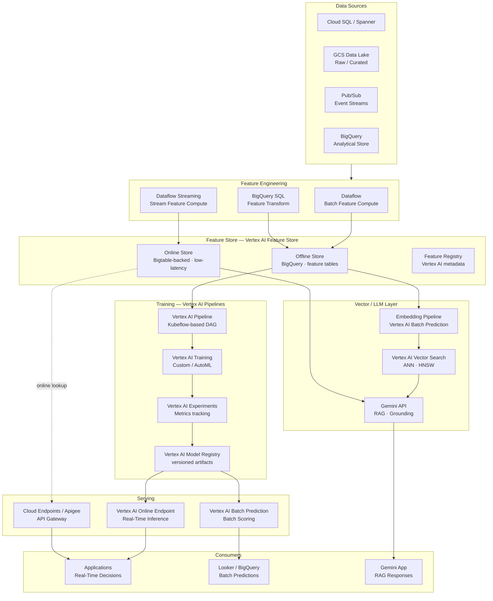
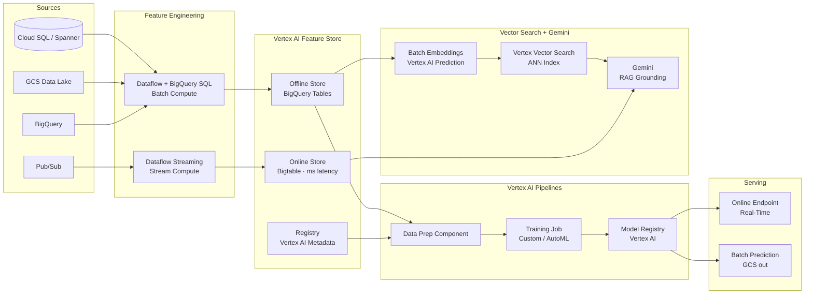
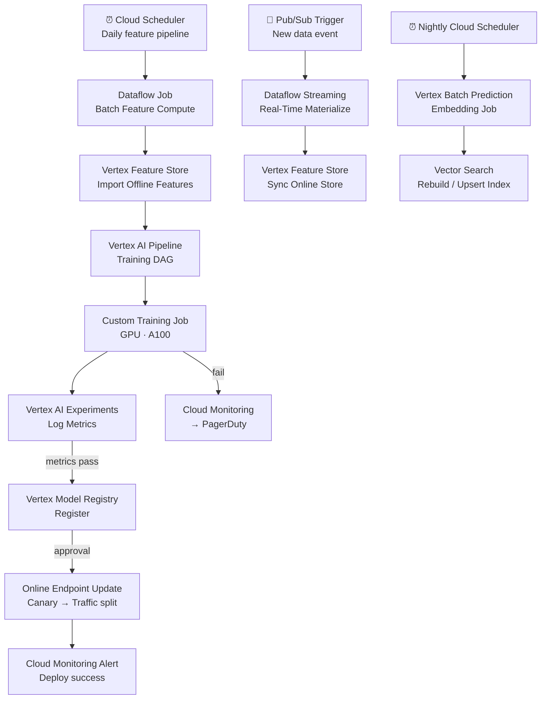

# 8.5 — AI/ML Data Platform · GCP Fully Managed

**Stack:** Vertex AI Feature Store · Vertex AI Pipelines · Vertex AI Vector Search · Gemini · GCS · BigQuery  
**Processing:** Batch (training) + Real-Time (online serving) — Hybrid  
**Buy vs Build:** Buy (fully managed, no infra to operate)

---

## Architecture Overview



---

## Data Flow



---

## Storage Zone Design

```
gs://<company>-ml-platform/
│
├── raw-features/
│   └── {domain}/{entity}/year=YYYY/month=MM/day=DD/
│       └── Parquet / Avro
│
├── training-datasets/
│   └── {model-name}/{pipeline-run-id}/
│       ├── train/  · validation/  · test/
│       └── metadata.json
│
├── model-artifacts/                        ← Vertex AI artifact store
│   └── {model-name}/{version}/
│       └── saved_model/  or  model.pkl
│
├── embeddings/
│   └── {index-name}/{run-date}/
│       └── *.json (id + embedding vector)
│
└── batch-predictions/
    └── {model-name}/{score-date}/
        └── predictions.jsonl

── BigQuery Datasets (separate from GCS)
   ├── feature_store_offline   ← Vertex AI Feature Store offline tables
   ├── ml_training             ← curated training views
   └── ml_predictions          ← batch prediction output tables
```

---

## Security Model

```
┌──────────────────────────────────────────────────────────────┐
│         IAM + Vertex AI RBAC + VPC Service Controls           │
│                                                              │
│  IAM Role / Principal   Access Level        Scope            │
│  ─────────────────────  ──────────────────  ──────────────── │
│  ml-engineer@           Vertex AI Admin     All resources     │
│  data-scientist@        Vertex AI User      Pipelines · Features · Experiments │
│  ml-ops@                Vertex AI Deployer  Endpoints · Registry │
│  feature-consumer@      BigQuery Data Viewer + Bigtable Reader Online Store │
│  ai-app@                aiplatform.endpoints.predict Endpoint invoke │
│  analyst@               BigQuery Data Viewer Batch predictions |
│                                                              │
│  VPC Service Controls   → data exfiltration prevention       │
│  Private Service Connect → Vertex AI + BigQuery private      │
│  CMEK (Cloud KMS)       → GCS + BigQuery + Bigtable          │
│  Workload Identity      → GKE pod → service account (no key) │
└──────────────────────────────────────────────────────────────┘
```

---

## Orchestration



---

## Component Map

| Component | GCP Service | Notes |
|-----------|------------|-------|
| Object Storage | Google Cloud Storage | All zones: datasets, artifacts, embeddings |
| Analytical Store | BigQuery | Offline feature tables; prediction output |
| Batch Feature Compute | Dataflow (Apache Beam) | Managed runner; auto-scaling workers |
| BigQuery Feature SQL | BigQuery SQL | Feature views as BQ materialized views |
| Stream Feature Compute | Dataflow Streaming | Pub/Sub source; windowed aggregations |
| Feature Store (Offline) | Vertex AI Feature Store | BigQuery-backed; time-travel snapshots |
| Feature Store (Online) | Vertex AI Feature Store | Bigtable-backed; <10ms p99 |
| Feature Registry | Vertex AI Metadata | Feature group + version lineage |
| Training Orchestration | Vertex AI Pipelines (KFP) | KFP SDK; component-based DAGs |
| Training Jobs | Vertex AI Custom Training | TPU / GPU (A100); distributed TF/PyTorch |
| AutoML | Vertex AI AutoML | Tabular / text / vision models |
| Experiment Tracking | Vertex AI Experiments | MLflow-compatible SDK |
| Model Registry | Vertex AI Model Registry | Version + alias management |
| Real-Time Serving | Vertex AI Online Endpoints | Auto-scaling; shadow mode |
| Batch Scoring | Vertex AI Batch Prediction | GCS in → GCS/BQ out |
| Embedding Generation | Vertex AI Batch Prediction | text-embedding-gecko or custom |
| Vector Store | Vertex AI Vector Search | Managed ANN; HNSW/ScaNN index |
| LLM / RAG | Gemini API + Vertex AI Search | Grounding API; real-time retrieval |
| API Gateway | Cloud Endpoints / Apigee | Auth, rate limiting, routing |
| Monitoring | Cloud Monitoring + Vertex Model Monitoring | Prediction drift detection |
| Governance | Dataplex + Data Catalog | ML asset lineage |
| Encryption | Cloud KMS (CMEK) | GCS + BQ + Bigtable |

---

## Comparison vs 8.6 — GCP OSS on Cloud

| Dimension | 8.5 GCP Fully Managed | 8.6 GCP OSS on Cloud |
|-----------|----------------------|---------------------|
| Feature Store | Vertex AI Feature Store | Feast + Redis on GKE |
| Training Orchestration | Vertex AI Pipelines (KFP) | Kubeflow Pipelines on GKE |
| Experiment Tracking | Vertex AI Experiments | MLflow on GKE |
| Model Registry | Vertex AI Model Registry | MLflow Model Registry |
| Vector Store | Vertex AI Vector Search | Weaviate on GKE |
| LLM / RAG | Gemini API | LangChain + OpenAI / VertexAI SDK |
| Serving | Vertex AI Endpoints | BentoML / Seldon on GKE |
| Ops Burden | Low — fully managed | Medium — manage GKE workloads |
| Portability | GCP lock-in | OSS portable |
| Cost | Vertex AI pricing | GKE + VM (potentially lower) |
| Best For | GCP-committed, managed experience | OSS teams, portability |
