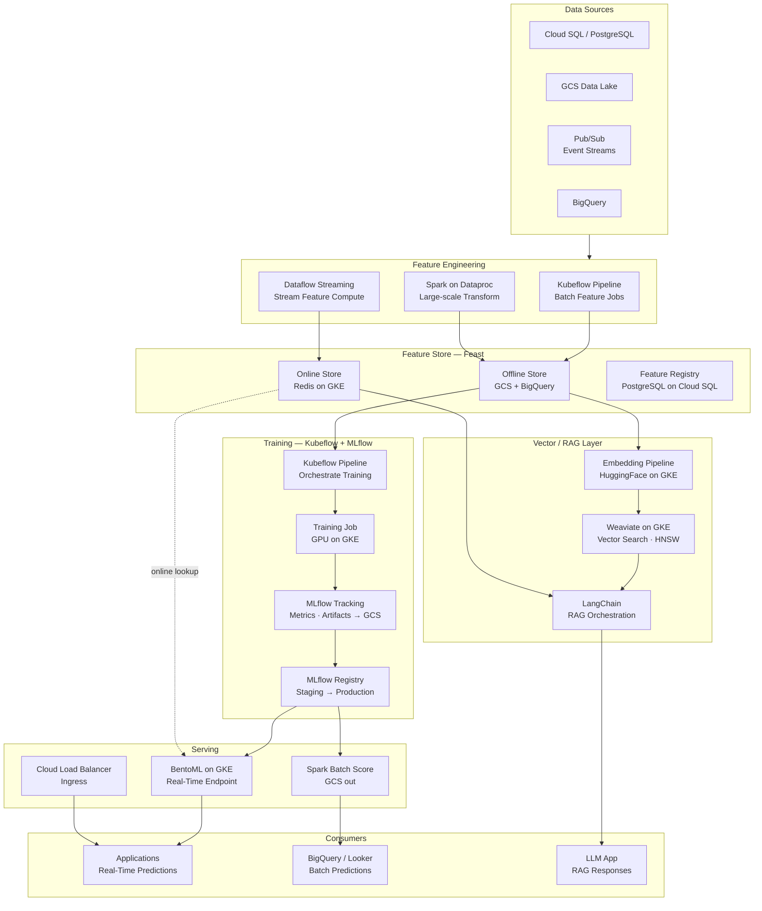
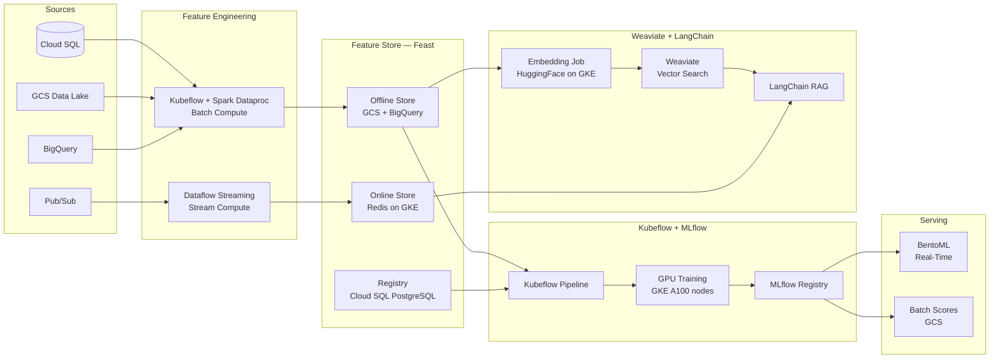
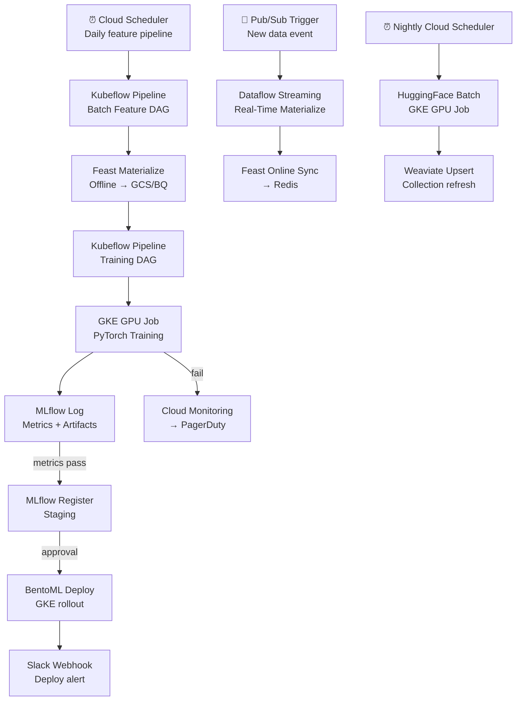

# 8.6 — AI/ML Data Platform · GCP OSS on Cloud

**Stack:** Feast · MLflow · Kubeflow Pipelines · Weaviate · LangChain · GCS · GKE · Redis  
**Processing:** Batch (training) + Real-Time (online serving) — Hybrid  
**Buy vs Build:** Build (OSS on GCP-managed infrastructure)

---

## Architecture Overview



---

## Data Flow



---

## Storage Zone Design

```
gs://<company>-ml-oss/
│
├── raw-features/
│   └── {domain}/{entity}/year=YYYY/month=MM/day=DD/
│       └── Parquet / Avro
│
├── feast-offline/                          ← Feast Offline Store (GCS)
│   └── {feature_view}/{entity}/
│       └── year=YYYY/month=MM/day=DD/
│           └── *.parquet
│
├── training-datasets/
│   └── {model-name}/{pipeline-run-id}/
│       ├── train.parquet  · validation.parquet  · test.parquet
│       └── schema.json
│
├── mlflow-artifacts/                       ← MLflow GCS artifact store
│   └── {experiment-id}/{run-id}/
│       └── artifacts/
│
├── embeddings/
│   └── {collection}/{run-date}/
│       └── *.parquet (id + vector + metadata)
│
└── batch-predictions/
    └── {model-name}/{score-date}/
        └── predictions.parquet
```

---

## Security Model

```
┌──────────────────────────────────────────────────────────────┐
│      IAM + Workload Identity + Feast RBAC + Weaviate API Keys │
│                                                              │
│  IAM Role / SA          Access Level        Scope            │
│  ─────────────────────  ──────────────────  ──────────────── │
│  ml-engineer@           Storage Admin + GKE All resources    │
│  data-scientist@        BigQuery Data Viewer + GCS Reader Features · Training │
│  ml-ops@                GKE Developer + GCS Reader Registry · BentoML |
│  feature-consumer@      Redis AUTH (read)   Online Store     │
│  llm-app@               Weaviate API Key    Vector collection │
│  analyst@               BigQuery Viewer     Batch predictions │
│                                                              │
│  Workload Identity      → GKE pod SA → GCP IAM (no key files) │
│  VPC Private Cluster    → GKE nodes not publicly accessible  │
│  Redis TLS + AUTH       → in-transit encryption              │
│  Weaviate API Keys      → per-class access control           │
│  Cloud KMS              → GCS + BigQuery CMEK encryption     │
└──────────────────────────────────────────────────────────────┘
```

---

## Orchestration



---

## Component Map

| Component | Tool / Service | Notes |
|-----------|---------------|-------|
| Object Storage | Google Cloud Storage | All zones: features, training, artifacts, predictions |
| Analytical Store | BigQuery | Feast offline tables; batch prediction output |
| Batch Feature Compute | Apache Spark on Dataproc | Managed Spark; ephemeral clusters |
| Stream Feature Compute | Dataflow Streaming (Apache Beam) | Pub/Sub → Redis materialization |
| Feature Store (Offline) | Feast + GCS + BigQuery | BigQuery source + GCS file store |
| Feature Store (Online) | Feast + Redis on GKE | Redis Operator; HA sentinel mode |
| Feature Registry | Feast + PostgreSQL (Cloud SQL) | Managed PostgreSQL; HA |
| Training Orchestration | Kubeflow Pipelines on GKE | KFP SDK; Argo Workflow backend |
| Training Jobs | PyTorch on GKE GPU nodes | A100 node pool; Gang scheduling |
| Experiment Tracking | MLflow on GKE | GCS artifact store; Cloud SQL backend |
| Model Registry | MLflow Model Registry | Staging → Production; webhook on promotion |
| Real-Time Serving | BentoML on GKE | Kubernetes deployment; HPA on RPS |
| Batch Scoring | Spark on Dataproc | GCS input; GCS/BigQuery output |
| Embedding Pipeline | HuggingFace Transformers on GKE | GPU Job; GCS output |
| Vector Store | Weaviate on GKE | StatefulSet; persistent disk |
| RAG Orchestration | LangChain | Weaviate retriever + Google PaLM / OpenAI |
| Ingress | GKE Ingress + Cloud Load Balancer | BentoML + RAG routing |
| Monitoring | Prometheus + Grafana on GKE | GKE pod metrics + custom ML metrics |
| Secrets | Secret Manager + Workload Identity | No key files; SA token binding |

---

## Comparison vs 8.5 — GCP Fully Managed

| Dimension | 8.6 GCP OSS on Cloud | 8.5 GCP Fully Managed |
|-----------|---------------------|----------------------|
| Feature Store | Feast + Redis on GKE | Vertex AI Feature Store |
| Training Orchestration | Kubeflow Pipelines on GKE | Vertex AI Pipelines (KFP managed) |
| Experiment Tracking | MLflow on GKE | Vertex AI Experiments |
| Model Registry | MLflow Registry | Vertex AI Model Registry |
| Vector Store | Weaviate on GKE | Vertex AI Vector Search |
| LLM / RAG | LangChain + OpenAI API | Gemini API native |
| Serving | BentoML on GKE | Vertex AI Online Endpoints |
| Ops Burden | Medium — manage GKE workloads | Low — fully managed |
| Portability | High — OSS portable | GCP lock-in |
| Cost | GKE + VM (potentially lower) | Vertex AI pricing |
| Best For | OSS teams, portability needs | GCP-first, managed experience |
