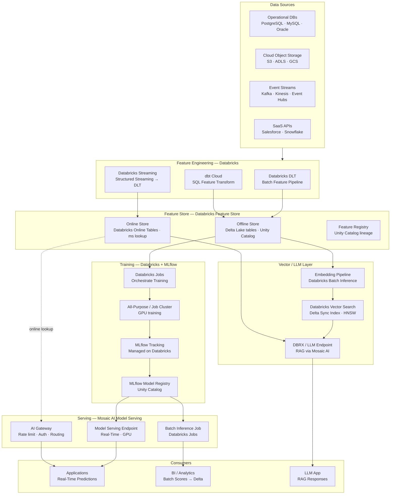
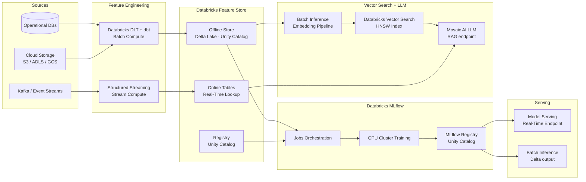
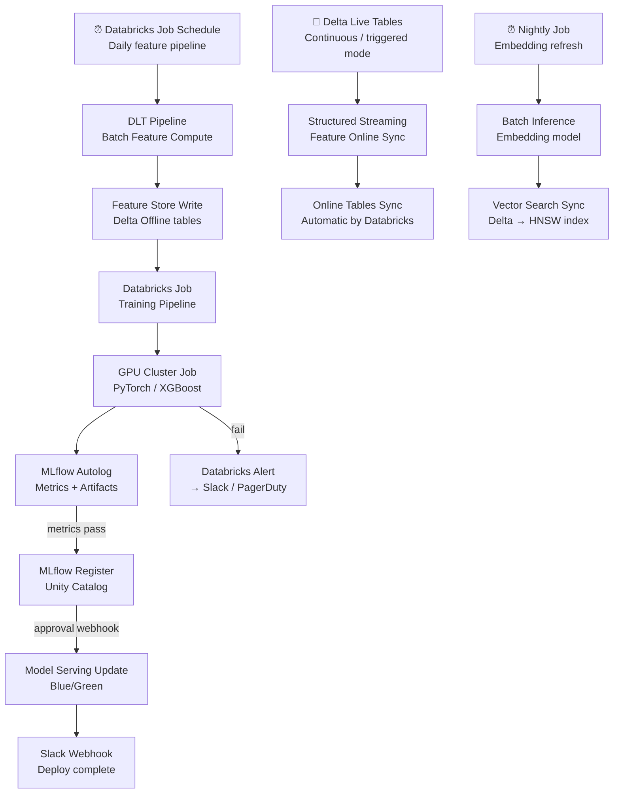

# 8.7 — AI/ML Data Platform · Multi-Cloud Fully Managed

**Stack:** Databricks (Feature Store · MLflow · Vector Search) · dbt Cloud · Delta Lake  
**Processing:** Batch (training) + Real-Time (online serving) — Hybrid  
**Buy vs Build:** Buy (fully managed Databricks on any cloud)

---

## Architecture Overview



---

## Data Flow



---

## Storage Zone Design

```
Delta Lake on Cloud Object Storage (S3 / ADLS / GCS)
Unity Catalog namespace: catalog.schema.table

catalog: ml_platform
│
├── schema: feature_store_offline
│   ├── {feature_table_name}              ← Databricks Feature Store tables
│   └── {feature_table_name}_checkpoint/
│
├── schema: training
│   ├── train_{model_name}_{run_id}
│   ├── validation_{model_name}_{run_id}
│   └── test_{model_name}_{run_id}
│
├── schema: vector_search
│   └── {collection_name}                 ← Delta table synced by Vector Search
│
└── schema: predictions
    └── {model_name}_{score_date}         ← Batch inference output

MLflow artifact store → s3|adls|gs://<company>-mlflow-artifacts/
```

---

## Security Model

```
┌──────────────────────────────────────────────────────────────┐
│        Databricks Unity Catalog + RBAC + IP Access Lists      │
│                                                              │
│  Group / Principal      Access Level        Scope            │
│  ─────────────────────  ──────────────────  ──────────────── │
│  ml-engineers           Admin               All catalogs · clusters │
│  data-scientists        USE SCHEMA + SELECT Feature Store · Experiments │
│  ml-ops                 EXECUTE + MODIFY    Model Registry · Endpoints │
│  feature-consumers      Online Tables API   Read-only online lookup │
│  llm-app                AI Gateway token    Model Serving endpoints │
│  analysts               SELECT              Predictions schema │
│                                                              │
│  Unity Catalog          → row/column security on feature tables │
│  AI Gateway             → API key per consumer; rate limits  │
│  Token-based Auth       → PAT + service principals (no passwords) │
│  Cluster Policies       → restrict cluster config per group  │
│  Customer-Managed Keys  → encryption on cloud object storage │
└──────────────────────────────────────────────────────────────┘
```

---

## Orchestration



---

## Component Map

| Component | Databricks Service | Notes |
|-----------|------------------|-------|
| Object Storage | S3 / ADLS / GCS (cloud native) | Delta Lake files; cloud-agnostic |
| Table Format | Delta Lake | ACID; time travel; schema evolution |
| Metadata / Governance | Unity Catalog | Cross-workspace; column-level security |
| Batch Feature Compute | Databricks DLT | Declarative pipelines; auto data quality |
| SQL Feature Transform | dbt Cloud + Databricks SQL | Semantic layer; feature views as dbt models |
| Stream Feature Compute | Structured Streaming + DLT | Auto-upsert to online tables |
| Feature Store (Offline) | Databricks Feature Store | Delta-backed; pointInTime joins |
| Feature Store (Online) | Databricks Online Tables | Auto-sync from Delta; <10ms lookup |
| Feature Registry | Unity Catalog lineage | Automatic lineage from DLT + Feature Store |
| Training Orchestration | Databricks Jobs | DAG tasks; retry + alerting |
| Training Compute | All-Purpose / Job GPU Cluster | A10G / A100; spot instances |
| Experiment Tracking | MLflow (managed on Databricks) | Auto-logging; artifact in cloud storage |
| Model Registry | MLflow + Unity Catalog | Cross-environment promotion |
| Real-Time Serving | Mosaic AI Model Serving | GPU endpoints; shadow mode; A/B |
| Batch Scoring | Databricks Batch Inference | Pandas UDF or mlflow.pyfunc |
| Embedding Pipeline | Databricks Batch Inference | BGE / E5 / OpenAI embeddings |
| Vector Store | Databricks Vector Search | Delta Sync index; Direct Vector Access |
| LLM / RAG | Mosaic AI (DBRX / Llama) | AI Playground; RAG Studio |
| AI Gateway | Databricks AI Gateway | Unified endpoint; rate limit; audit |
| Monitoring | Databricks Lakehouse Monitoring | Drift detection on Delta tables |

---

## Comparison vs 8.8 — Multi-Cloud OSS Portable

| Dimension | 8.7 Multi-Cloud Managed | 8.8 Multi-Cloud OSS Portable |
|-----------|------------------------|------------------------------|
| Feature Store | Databricks Feature Store | Feast + Redis |
| Training Orchestration | Databricks Jobs | Apache Airflow |
| Experiment Tracking | MLflow (managed) | MLflow (self-hosted) |
| Model Registry | MLflow + Unity Catalog | MLflow (self-hosted) |
| Vector Store | Databricks Vector Search | Qdrant |
| LLM / RAG | Mosaic AI / DBRX | LangChain + any LLM provider |
| Serving | Mosaic AI Model Serving | BentoML / Seldon |
| Table Format | Delta Lake | Apache Iceberg |
| Ops Burden | Low — Databricks managed | Medium — self-manage OSS stack |
| Portability | Databricks lock-in | Fully portable OSS |
| Cost | Databricks DBU pricing | Infra cost + operational overhead |
| Best For | Enterprise scale, unified platform | Maximum portability, no vendor lock-in |
