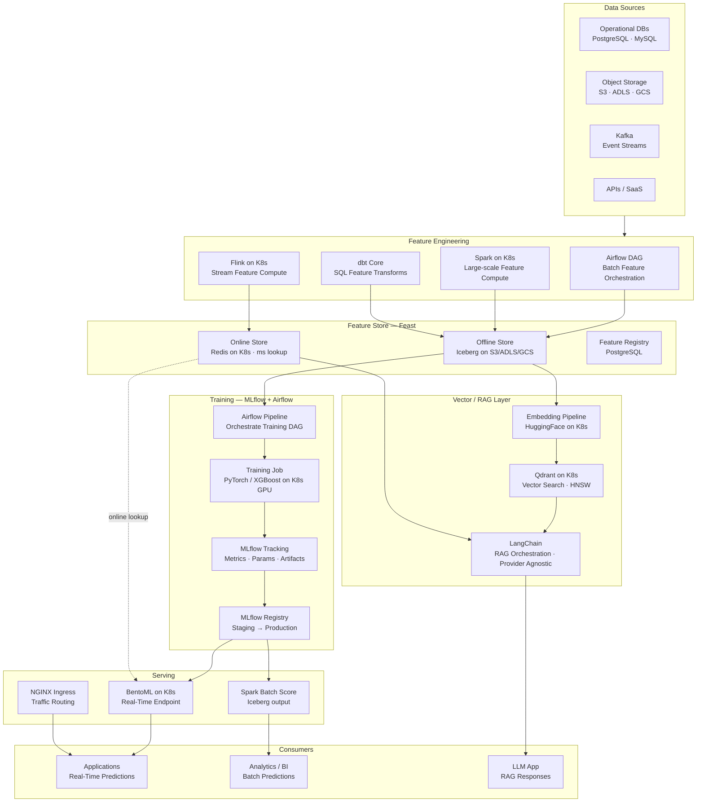
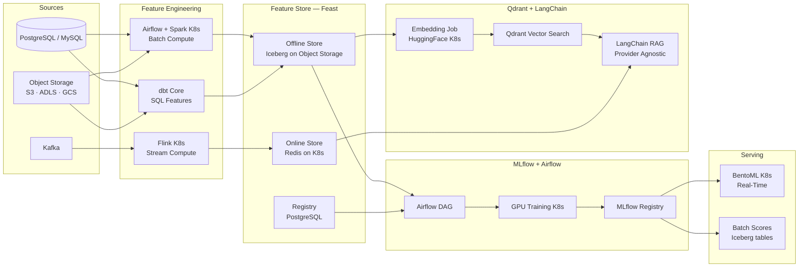
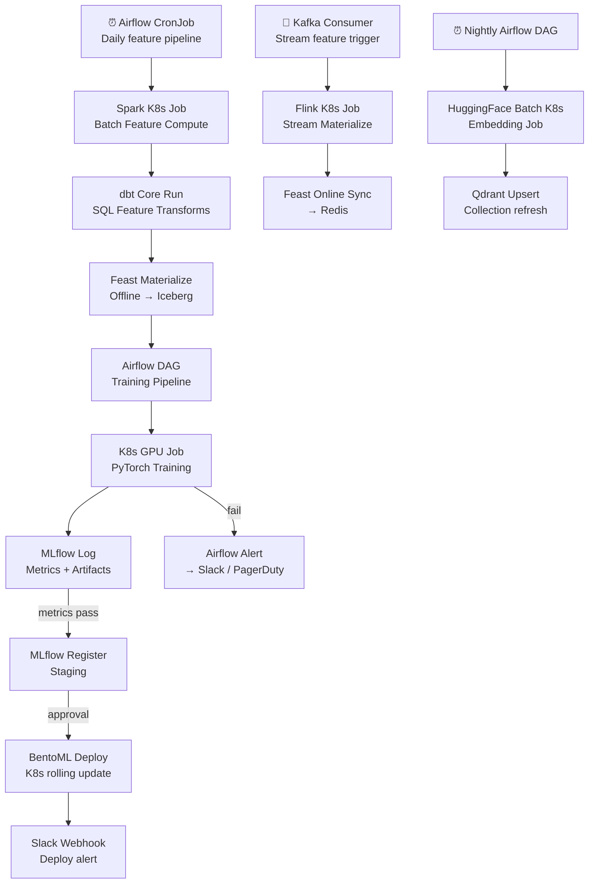

# 8.8 — AI/ML Data Platform · Multi-Cloud OSS Portable

**Stack:** Feast · MLflow · Apache Airflow · Qdrant · LangChain · dbt Core · Apache Iceberg · Kubernetes  
**Processing:** Batch (training) + Real-Time (online serving) — Hybrid  
**Buy vs Build:** Build (fully portable OSS on any cloud)

---

## Architecture Overview



---

## Data Flow



---

## Storage Zone Design

```
Object Storage (S3 / ADLS / GCS) — Apache Iceberg tables
│
├── raw-features/
│   └── {domain}/{entity}/
│       └── Parquet partitioned by date
│
├── iceberg-warehouse/                      ← Feast Offline + dbt outputs
│   └── {catalog}/{database}/
│       └── {table}/                        ← Iceberg table (data + metadata)
│           ├── data/   *.parquet
│           └── metadata/   *.json · *.avro
│
├── training-datasets/
│   └── {model-name}/{run-id}/
│       ├── train.parquet  · validation.parquet  · test.parquet
│       └── data-profile.json
│
├── mlflow-artifacts/
│   └── {experiment-id}/{run-id}/
│       └── artifacts/
│
├── embeddings/
│   └── {collection}/{run-date}/
│       └── *.parquet (id + vector + metadata)
│
└── batch-predictions/
    └── {model-name}/{score-date}/
        └── Iceberg table (id + prediction + score)
```

---

## Security Model

```
┌──────────────────────────────────────────────────────────────┐
│    K8s RBAC + Feast ACL + MLflow Auth + Qdrant API Keys       │
│                                                              │
│  K8s ServiceAccount    Access Level        Scope             │
│  ─────────────────────  ──────────────────  ──────────────── │
│  ml-engineer-sa        Admin               All namespaces    │
│  data-scientist-sa     Read + Write        ml-features · ml-training ns │
│  ml-ops-sa             Deploy              ml-serving ns     │
│  feature-consumer-sa   Redis AUTH (read)   Online Store      │
│  llm-app-sa            Qdrant API key      vector-search ns  │
│  analyst-sa            Read only           batch-output object prefix │
│                                                              │
│  Feast ACL             → per feature view access control    │
│  MLflow Auth           → OIDC (Keycloak or cloud IdP)       │
│  Qdrant API Keys       → per-collection granularity          │
│  Redis TLS + AUTH      → in-transit + password              │
│  OPA / Kyverno         → admission policies on K8s pods     │
│  Sealed Secrets / Vault → secret management per namespace   │
└──────────────────────────────────────────────────────────────┘
```

---

## Orchestration



---

## Component Map

| Component | Tool / Service | Notes |
|-----------|---------------|-------|
| Object Storage | S3 / ADLS / GCS (cloud native) | Any cloud; Iceberg abstraction above |
| Table Format | Apache Iceberg | ACID; time travel; cloud-agnostic |
| Iceberg Catalog | Nessie / Hive Metastore / JDBC | Git-like branching with Nessie |
| Batch Feature Compute | Apache Spark on Kubernetes | Spark Operator; Iceberg source/sink |
| SQL Feature Transforms | dbt Core | Feature views as dbt models |
| Stream Feature Compute | Apache Flink on Kubernetes | Flink Operator; Kafka source |
| Feature Store (Offline) | Feast + Iceberg | Offline store via Iceberg tables |
| Feature Store (Online) | Feast + Redis | Redis Operator; HA sentinel |
| Feature Registry | Feast + PostgreSQL | Metadata + lineage |
| Training Orchestration | Apache Airflow on K8s | CeleryExecutor or KubernetesExecutor |
| Training Jobs | PyTorch / XGBoost on K8s GPU | Gang scheduling; GPU node pools |
| Experiment Tracking | MLflow (self-hosted) | Object storage artifact backend |
| Model Registry | MLflow Model Registry | PostgreSQL backend |
| Real-Time Serving | BentoML on Kubernetes | HPA autoscale; multi-model |
| Batch Scoring | Apache Spark on K8s | Iceberg input + output |
| Embedding Pipeline | HuggingFace Transformers on K8s | BGE / E5 models; GPU batch |
| Vector Store | Qdrant on Kubernetes | StatefulSet; persistent volume |
| RAG Orchestration | LangChain | Qdrant retriever; any LLM provider |
| Ingress | NGINX Ingress Controller | BentoML + RAG API routing |
| Monitoring | Prometheus + Grafana | K8s + custom ML metrics |
| Secrets | HashiCorp Vault or Sealed Secrets | Cloud-agnostic secret management |
| Service Mesh | Istio (optional) | mTLS between ML services |

---

## Comparison vs 8.7 — Multi-Cloud Managed

| Dimension | 8.8 Multi-Cloud OSS Portable | 8.7 Multi-Cloud Managed |
|-----------|------------------------------|------------------------|
| Feature Store | Feast + Redis + Iceberg | Databricks Feature Store |
| Training Orchestration | Apache Airflow | Databricks Jobs |
| Experiment Tracking | MLflow (self-hosted) | MLflow (Databricks managed) |
| Model Registry | MLflow (self-hosted) | MLflow + Unity Catalog |
| Table Format | Apache Iceberg | Delta Lake |
| Vector Store | Qdrant | Databricks Vector Search |
| LLM / RAG | LangChain (any provider) | Mosaic AI / DBRX |
| Serving | BentoML | Mosaic AI Model Serving |
| Ops Burden | High — manage full OSS stack | Low — Databricks managed |
| Portability | Maximum — runs on any K8s | Databricks lock-in |
| Cost | Infra + operational overhead | Databricks DBU pricing |
| Best For | No vendor lock-in, OSS commitment | Enterprise scale, unified platform |
