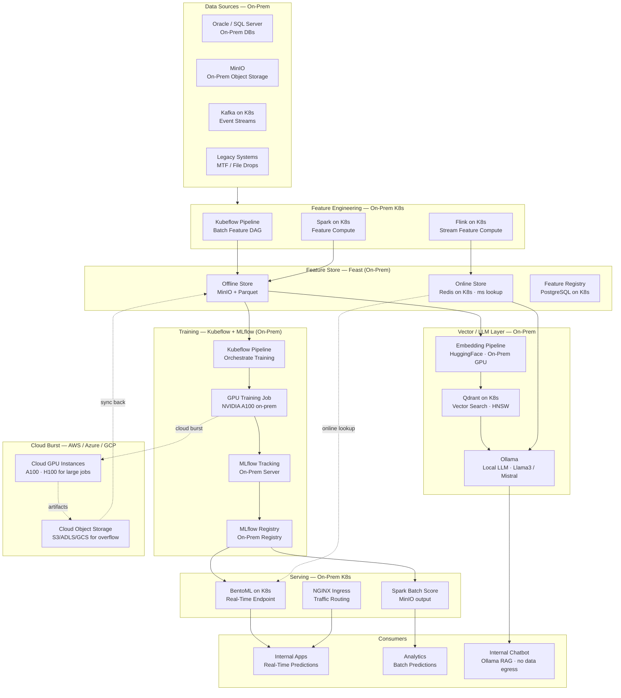
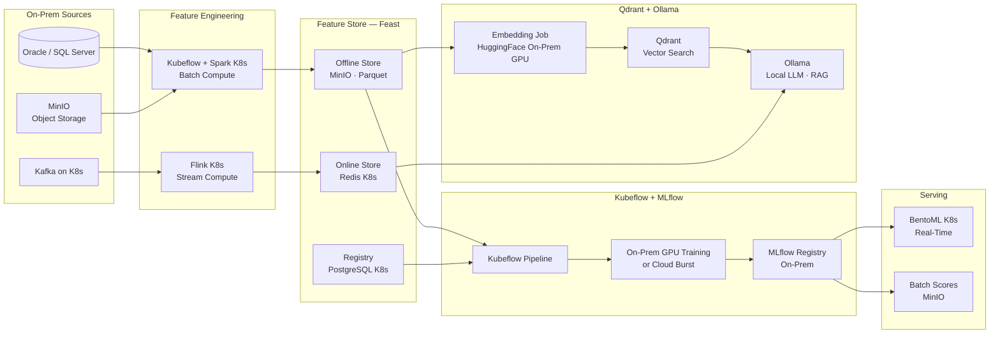
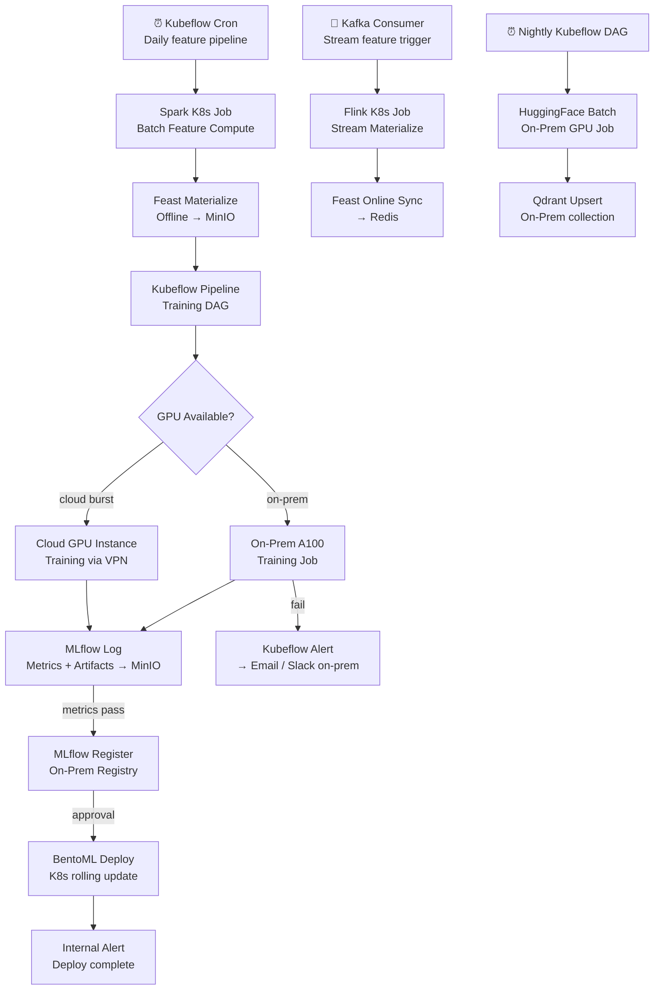

# 8.9 — AI/ML Data Platform · Hybrid OSS Self-Hosted (On-Prem + Cloud)

**Stack:** Feast · MLflow · Kubeflow Pipelines · Qdrant · Ollama (local LLM) · MinIO · Redis · Kubernetes on-prem  
**Processing:** Batch (training) + Real-Time (online serving) — Hybrid  
**Buy vs Build:** Full Build (self-hosted, on-prem + private cloud)

---

## Architecture Overview



---

## Data Flow



---

## Storage Zone Design

```
MinIO (on-prem) — s3-compatible API
│
├── raw-features/
│   └── {domain}/{entity}/year=YYYY/month=MM/day=DD/
│       └── Parquet · raw signals from on-prem sources
│
├── feast-offline/                          ← Feast Offline Store
│   └── {feature_view}/{entity}/
│       └── year=YYYY/month=MM/day=DD/
│           └── *.parquet
│
├── training-datasets/
│   └── {model-name}/{pipeline-run-id}/
│       ├── train.parquet  · validation.parquet  · test.parquet
│       └── schema.json
│
├── mlflow-artifacts/                       ← MLflow artifact store
│   └── {experiment-id}/{run-id}/
│       └── artifacts/  (model + plots + metrics)
│
├── embeddings/
│   └── {collection}/{run-date}/
│       └── *.parquet (id + vector + metadata)
│
└── batch-predictions/
    └── {model-name}/{score-date}/
        └── predictions.parquet

Cloud Object Storage (for burst / DR only):
  s3://<company>-ml-burst/ or adls://<company>-ml-burst/
  └── large-training-artifacts/{job-id}/
```

---

## Security Model

```
┌──────────────────────────────────────────────────────────────┐
│   K8s RBAC + MinIO IAM + Feast ACL + Ollama local-only       │
│                                                              │
│  K8s ServiceAccount    Access Level        Scope             │
│  ─────────────────────  ──────────────────  ──────────────── │
│  ml-engineer-sa        Admin               All namespaces    │
│  data-scientist-sa     Read + Write        Features · Training │
│  ml-ops-sa             Deploy              Serving namespace  │
│  feature-consumer-sa   Redis AUTH (read)   Online Store      │
│  internal-app-sa       BentoML API key     Serving endpoint  │
│  analyst-sa            MinIO read          Batch predictions bucket │
│                                                              │
│  Data Sovereignty       → all data stays on-prem            │
│  Ollama (local LLM)     → no data egress to external APIs    │
│  MinIO IAM              → bucket + path access policies      │
│  OPA / Kyverno          → admission control on GPU workloads │
│  HashiCorp Vault        → secrets management on-prem         │
│  Network Isolation      → air-gap capable; VPN for cloud burst │
│  NVIDIA MIG             → GPU partition isolation per team   │
└──────────────────────────────────────────────────────────────┘
```

---

## Orchestration



---

## Component Map

| Component | Tool / Service | Notes |
|-----------|---------------|-------|
| On-Prem Object Storage | MinIO | S3-compatible; distributed HA mode |
| On-Prem K8s | Kubernetes (kubeadm / Rancher) | Bare-metal or on-prem VMs |
| GPU Hardware | NVIDIA A100 / H100 on-prem | MIG partitioning; CUDA device plugin |
| Batch Feature Compute | Apache Spark on Kubernetes | Spark Operator; MinIO S3A connector |
| Stream Feature Compute | Apache Flink on Kubernetes | Flink Operator; Kafka source |
| Feature Store (Offline) | Feast + MinIO | S3-compatible offline store |
| Feature Store (Online) | Feast + Redis on K8s | Redis Operator; persistence + AOF |
| Feature Registry | Feast + PostgreSQL on K8s | PostgreSQL Operator; HA + backups |
| Training Orchestration | Kubeflow Pipelines | KFP SDK; Argo Workflow backend |
| Training Jobs | PyTorch / XGBoost on K8s GPU | Gang scheduling; NCCL for distributed |
| Cloud Burst | AWS / Azure / GCP spot GPU | VPN tunnel; artifact sync back to MinIO |
| Experiment Tracking | MLflow (on-prem K8s) | MinIO artifact store; PostgreSQL backend |
| Model Registry | MLflow Model Registry (on-prem) | Staging → Production promotion |
| Real-Time Serving | BentoML on Kubernetes | HPA autoscale; GPU serving |
| Batch Scoring | Apache Spark on K8s | MinIO input + output |
| Embedding Pipeline | HuggingFace Transformers | On-prem GPU; BGE / E5 models |
| Vector Store | Qdrant on Kubernetes | StatefulSet; persistent volume; on-prem |
| Local LLM | Ollama (Llama3 / Mistral / Phi) | No data egress; GPU-backed inference |
| RAG Orchestration | LangChain + Ollama | Qdrant retriever → Ollama local LLM |
| Ingress | NGINX Ingress Controller | Internal DNS; no public exposure |
| Monitoring | Prometheus + Grafana (on-prem) | GPU metrics (DCGM exporter) |
| Secrets | HashiCorp Vault (on-prem) | On-prem secrets; PKI |
| Service Mesh | Istio | mTLS between all ML services |

---

## Comparison vs 8.8 — Multi-Cloud OSS Portable

| Dimension | 8.9 Hybrid OSS Self-Hosted | 8.8 Multi-Cloud OSS Portable |
|-----------|---------------------------|------------------------------|
| Deployment | On-prem K8s + optional cloud burst | Cloud K8s (any cloud) |
| Object Storage | MinIO (S3-compatible) | S3 / ADLS / GCS native |
| LLM | Ollama (local, no egress) | LangChain + external LLM API |
| Data Sovereignty | Full — no data leaves on-prem | Depends on cloud region policy |
| GPU | Own hardware (CapEx) | Cloud spot instances (OpEx) |
| Cloud Burst | Optional VPN-based burst | Native cloud elasticity |
| Ops Burden | Highest — manage hardware + K8s | High — manage K8s on cloud |
| Portability | Self-contained; no cloud dependency | Cloud portable, not cloud-free |
| Cost | High CapEx, low OpEx at scale | OpEx-only; scales to zero |
| Best For | Air-gap, regulated, sovereignty-first | OSS teams on cloud, no hardware |
