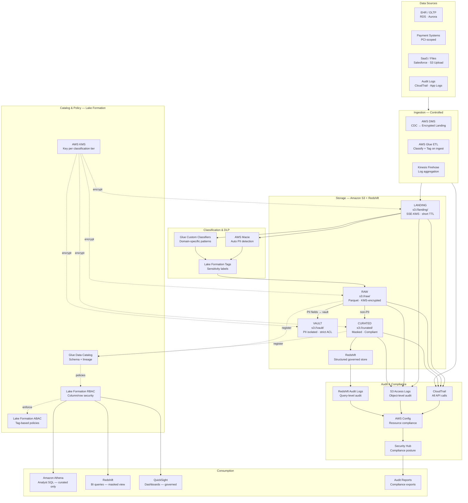
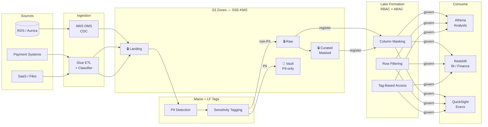
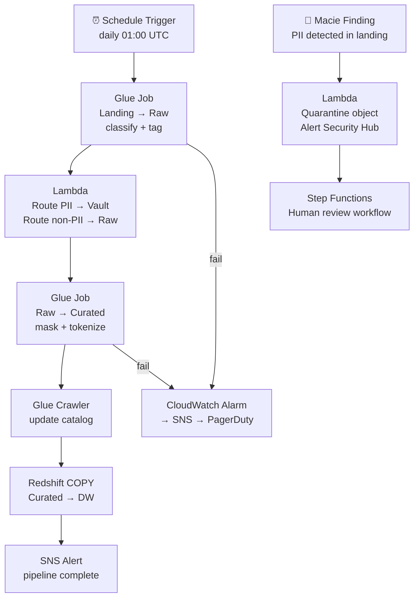

# 9.1 — Governed / Compliance-First · AWS Fully Managed

**Stack:** Redshift · Lake Formation · Macie · CloudTrail · AWS KMS · AWS Config
**Processing:** Batch-first · Compliance-driven
**Buy vs Build:** Buy (fully managed, no infra to operate)
**Compliance Targets:** HIPAA · PCI DSS · SOX · GDPR

---

## Architecture Overview



---

## Data Flow



---

## Zone Design

```
s3://<company>-governed/
│
├── landing/
│   └── {source}/{table}/year=YYYY/month=MM/day=DD/
│       └── raw as-received · SSE-KMS (landing-key) · 7-day TTL
│
├── raw/
│   └── {source}/{table}/year=YYYY/month=MM/day=DD/
│       └── Parquet · SSE-KMS (raw-key) · Macie-tagged
│
├── curated/
│   └── {domain}/{entity}/year=YYYY/month=MM/
│       └── PII fields tokenized/masked · Parquet · SSE-KMS (curated-key)
│
└── vault/
    └── {classification}/{entity}/year=YYYY/
        └── raw PII fields · SSE-KMS (vault-key) · strict IAM boundary
            Lake Formation row/col policies + separate KMS CMK
```

---

## Security Model

```
┌──────────────────────────────────────────────────────────────────┐
│  Lake Formation RBAC + ABAC                                      │
│                                                                  │
│  IAM Role           Access Level   Zone          Column Policy   │
│  ─────────────────  ────────────   ───────────   ─────────────  │
│  compliance-admin   Read+Write     All zones     Full access     │
│  data-engineer      Read+Write     Raw+Curated   PII masked      │
│  data-analyst       Read only      Curated       PII masked      │
│  bi-consumer        Read only      Curated       PII masked      │
│  auditor            Read only      Audit logs    No PII          │
│  vault-access       Read only      Vault         Authorized PHI  │
│                                                                  │
│  Column masking  → PII / PHI / PAN via Lake Formation           │
│  Row filtering   → by region / jurisdiction (GDPR residency)    │
│  ABAC tags       → sensitivity:high → requires vault-access role │
│  KMS CMKs        → 1 key per zone; vault key HSM-backed         │
│  Macie           → continuous scanning · alerts on exposure     │
│  CloudTrail      → all s3:GetObject + LF:GetDataAccess logged   │
└──────────────────────────────────────────────────────────────────┘
```

---

## Orchestration



---

## Component Map

| Component | AWS Service | Notes |
|-----------|-------------|-------|
| Object Storage | S3 | SSE-KMS; separate CMK per zone |
| DW Storage | Redshift | Encrypted at rest; column-level security via LF |
| DB Ingestion | AWS DMS | CDC with VPC; no plaintext transit |
| File / SaaS Ingestion | AWS Glue ETL | Custom classifiers for PHI/PAN patterns |
| PII Detection | AWS Macie | Scans landing zone; auto-tags sensitivity |
| Schema Catalog | Glue Data Catalog | LF-integrated; tags inherited by catalog entries |
| Access Control | Lake Formation RBAC/ABAC | Column masking, row filter, tag-based policies |
| Encryption | AWS KMS (CMK) | Per-zone keys; vault key backed by CloudHSM |
| Audit Trail | CloudTrail + S3 Access Logs | Immutable; shipped to dedicated audit account |
| Resource Compliance | AWS Config | Rules for encryption, public access blocks, KMS rotation |
| Compliance Posture | AWS Security Hub | HIPAA, PCI DSS standards checks |
| Ad-hoc Query | Amazon Athena | Governed via LF; analysts see masked curated only |
| BI Engine | Redshift | Views enforce masking; query logs audited |
| Dashboards | Amazon QuickSight | SPICE; governed by LF permissions |
| Orchestration | AWS Glue Workflows + Step Functions | Step Functions for human-in-loop review on PII alerts |
| Monitoring | CloudWatch + Security Hub | Dashboards per compliance standard |

---

## Compliance Controls Matrix

| Control | Mechanism | Regulation |
|---------|-----------|------------|
| Data residency | S3 bucket region lock + Config rule | GDPR |
| PII detection & tagging | Macie + LF tags | GDPR, HIPAA |
| Column masking | Lake Formation column mask | HIPAA, PCI |
| Encryption at rest | SSE-KMS with CMK rotation | PCI DSS, HIPAA |
| Encryption in transit | TLS 1.2+ enforced via bucket policy | PCI DSS |
| Access audit trail | CloudTrail + S3 access logs | SOX, HIPAA |
| Right to erasure | Vault delete + Glue job to reprocess masked curated | GDPR |
| Least privilege | Lake Formation + IAM permission boundaries | All |
| Key management | KMS with annual rotation | PCI DSS |
| Compliance scan | Security Hub + AWS Config rules | PCI, HIPAA |

---

## Comparison vs 9.2 (AWS OSS)

| Dimension | 9.1 AWS Managed | 9.2 AWS OSS |
|-----------|----------------|-------------|
| Access Control | Lake Formation RBAC/ABAC | Apache Ranger |
| PII Detection | AWS Macie | Custom classifiers + OpenMetadata |
| Audit | CloudTrail + Config | Debezium audit + custom sink |
| Encryption | KMS managed | Customer-managed KMS + Ranger encryption zone |
| Ops Overhead | Low (managed) | High (self-managed Ranger) |
| Cost Model | Pay-per-use | EC2/ECS for Ranger + overhead |
| Compliance Certification | AWS BAA / PCI DSS AoC | Customer responsibility |
