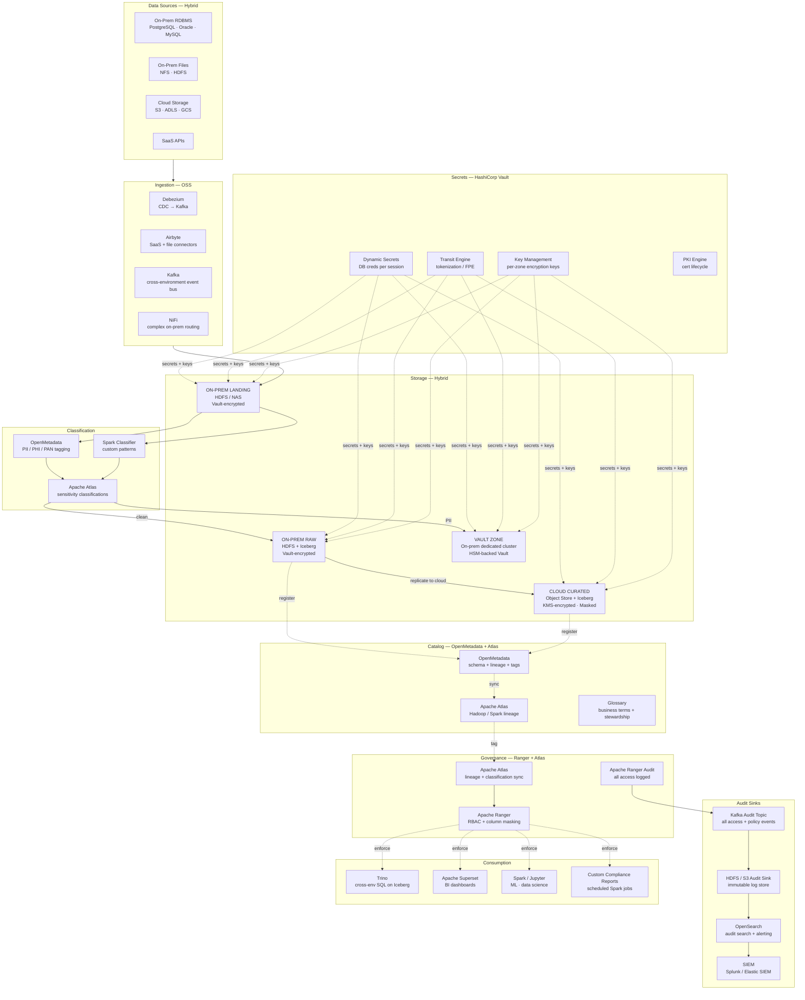
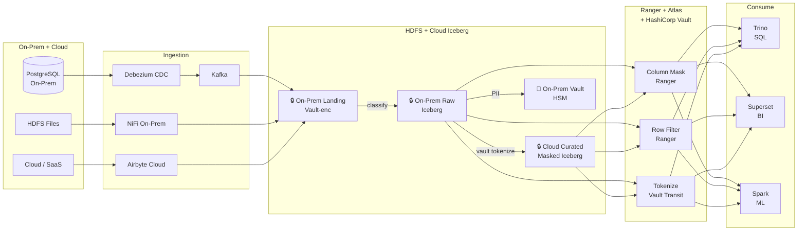
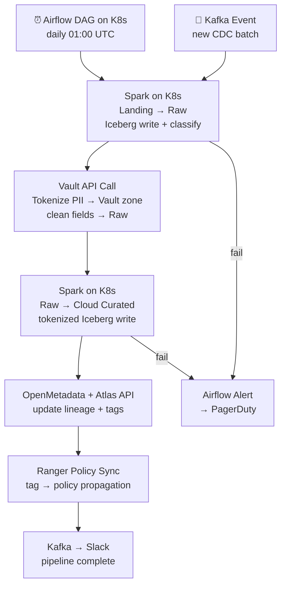

# 9.10 — Governed / Compliance-First · Hybrid OSS Self-Hosted

**Stack:** Apache Atlas · Apache Ranger · HashiCorp Vault · OpenMetadata · Audit Sinks
**Processing:** Batch-first · Compliance-driven
**Buy vs Build:** Full Build (all components self-hosted on-prem + cloud)
**Compliance Targets:** GDPR · HIPAA · PCI DSS · SOX

---

## Architecture Overview



---

## Data Flow



---

## Zone Design

```
Hybrid Zone Layout:
│
├── ON-PREM (Kubernetes cluster or bare-metal)
│   ├── landing/    → HDFS / NAS · Vault Transit encrypted · 7-day
│   ├── raw/        → Iceberg on HDFS · Vault KMS key · Atlas-tagged
│   └── vault/      → Dedicated namespace · HSM-backed Vault cluster
│                      on-prem network isolation · Ranger strict policy
│
└── CLOUD  (S3 / ADLS / GCS — whichever primary cloud)
    ├── curated/    → Iceberg · SSE with Vault-managed key
    │   └── {domain}/{entity}/  → PII tokenized via Vault Transit
    └── audit-sink/ → immutable · separate account/subscription
        └── Kafka connector → object store · WORM policy
```

---

## Security Model

```
┌──────────────────────────────────────────────────────────────────┐
│  Apache Ranger + HashiCorp Vault + Apache Atlas                  │
│                                                                  │
│  Role                Access Level   Zone          Protection     │
│  ─────────────────   ────────────   ──────────    ─────────────│
│  data-engineer       Read+Write     Raw+Curated   Ranger masked  │
│  data-analyst        Read only      Curated       Ranger masked  │
│  data-scientist      Read only      Raw+Curated   Ranger masked  │
│  bi-consumer         Read only      Curated       Full mask      │
│  compliance-officer  Read only      All+Vault     Partial reveal │
│  auditor             Read only      Audit sink    No PII         │
│                                                                  │
│  Column masking  → Ranger masking policies (hash/nullify/FPE)  │
│  Row filtering   → Ranger row-filter by jurisdiction attribute  │
│  Tokenization    → Vault Transit Engine (format-preserving)     │
│  Dynamic secrets → Vault issues per-session DB credentials      │
│  Key mgmt        → Vault KMS + on-prem HSM (Thales/SafeNet)    │
│  PKI             → Vault PKI engine for service mTLS certs     │
│  Audit           → Ranger + Vault audit → Kafka → WORM sink    │
└──────────────────────────────────────────────────────────────────┘
```

---

## Orchestration



---

## Component Map

| Component | Tool / Service | Notes |
|-----------|---------------|-------|
| On-Prem Storage | HDFS / NetApp NAS | Ranger-governed; Vault-encrypted |
| Cloud Storage | S3 / ADLS / GCS | SSE with Vault-managed CMK |
| Table Format | Apache Iceberg | Portable; Spark + Trino; ACID |
| CDC Ingestion | Debezium | PostgreSQL/MySQL/Oracle → Kafka |
| On-Prem Routing | Apache NiFi | Complex on-prem data routing + provenance |
| SaaS Ingestion | Airbyte on K8s | 300+ connectors; self-managed |
| Event Bus | Apache Kafka on K8s | Cross-environment; CDC + audit |
| Classification | Spark + OpenMetadata | Custom PII/PHI/PAN classifier |
| Access Control | Apache Ranger | Column masking, row filter, HDFS + Trino plugins |
| Metadata Catalog | Apache Atlas | Hadoop/Spark native lineage |
| Schema Catalog | OpenMetadata | Full catalog; Atlas sync; glossary |
| Secrets & Keys | HashiCorp Vault | Dynamic secrets, Transit tokenization, KMS, PKI |
| On-Prem HSM | Thales Luna / SafeNet | Vault HSM auto-unseal; vault zone key |
| Audit Trail | Ranger Audit + Vault Audit → Kafka → WORM | Immutable; cross-env consistent |
| Audit Search | OpenSearch | Ranger + Vault events + SIEM feed |
| SIEM | Splunk / Elastic SIEM | Audit events + threat detection |
| Query Engine | Trino on K8s | Iceberg + HDFS; Ranger-governed |
| BI | Apache Superset | Connected via Trino |
| ML | Spark / Jupyter on K8s | Governed curated Iceberg |
| Orchestration | Apache Airflow on K8s | KubernetesExecutor; DAGs for all pipelines |
| Monitoring | Prometheus + Grafana | Ranger, Vault, Kafka, pipeline metrics |

---

## Compliance Controls Matrix

| Control | Mechanism | Regulation |
|---------|-----------|------------|
| PII detection | Spark classifier + OpenMetadata + Atlas | GDPR, HIPAA |
| Column masking | Ranger column masking policies | HIPAA, PCI |
| Row filtering | Ranger row-filter by jurisdiction | GDPR |
| Tokenization | Vault Transit FPE | HIPAA, PCI DSS |
| Dynamic secrets | Vault dynamic DB credentials | PCI DSS (no static credentials) |
| Encryption at rest | Vault KMS (on-prem HSM for vault zone) | PCI DSS, HIPAA |
| Encryption in transit | TLS + Vault mTLS (Vault PKI) | PCI DSS |
| Immutable audit | Kafka → WORM object store | SOX, HIPAA, PCI DSS |
| Lineage | Atlas + OpenMetadata | GDPR (erasure tracing) |
| Data residency | On-prem vault zone + cloud region isolation | GDPR |
| Right to erasure | Iceberg DELETE + Vault key deletion | GDPR |
| Certificate lifecycle | Vault PKI engine | PCI DSS (TLS cert rotation) |

---

## Comparison vs 9.9 (Hybrid Managed)

| Dimension | 9.10 Hybrid OSS | 9.9 Hybrid Managed |
|-----------|-----------------|-------------------|
| ETL / Ingestion | Debezium + Airbyte + NiFi | Informatica IDMC |
| Catalog | Atlas + OpenMetadata | Collibra SaaS |
| Access Control | Apache Ranger | Collibra policies |
| Tokenization | Vault Transit FPE | Protegrity |
| DB Monitoring | Ranger Audit + Vault | IBM Guardium |
| HSM Integration | Vault + Thales/SafeNet | Protegrity + Guardium native |
| Mainframe Support | Limited (custom adapters) | Native Informatica |
| Ops Overhead | Very High | Low-Medium |
| Cost Model | Infra + engineering | High SaaS license |
| Flexibility | Full control | Vendor roadmap |
