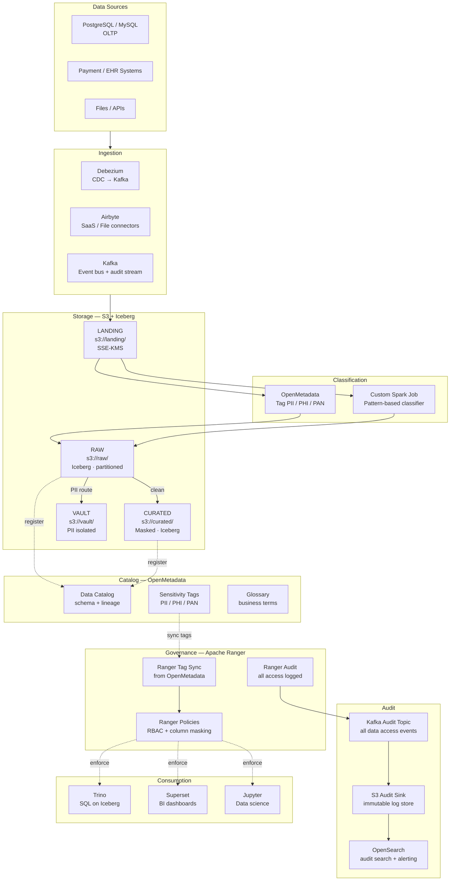
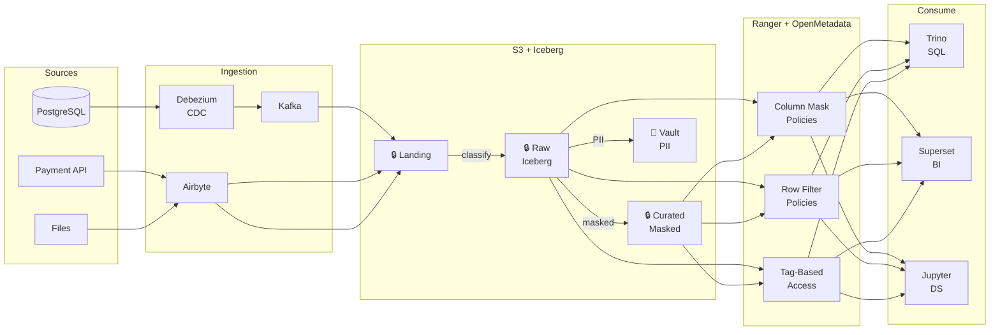
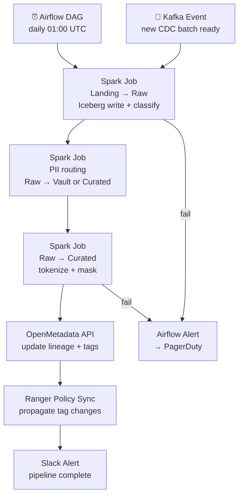

# 9.2 — Governed / Compliance-First · AWS OSS on Cloud

**Stack:** S3 · Apache Iceberg · Apache Ranger · OpenMetadata · Debezium · AWS KMS
**Processing:** Batch-first · Compliance-driven
**Buy vs Build:** Build (OSS governance stack on AWS infra)
**Compliance Targets:** HIPAA · PCI DSS · SOX · GDPR

---

## Architecture Overview



---

## Data Flow



---

## Zone Design

```
s3://<company>-governed/
│
├── landing/
│   └── {source}/{table}/year=YYYY/month=MM/day=DD/
│       └── raw format · SSE-KMS · 7-day TTL
│
├── raw/
│   └── {source}/{table}/
│       └── Iceberg table · SSE-KMS (raw-key) · OpenMetadata-tagged
│
├── curated/
│   └── {domain}/{entity}/
│       └── Iceberg table · PII tokenized · SSE-KMS (curated-key)
│
└── vault/
    └── {sensitivity}/{entity}/
        └── Iceberg table · SSE-KMS (vault-key CMK) · Ranger strict policy
```

---

## Security Model

```
┌──────────────────────────────────────────────────────────────────┐
│  Apache Ranger — Policy Engine                                   │
│                                                                  │
│  Role                Access Level   Zone          Masking        │
│  ─────────────────   ────────────   ───────────   ───────────── │
│  data-engineer       Read+Write     Raw+Curated   PII masked     │
│  data-analyst        Read only      Curated       PII masked     │
│  data-scientist      Read only      Raw+Curated   PII masked     │
│  bi-consumer         Read only      Curated       Full mask      │
│  compliance-officer  Read only      All + Vault   Partial reveal │
│  auditor             Read only      Audit sink    No PII         │
│                                                                  │
│  Column masking  → Ranger masking policies (hash / nullify)     │
│  Row filtering   → Ranger row-filter by region/jurisdiction     │
│  Tag-based       → OpenMetadata sensitivity tags → Ranger sync  │
│  Encryption      → SSE-KMS per zone; vault uses CMK             │
│  Audit           → Ranger Audit → Kafka → S3 immutable sink     │
└──────────────────────────────────────────────────────────────────┘
```

---

## Orchestration



---

## Component Map

| Component | Tool / Service | Notes |
|-----------|---------------|-------|
| Object Storage | S3 | SSE-KMS; separate CMK per zone |
| Table Format | Apache Iceberg | ACID, time-travel, schema evolution |
| CDC Ingestion | Debezium | Postgres/MySQL → Kafka |
| SaaS / File Ingestion | Airbyte | 300+ connectors; OSS self-hosted |
| Event Bus | Apache Kafka (MSK) | CDC stream + audit event bus |
| Classification | Spark custom job + OpenMetadata | Pattern-based PII/PHI/PAN tagging |
| Access Control | Apache Ranger | Column masking, row filter, tag policies |
| Schema Catalog | OpenMetadata | Lineage, sensitivity tags, glossary |
| Encryption | AWS KMS (CMK) | Per-zone; vault key HSM-backed |
| Audit Trail | Ranger Audit → Kafka → S3 | Immutable; query-level + object-level |
| Audit Search | OpenSearch | Ranger audit events; SIEM-ready |
| Query Engine | Trino | Iceberg connector; Ranger-governed |
| BI | Apache Superset | Connected via Trino |
| Orchestration | Apache Airflow | DAGs for classify, mask, load |
| Monitoring | Prometheus + Grafana | Pipeline + Ranger metrics |

---

## Compliance Controls Matrix

| Control | Mechanism | Regulation |
|---------|-----------|------------|
| PII detection | Spark classifier + OpenMetadata tags | GDPR, HIPAA |
| Column masking | Ranger column masking policies | HIPAA, PCI |
| Row filtering | Ranger row filter by jurisdiction | GDPR |
| Encryption at rest | SSE-KMS CMK per zone | PCI DSS, HIPAA |
| Encryption in transit | TLS 1.2+ · bucket policy enforce | PCI DSS |
| Audit trail | Ranger Audit → Kafka → S3 | SOX, HIPAA |
| Lineage | OpenMetadata automated lineage | GDPR right to erasure tracing |
| Data residency | S3 region + Iceberg catalog scoping | GDPR |
| Right to erasure | Iceberg delete + reprocess masked | GDPR |
| Least privilege | Ranger RBAC policies | All |

---

## Comparison vs 9.1 (AWS Managed)

| Dimension | 9.2 AWS OSS | 9.1 AWS Managed |
|-----------|------------|-----------------|
| Access Control | Apache Ranger | Lake Formation |
| PII Detection | Custom Spark + OpenMetadata | AWS Macie |
| Catalog | OpenMetadata | Glue Data Catalog |
| Audit | Ranger → Kafka → S3 | CloudTrail + Config |
| Encryption | KMS CMK (customer-managed) | KMS CMK (AWS-managed) |
| Ops Overhead | High (Ranger, Kafka, Airflow) | Low (fully managed) |
| Cost Model | EC2/MSK for services | Pay-per-use |
| Portability | High (OSS stack portable) | AWS lock-in |
