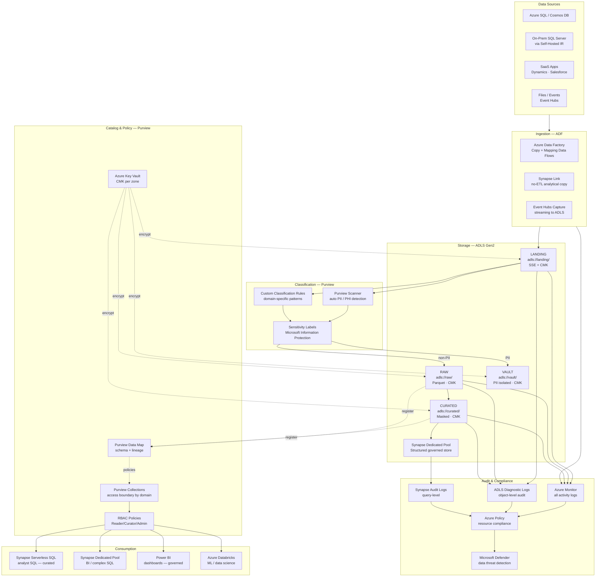
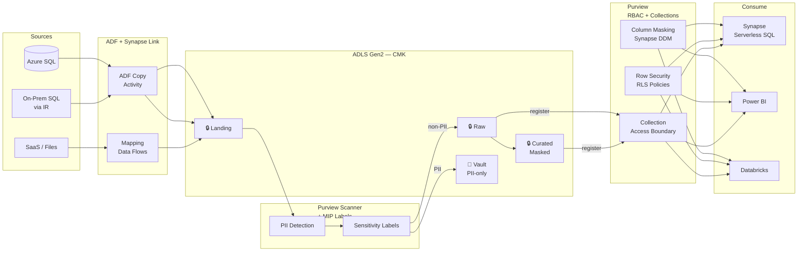
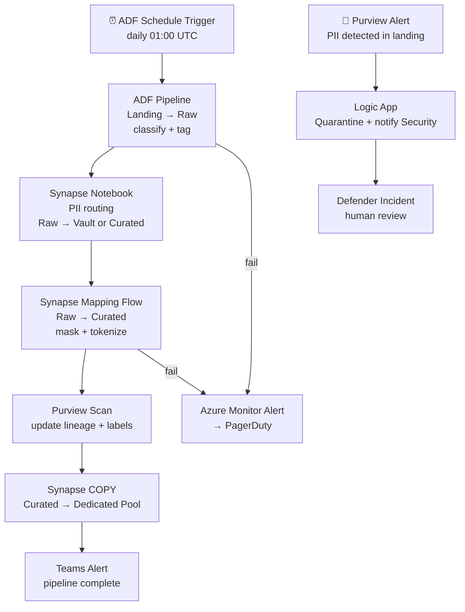

# 9.3 — Governed / Compliance-First · Azure Fully Managed

**Stack:** Synapse Analytics · Microsoft Purview · Azure Policy · Key Vault · Microsoft Defender for Data
**Processing:** Batch-first · Compliance-driven
**Buy vs Build:** Buy (fully managed, no infra to operate)
**Compliance Targets:** GDPR · HIPAA · PCI DSS · ISO 27001

---

## Architecture Overview



---

## Data Flow



---

## Zone Design

```
adls://<company>-governed/
│
├── landing/
│   └── {source}/{table}/year=YYYY/month=MM/day=DD/
│       └── raw as-received · CMK encrypted · 7-day TTL
│
├── raw/
│   └── {source}/{table}/year=YYYY/month=MM/day=DD/
│       └── Parquet · CMK (raw-key) · Purview-tagged
│
├── curated/
│   └── {domain}/{entity}/year=YYYY/month=MM/
│       └── PII tokenized/masked · Parquet · CMK (curated-key)
│
└── vault/
    └── {classification}/{entity}/year=YYYY/
        └── raw PII · CMK (vault-key HSM) · Purview strict collection
```

---

## Security Model

```
┌──────────────────────────────────────────────────────────────────┐
│  Microsoft Purview + Synapse Row-Level Security                  │
│                                                                  │
│  Role                  Access Level   Zone          Masking      │
│  ──────────────────    ────────────   ──────────    ─────────── │
│  compliance-admin      Read+Write     All zones     Full         │
│  data-engineer         Read+Write     Raw+Curated   DDM masked   │
│  data-analyst          Read only      Curated       DDM masked   │
│  bi-consumer           Read only      Curated       DDM masked   │
│  auditor               Read only      Audit logs    No PII       │
│  vault-access          Read only      Vault         Authorized   │
│                                                                  │
│  Dynamic Data Masking → Synapse DDM on PII columns             │
│  Row-Level Security   → Synapse RLS by team/region             │
│  Purview Collections  → namespace-level access boundary        │
│  CMK                  → Azure Key Vault per zone               │
│  Defender for Data    → anomaly detection + threat alerts      │
│  Policy               → deny public access, require CMK        │
└──────────────────────────────────────────────────────────────────┘
```

---

## Orchestration



---

## Component Map

| Component | Azure Service | Notes |
|-----------|--------------|-------|
| Object Storage | ADLS Gen2 | Hierarchical namespace; CMK per container |
| DW Storage | Synapse Dedicated Pool | Columnar; DDM + RLS for compliance |
| Ingestion | Azure Data Factory | Self-hosted IR for on-prem; Mapping Flows for transform |
| No-ETL Analytical Copy | Synapse Link | Cosmos DB + SQL Server analytical copy |
| PII Detection | Microsoft Purview Scanner | Custom + built-in classifiers; MIP labels |
| Schema Catalog | Purview Data Map | Lineage; automated scanning; glossary |
| Access Control | Purview RBAC + Collections | Fine-grained namespace access |
| Column Masking | Synapse DDM | Dynamic Data Masking on sensitive columns |
| Row Security | Synapse RLS | Row-level security policies |
| Encryption | Azure Key Vault (CMK) | Per-zone keys; Premium tier HSM for vault |
| Compliance Policy | Azure Policy | Deny public access, require encryption, audit |
| Threat Detection | Microsoft Defender for SQL | Anomaly + SQL injection detection |
| Audit Trail | Azure Monitor + ADLS Diagnostics | Immutable log export to Log Analytics |
| Ad-hoc Query | Synapse Serverless SQL | Governed via Purview; analysts curated only |
| BI | Power BI | Row-level security from Synapse |
| ML / DS | Azure Databricks | Governed via Purview Unity Catalog integration |
| Orchestration | ADF + Synapse Pipelines | ADF for ingestion; Synapse for transform |

---

## Compliance Controls Matrix

| Control | Mechanism | Regulation |
|---------|-----------|------------|
| Data residency | ADLS region lock + Azure Policy | GDPR |
| PII detection | Purview Scanner + MIP labels | GDPR, HIPAA |
| Column masking | Synapse DDM | HIPAA, PCI |
| Row filtering | Synapse RLS | GDPR |
| Encryption at rest | CMK via Key Vault (HSM for vault) | PCI DSS, HIPAA |
| Encryption in transit | TLS 1.2+ enforced | PCI DSS |
| Audit trail | Azure Monitor + Diagnostic Logs | SOX, HIPAA |
| Threat detection | Defender for SQL | PCI DSS |
| Right to erasure | ADLS delete + Synapse TRUNCATE | GDPR |
| Compliance posture | Azure Policy + Security Center | PCI, HIPAA |

---

## Comparison vs 9.4 (Azure OSS)

| Dimension | 9.3 Azure Managed | 9.4 Azure OSS |
|-----------|------------------|---------------|
| Access Control | Purview RBAC + Synapse RLS | Apache Ranger |
| PII Detection | Purview Scanner + MIP | Custom classifiers + OpenMetadata |
| Catalog | Microsoft Purview | Collibra / OpenMetadata |
| Encryption | Azure Key Vault CMK | Azure Key Vault + Ranger encryption zone |
| Ops Overhead | Low (managed) | High (self-managed Ranger) |
| Cost Model | Pay-per-use | VM/AKS for Ranger overhead |
| M365 Integration | Native (MIP labels) | Custom |
