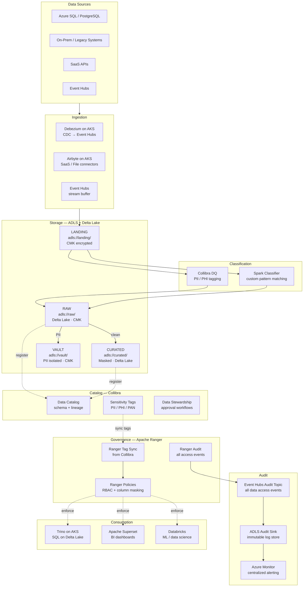
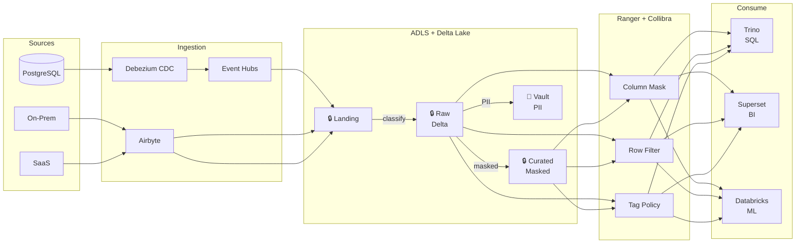
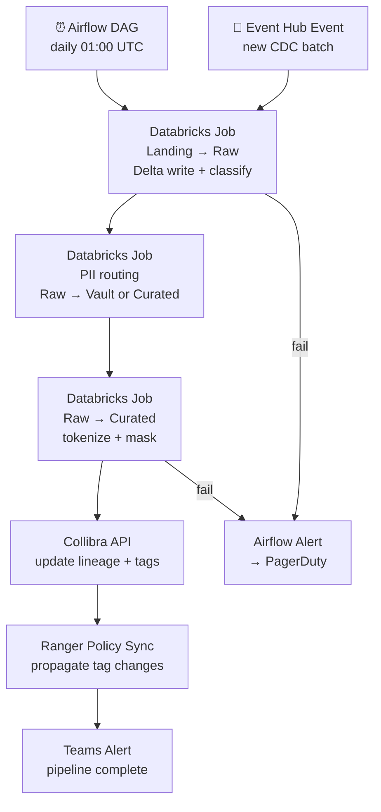

# 9.4 — Governed / Compliance-First · Azure OSS on Cloud

**Stack:** ADLS Gen2 · Delta Lake · Apache Ranger · Collibra · Azure Key Vault
**Processing:** Batch-first · Compliance-driven
**Buy vs Build:** Build (OSS governance on Azure infra)
**Compliance Targets:** GDPR · HIPAA · PCI DSS · SOX

---

## Architecture Overview



---

## Data Flow



---

## Zone Design

```
adls://<company>-governed/
│
├── landing/
│   └── {source}/{table}/year=YYYY/month=MM/day=DD/
│       └── raw format · CMK · 7-day TTL
│
├── raw/
│   └── {source}/{table}/
│       └── Delta Lake table · CMK (raw-key) · Collibra-tagged
│
├── curated/
│   └── {domain}/{entity}/
│       └── Delta Lake table · PII tokenized · CMK (curated-key)
│
└── vault/
    └── {sensitivity}/{entity}/
        └── Delta Lake table · CMK (vault-key HSM) · Ranger strict policy
```

---

## Security Model

```
┌──────────────────────────────────────────────────────────────────┐
│  Apache Ranger — Policy Engine                                   │
│                                                                  │
│  Role                Access Level   Zone          Masking        │
│  ─────────────────   ────────────   ──────────    ───────────── │
│  data-engineer       Read+Write     Raw+Curated   PII masked     │
│  data-analyst        Read only      Curated       PII masked     │
│  data-scientist      Read only      Raw+Curated   PII masked     │
│  bi-consumer         Read only      Curated       Full mask      │
│  compliance-officer  Read only      All + Vault   Partial        │
│  auditor             Read only      Audit sink    No PII         │
│                                                                  │
│  Column masking  → Ranger hash / nullify masking policies       │
│  Row filtering   → Ranger row-filter by jurisdiction            │
│  Tag-based       → Collibra sensitivity tags → Ranger sync      │
│  Encryption      → Azure Key Vault CMK per zone                 │
│  Audit           → Ranger Audit → Event Hubs → ADLS sink        │
└──────────────────────────────────────────────────────────────────┘
```

---

## Orchestration



---

## Component Map

| Component | Tool / Service | Notes |
|-----------|---------------|-------|
| Object Storage | ADLS Gen2 | Hierarchical namespace; CMK per container |
| Table Format | Delta Lake | ACID, time-travel; native Databricks support |
| CDC Ingestion | Debezium on AKS | PostgreSQL/SQL Server → Event Hubs |
| SaaS / File Ingestion | Airbyte on AKS | OSS connectors; self-managed |
| Event Bus | Azure Event Hubs | Kafka-compatible; CDC + audit stream |
| Classification | Spark on Databricks + Collibra DQ | Pattern-based PII/PHI/PAN |
| Access Control | Apache Ranger on AKS | Column masking, row filter, tag policies |
| Schema Catalog | Collibra Data Catalog | Lineage, sensitivity tags, stewardship |
| Encryption | Azure Key Vault (CMK) | Per-zone keys; Premium HSM for vault |
| Audit Trail | Ranger Audit → Event Hubs → ADLS | Immutable; query-level + object-level |
| Audit Monitoring | Azure Monitor | Centralized alerting; SIEM integration |
| Query Engine | Trino on AKS | Delta Lake connector; Ranger-governed |
| BI | Apache Superset | Connected via Trino |
| ML / DS | Azure Databricks | Delta Lake native; Ranger governance |
| Orchestration | Apache Airflow on AKS | DAGs for classify, mask, sync |

---

## Compliance Controls Matrix

| Control | Mechanism | Regulation |
|---------|-----------|------------|
| PII detection | Spark classifier + Collibra DQ | GDPR, HIPAA |
| Column masking | Ranger column masking policies | HIPAA, PCI |
| Row filtering | Ranger row filter by jurisdiction | GDPR |
| Encryption at rest | CMK per zone (HSM for vault) | PCI DSS, HIPAA |
| Encryption in transit | TLS 1.2+ | PCI DSS |
| Audit trail | Ranger Audit → Event Hubs → ADLS | SOX, HIPAA |
| Lineage | Collibra automated lineage | GDPR |
| Data residency | ADLS region + Ranger scoping | GDPR |
| Right to erasure | Delta Lake DELETE + reprocess | GDPR |
| Stewardship | Collibra approval workflows | Internal governance |

---

## Comparison vs 9.3 (Azure Managed)

| Dimension | 9.4 Azure OSS | 9.3 Azure Managed |
|-----------|--------------|-------------------|
| Access Control | Apache Ranger | Purview RBAC + Synapse RLS |
| Catalog | Collibra | Microsoft Purview |
| Table Format | Delta Lake (OSS) | Parquet + Synapse |
| Portability | High | Azure lock-in |
| Ops Overhead | High (Ranger, Airflow on AKS) | Low |
| Cost Model | AKS cluster + license | Pay-per-use |
| M365 Integration | None | Native MIP labels |
