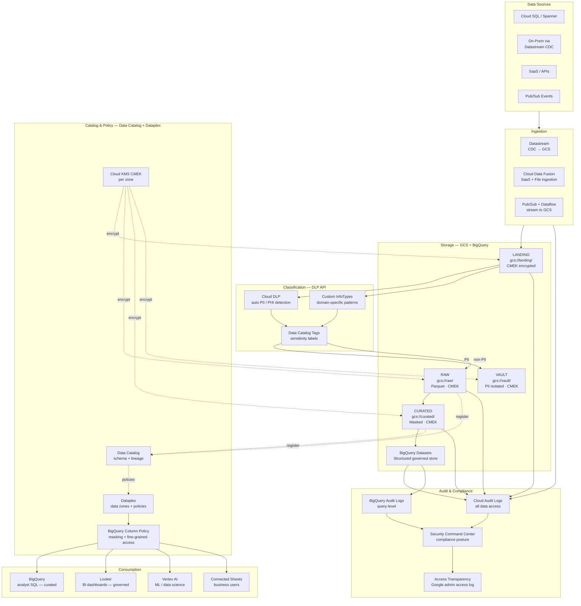
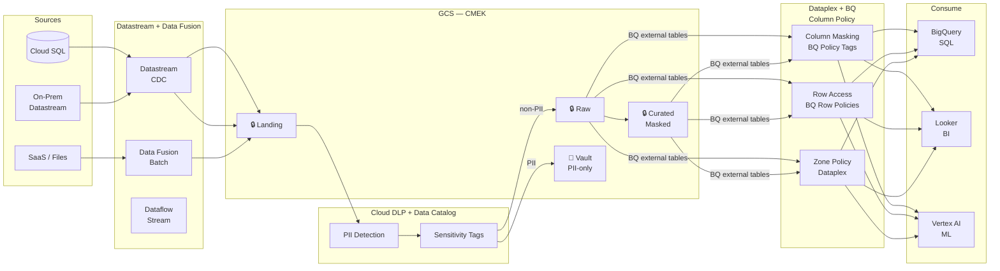
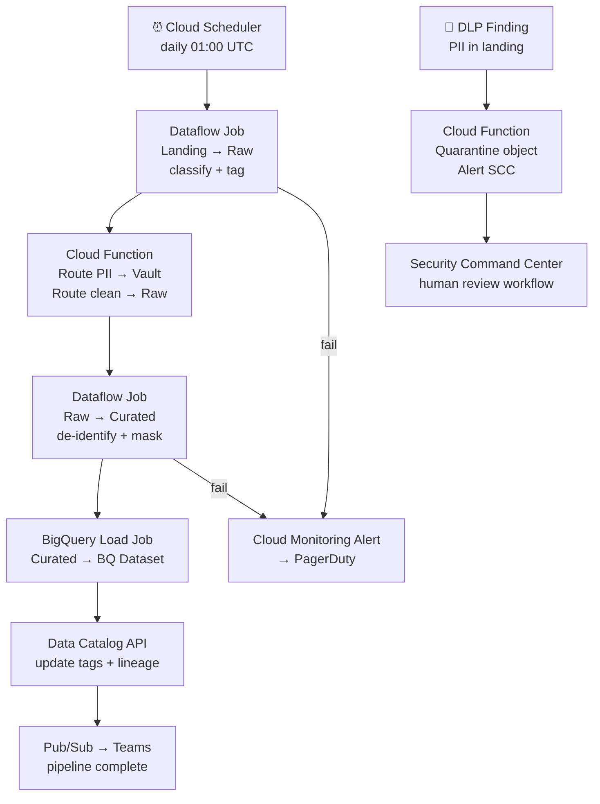

# 9.5 — Governed / Compliance-First · GCP Fully Managed

**Stack:** BigQuery · Data Catalog · Cloud DLP API · Cloud KMS · Dataplex · VPC Service Controls
**Processing:** Batch-first · Compliance-driven
**Buy vs Build:** Buy (fully managed, no infra to operate)
**Compliance Targets:** GDPR · HIPAA · PCI DSS · FedRAMP

---

## Architecture Overview



---

## Data Flow



---

## Zone Design

```
gcs://<company>-governed/
│
├── landing/
│   └── {source}/{table}/year=YYYY/month=MM/day=DD/
│       └── raw as-received · CMEK · 7-day lifecycle
│
├── raw/
│   └── {source}/{table}/year=YYYY/month=MM/day=DD/
│       └── Parquet · CMEK (raw-key) · DLP-tagged
│
├── curated/
│   └── {domain}/{entity}/year=YYYY/month=MM/
│       └── PII de-identified · Parquet · CMEK (curated-key)
│
└── vault/
    └── {classification}/{entity}/year=YYYY/
        └── raw PII · CMEK (vault-key HSM) · Dataplex strict zone
```

---

## Security Model

```
┌──────────────────────────────────────────────────────────────────┐
│  BigQuery Column Policy Tags + IAM + Dataplex Zones              │
│                                                                  │
│  IAM Role / Group      Access Level   Zone          BQ Masking   │
│  ──────────────────    ────────────   ──────────    ──────────── │
│  compliance-admin      Read+Write     All zones     Full access  │
│  data-engineer         Read+Write     Raw+Curated   Policy Tag   │
│  data-analyst          Read only      Curated       Full mask    │
│  bi-consumer           Read only      Curated       Full mask    │
│  auditor               Read only      Audit logs    No PII       │
│  vault-access          Read only      Vault         Authorized   │
│                                                                  │
│  BQ Column Policy Tags → masking rules on PII/PHI columns      │
│  BQ Row Access Policies → filter by jurisdiction/region        │
│  VPC Service Controls  → perimeter around BQ + GCS + KMS       │
│  CMEK                  → Cloud KMS per zone; HSM for vault      │
│  Cloud DLP             → continuous scanning + de-identification│
│  Cloud Audit Logs      → DATA_READ events; immutable in BQ      │
└──────────────────────────────────────────────────────────────────┘
```

---

## Orchestration



---

## Component Map

| Component | GCP Service | Notes |
|-----------|------------|-------|
| Object Storage | GCS | CMEK per bucket; uniform bucket-level access |
| DW Storage | BigQuery | Column Policy Tags; row access policies |
| CDC Ingestion | Datastream | Direct CDC from PostgreSQL/MySQL/Oracle |
| File / SaaS Ingestion | Cloud Data Fusion | GUI-driven pipelines; 150+ connectors |
| Stream Ingestion | Pub/Sub + Dataflow | Sub-second ingest to GCS |
| PII Detection | Cloud DLP API | 100+ built-in infoTypes; custom infoTypes |
| De-identification | Cloud DLP API | Tokenization, pseudonymization, masking |
| Schema Catalog | Google Data Catalog | Auto-discovery; lineage; sensitivity tags |
| Data Zones | Dataplex | Logical zones with policy enforcement |
| Column Masking | BigQuery Column Policy Tags | Masking rules on tagged columns |
| Row Access | BigQuery Row Access Policies | Filter by group/attribute |
| Encryption | Cloud KMS CMEK | Per-zone keys; Cloud HSM for vault |
| Network Perimeter | VPC Service Controls | Prevent data exfiltration |
| Audit Trail | Cloud Audit Logs | DATA_READ/WRITE; immutable export to BQ |
| Compliance Posture | Security Command Center | Posture checks; threat detection |
| Access Transparency | Access Transparency Logs | Google SRE access audit |
| BI | Looker | LookML governed; BQ policy tags respected |
| ML | Vertex AI | Governed datasets from curated BQ |
| Orchestration | Cloud Composer (Airflow) | DAGs for classify, mask, BQ load |

---

## Compliance Controls Matrix

| Control | Mechanism | Regulation |
|---------|-----------|------------|
| Data residency | GCS region lock + Organization Policy | GDPR |
| PII detection | Cloud DLP built-in + custom infoTypes | GDPR, HIPAA |
| Column masking | BQ Column Policy Tags | HIPAA, PCI |
| Row filtering | BQ Row Access Policies | GDPR |
| De-identification | Cloud DLP tokenization | HIPAA Safe Harbor |
| Encryption at rest | CMEK (Cloud KMS / HSM) | PCI DSS, HIPAA |
| Network perimeter | VPC Service Controls | PCI DSS |
| Audit trail | Cloud Audit Logs → BQ | SOX, HIPAA |
| Compliance posture | Security Command Center | PCI, HIPAA |
| Right to erasure | GCS delete + BQ table expiry | GDPR |

---

## Comparison vs 9.6 (GCP OSS)

| Dimension | 9.5 GCP Managed | 9.6 GCP OSS |
|-----------|----------------|-------------|
| Access Control | BQ Column Policy + Dataplex | Apache Ranger |
| PII Detection | Cloud DLP API | Custom + OpenMetadata |
| Catalog | Data Catalog + Dataplex | OpenMetadata |
| Encryption | Cloud KMS CMEK | Cloud KMS + Ranger encryption zone |
| Network Perimeter | VPC Service Controls | Custom VPC + Ranger |
| Ops Overhead | Low (fully managed) | High (Ranger on GKE) |
| Cost Model | Pay-per-query | GKE cluster + overhead |
| FedRAMP | GCP FedRAMP High | Customer responsibility |
