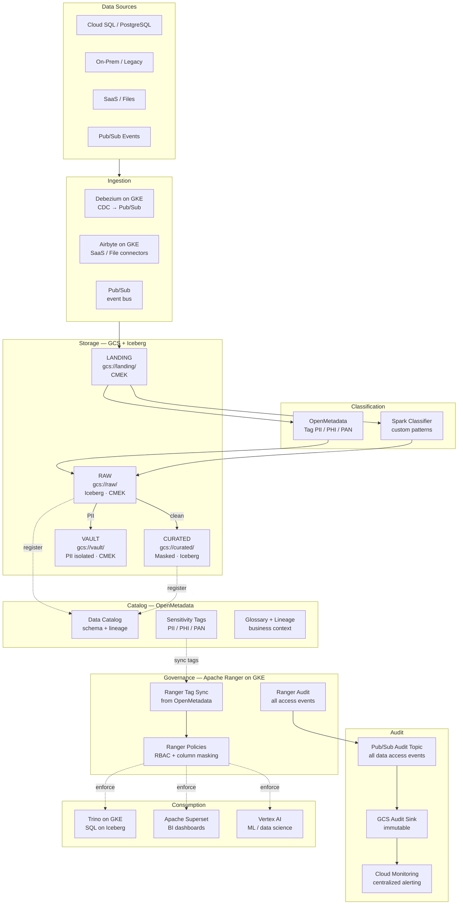
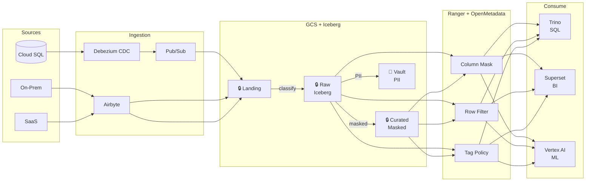
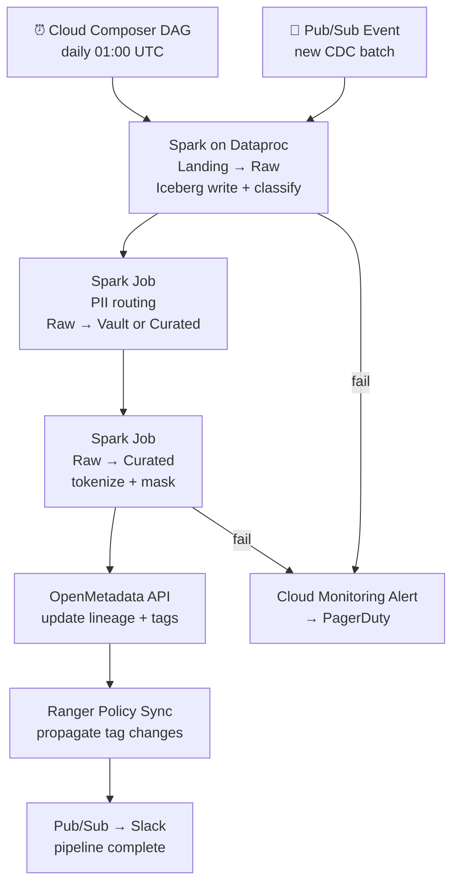

# 9.6 — Governed / Compliance-First · GCP OSS on Cloud

**Stack:** GCS · Apache Iceberg · Apache Ranger · OpenMetadata · Cloud KMS
**Processing:** Batch-first · Compliance-driven
**Buy vs Build:** Build (OSS governance on GCP infra)
**Compliance Targets:** GDPR · HIPAA · PCI DSS

---

## Architecture Overview



---

## Data Flow



---

## Zone Design

```
gcs://<company>-governed/
│
├── landing/
│   └── {source}/{table}/year=YYYY/month=MM/day=DD/
│       └── raw format · CMEK · 7-day lifecycle
│
├── raw/
│   └── {source}/{table}/
│       └── Iceberg table · CMEK (raw-key) · OpenMetadata-tagged
│
├── curated/
│   └── {domain}/{entity}/
│       └── Iceberg table · PII tokenized · CMEK (curated-key)
│
└── vault/
    └── {sensitivity}/{entity}/
        └── Iceberg table · CMEK (vault-key HSM) · Ranger strict policy
```

---

## Security Model

```
┌──────────────────────────────────────────────────────────────────┐
│  Apache Ranger — Policy Engine (on GKE)                          │
│                                                                  │
│  Role                Access Level   Zone          Masking        │
│  ─────────────────   ────────────   ──────────    ───────────── │
│  data-engineer       Read+Write     Raw+Curated   PII masked     │
│  data-analyst        Read only      Curated       PII masked     │
│  data-scientist      Read only      Raw+Curated   PII masked     │
│  bi-consumer         Read only      Curated       Full mask      │
│  compliance-officer  Read only      All + Vault   Partial        │
│  auditor             Read only      Audit sink    No PII         │
│                                                                  │
│  Column masking  → Ranger hash / nullify masking policies       │
│  Row filtering   → Ranger row-filter by jurisdiction            │
│  Tag-based       → OpenMetadata sensitivity tags → Ranger sync  │
│  Encryption      → Cloud KMS CMEK per zone; HSM for vault       │
│  Audit           → Ranger Audit → Pub/Sub → GCS immutable       │
└──────────────────────────────────────────────────────────────────┘
```

---

## Orchestration



---

## Component Map

| Component | Tool / Service | Notes |
|-----------|---------------|-------|
| Object Storage | GCS | CMEK per bucket; uniform access |
| Table Format | Apache Iceberg | ACID, time-travel; Spark + Trino read |
| CDC Ingestion | Debezium on GKE | PostgreSQL/MySQL → Pub/Sub |
| SaaS / File Ingestion | Airbyte on GKE | OSS connectors; self-managed |
| Event Bus | Google Pub/Sub | CDC stream + audit event bus |
| Classification | Spark on Dataproc + OpenMetadata | Pattern-based PII/PHI/PAN |
| Access Control | Apache Ranger on GKE | Column masking, row filter, tag policies |
| Schema Catalog | OpenMetadata | Lineage, sensitivity tags, glossary |
| Encryption | Cloud KMS CMEK | Per-zone keys; Cloud HSM for vault |
| Audit Trail | Ranger Audit → Pub/Sub → GCS | Immutable; query + object level |
| Audit Monitoring | Cloud Monitoring | Alerts + dashboards |
| Query Engine | Trino on GKE | Iceberg connector; Ranger-governed |
| BI | Apache Superset | Connected via Trino |
| ML | Vertex AI | Governed curated zone datasets |
| Orchestration | Cloud Composer (Airflow) | DAGs for classify, mask, load |

---

## Compliance Controls Matrix

| Control | Mechanism | Regulation |
|---------|-----------|------------|
| PII detection | Spark classifier + OpenMetadata tags | GDPR, HIPAA |
| Column masking | Ranger column masking policies | HIPAA, PCI |
| Row filtering | Ranger row filter by jurisdiction | GDPR |
| Encryption at rest | CMEK per zone (Cloud HSM for vault) | PCI DSS, HIPAA |
| Encryption in transit | TLS 1.2+ | PCI DSS |
| Audit trail | Ranger Audit → Pub/Sub → GCS | SOX, HIPAA |
| Lineage | OpenMetadata automated lineage | GDPR |
| Data residency | GCS region + Ranger scoping | GDPR |
| Right to erasure | Iceberg DELETE + reprocess | GDPR |
| Least privilege | Ranger RBAC policies | All |

---

## Comparison vs 9.5 (GCP Managed)

| Dimension | 9.6 GCP OSS | 9.5 GCP Managed |
|-----------|------------|-----------------|
| Access Control | Apache Ranger | BQ Column Policy + Dataplex |
| PII Detection | Custom + OpenMetadata | Cloud DLP API |
| Catalog | OpenMetadata | Google Data Catalog |
| Table Format | Iceberg (OSS) | Parquet + BQ native |
| Portability | High (OSS portable) | GCP lock-in |
| Ops Overhead | High (GKE clusters) | Low (fully managed) |
| Cost Model | GKE + Dataproc | Pay-per-query |
| FedRAMP Support | Customer responsibility | GCP FedRAMP High |
