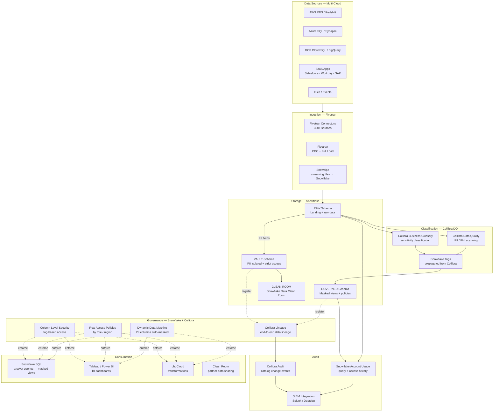
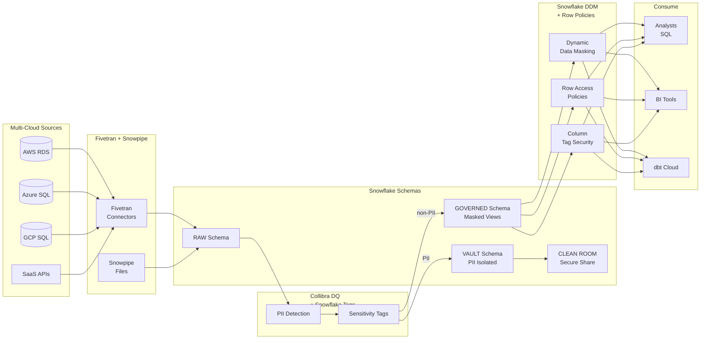
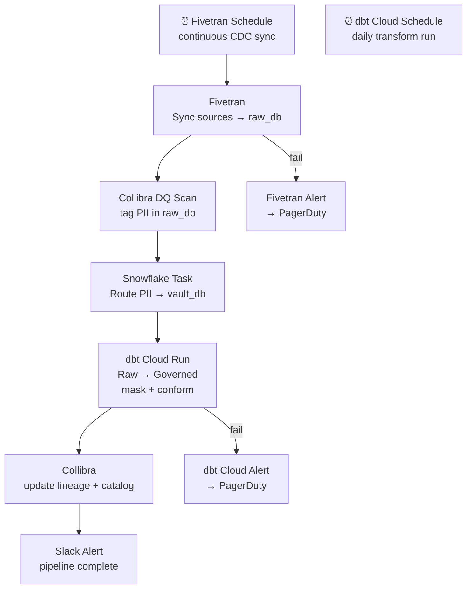

# 9.7 — Governed / Compliance-First · Multi-Cloud Fully Managed

**Stack:** Snowflake · Collibra · Fivetran · Snowflake Dynamic Data Masking · Snowflake Data Clean Room
**Processing:** Batch-first · Compliance-driven
**Buy vs Build:** Buy (SaaS-first, multi-cloud portable)
**Compliance Targets:** GDPR · HIPAA · PCI DSS · SOX · CCPA

---

## Architecture Overview



---

## Data Flow



---

## Zone Design

```
Snowflake Account: <company>_governed
│
├── DATABASE: raw_db
│   ├── SCHEMA: {source}_landing   — direct Fivetran load, no transform
│   └── SCHEMA: {source}_raw       — typed, partitioned, no masking
│
├── DATABASE: governed_db
│   ├── SCHEMA: {domain}_curated   — PII columns masked via DDM policy
│   └── SCHEMA: {domain}_views     — analyst-facing masked views
│
├── DATABASE: vault_db
│   └── SCHEMA: {classification}   — raw PII; strict RBAC; no direct query
│       (vault-access role only; Snowflake encryption key isolated)
│
└── DATABASE: clean_room_db
    └── Snowflake Data Clean Room  — partner sharing without PII exposure
```

---

## Security Model

```
┌──────────────────────────────────────────────────────────────────┐
│  Snowflake RBAC + Dynamic Data Masking + Row Access Policies     │
│                                                                  │
│  Role                  Access Level     Schema        Masking    │
│  ──────────────────    ────────────     ──────────    ───────── │
│  COMPLIANCE_ADMIN      Read+Write       All           None       │
│  DATA_ENGINEER         Read+Write       Raw+Governed  DDM active │
│  DATA_ANALYST          Read only        Governed      DDM active │
│  BI_CONSUMER           Read only        Governed      DDM active │
│  AUDITOR               Read only        Account Usage No PII     │
│  VAULT_ACCESS          Read only        Vault         Authorized │
│  CLEAN_ROOM            Controlled share Clean Room    No raw PII │
│                                                                  │
│  Dynamic Data Masking  → policy per column per role             │
│  Row Access Policies   → filter by jurisdiction column          │
│  Column-Level Security → tag → masking policy binding           │
│  Tri-Secret Sharing    → customer-managed key (Snowflake + HSM) │
│  Network Policy        → IP allowlist per role                  │
│  Audit                 → ACCOUNT_USAGE.QUERY_HISTORY            │
└──────────────────────────────────────────────────────────────────┘
```

---

## Orchestration



---

## Component Map

| Component | Tool / Service | Notes |
|-----------|---------------|-------|
| Data Warehouse | Snowflake | Multi-cloud (AWS/Azure/GCP); virtual warehouses |
| Ingestion | Fivetran | 300+ connectors; managed CDC; auto-schema migration |
| File Ingestion | Snowpipe | Streaming files from S3/ADLS/GCS → Snowflake |
| Classification | Collibra Data Quality | PII/PHI scanning; sensitivity tags |
| Schema Catalog | Collibra Data Catalog | End-to-end lineage; business glossary |
| Tag Management | Snowflake Tags + Collibra sync | Tags propagate to DDM policies |
| Column Masking | Snowflake Dynamic Data Masking | Role-based masking expressions |
| Row Access | Snowflake Row Access Policies | Filter by jurisdiction attribute |
| PII Isolation | Snowflake Vault Schema + RBAC | Separate database; tri-secret sharing key |
| Data Clean Room | Snowflake Data Clean Room | Partner analytics without raw PII exchange |
| Encryption | Tri-Secret Sharing (Snowflake + customer CMK) | HSM-backed customer key |
| Audit Trail | Snowflake ACCOUNT_USAGE | QUERY_HISTORY + ACCESS_HISTORY views |
| Compliance Posture | Collibra + Snowflake account usage reports | Cross-cloud compliance dashboard |
| SIEM | Splunk / Datadog integration | Snowflake audit logs shipped |
| Transformation | dbt Cloud | Runs on Snowflake; governed models |
| BI | Tableau / Power BI | Row-level security from Snowflake |
| Orchestration | dbt Cloud + Fivetran triggers | Event-driven + scheduled |

---

## Compliance Controls Matrix

| Control | Mechanism | Regulation |
|---------|-----------|------------|
| PII detection | Collibra DQ scanning + Snowflake tags | GDPR, HIPAA |
| Column masking | Snowflake Dynamic Data Masking | HIPAA, PCI |
| Row filtering | Snowflake Row Access Policies | GDPR, CCPA |
| PII isolation | Vault schema + tri-secret sharing | HIPAA, PCI |
| Encryption at rest | Tri-Secret Sharing (customer CMK) | PCI DSS, HIPAA |
| Encryption in transit | TLS 1.2+ mandatory | PCI DSS |
| Audit trail | ACCOUNT_USAGE.QUERY_HISTORY | SOX, HIPAA |
| Data clean room | Snowflake Clean Room | GDPR (no raw PII to partners) |
| Right to erasure | Snowflake DELETE + dbt rerun | GDPR, CCPA |
| Data residency | Snowflake region selection | GDPR |

---

## Comparison vs 9.8 (Multi-Cloud OSS)

| Dimension | 9.7 Multi-Cloud Managed | 9.8 Multi-Cloud OSS |
|-----------|------------------------|---------------------|
| DW / Store | Snowflake | Iceberg + Trino |
| Ingestion | Fivetran (managed) | Airbyte + Kafka (self-managed) |
| Access Control | Snowflake DDM + Row Policies | Apache Ranger |
| Catalog | Collibra (SaaS) | OpenMetadata (OSS) |
| Clean Room | Snowflake native | Custom + clean room tooling |
| Ops Overhead | Very Low | High |
| Cost Model | Snowflake credits + Fivetran/Collibra licenses | Self-hosted infra + OSS |
| Portability | Snowflake multi-cloud (3 clouds) | Full OSS portability |
