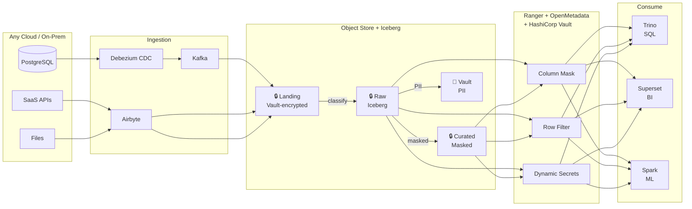
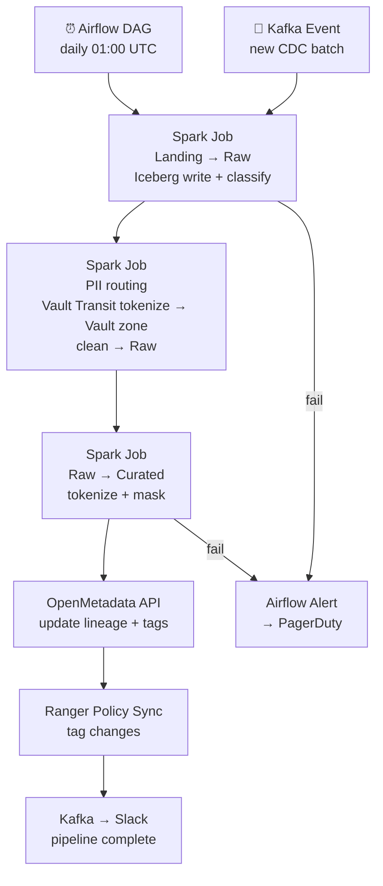

# 9.8 — Governed / Compliance-First · Multi-Cloud OSS Portable

**Stack:** Apache Iceberg · Apache Ranger · OpenMetadata · HashiCorp Vault · Trino
**Processing:** Batch-first · Compliance-driven
**Buy vs Build:** Build (fully portable OSS governance stack)
**Compliance Targets:** GDPR · HIPAA · PCI DSS · SOX

---

## Architecture Overview

```mermaid
flowchart TD
    subgraph SRC["Data Sources — Any Cloud"]
        S1[PostgreSQL / MySQL\nAWS · Azure · GCP]
        S2[On-Prem Systems]
        S3[SaaS APIs]
        S4[Object Storage\nS3 · ADLS · GCS]
    end

    subgraph INGEST["Ingestion — OSS"]
        I1[Debezium\nCDC → Kafka]
        I2[Airbyte\nSaaS / File connectors]
        I3[Kafka\ncross-cloud event bus]
    end

    subgraph CLASSIFY["Classification"]
        CL1[OpenMetadata\nTag PII / PHI / PAN]
        CL2[Spark Classifier\ncustom pattern matching]
    end

    subgraph STORAGE["Storage — Object Store + Iceberg"]
        Z1[LANDING\n{cloud}://landing/\nclient-side encrypted]
        Z2[RAW\n{cloud}://raw/\nIceberg · encrypted]
        Z3[CURATED\n{cloud}://curated/\nMasked · Iceberg]
        Z4[VAULT\n{cloud}://vault/\nPII isolated · Vault KMS]
    end

    subgraph GOVERN["Governance — Apache Ranger"]
        R1[Ranger Policies\nRBAC + column masking]
        R2[Ranger Audit\nall access events]
        R3[Ranger Tag Sync\nfrom OpenMetadata]
    end

    subgraph CATALOG["Catalog — OpenMetadata"]
        CM1[Data Catalog\nschema + lineage]
        CM2[Sensitivity Tags\nPII / PHI / PAN]
        CM3[Glossary + Data Products\nbusiness context]
    end

    subgraph SECRETS["Secrets — HashiCorp Vault"]
        HV1[Dynamic Secrets\nDB credentials per session]
        HV2[Encryption as a Service\ntransit secret engine]
        HV3[Key Management\nper-zone encryption keys]
    end

    subgraph AUDIT["Audit"]
        AU1[Kafka Audit Topic]
        AU2[Object Store Audit Sink\nimmutable]
        AU3[OpenSearch\naudit search + SIEM]
    end

    subgraph CONSUME["Consumption"]
        F1[Trino\ncross-cloud SQL on Iceberg]
        F2[Apache Superset\nBI dashboards]
        F3[Jupyter / Spark\nML / data science]
    end

    SRC --> INGEST
    INGEST --> Z1
    Z1 --> CL1 & CL2
    CL1 & CL2 --> Z2
    Z2 -->|PII| Z4
    Z2 -->|clean| Z3

    Z2 & Z3 -. register .-> CM1
    CM2 -. sync tags .-> R3 --> R1
    HV1 & HV2 & HV3 -. secrets + keys .-> Z1 & Z2 & Z3 & Z4
    R1 -. enforce .-> F1 & F2 & F3
    R2 --> AU1 --> AU2 --> AU3
```

---

## Data Flow



---

## Zone Design

```
{cloud-provider}://<company>-governed/
│  (S3 on AWS, ADLS on Azure, GCS on GCP — same logical structure)
│
├── landing/
│   └── {source}/{table}/year=YYYY/month=MM/day=DD/
│       └── raw · client-side encrypted (Vault Transit) · 7-day lifecycle
│
├── raw/
│   └── {source}/{table}/
│       └── Iceberg table · SSE with Vault-managed key · tagged
│
├── curated/
│   └── {domain}/{entity}/
│       └── Iceberg table · PII tokenized · Vault-managed key
│
└── vault/
    └── {sensitivity}/{entity}/
        └── Iceberg table · Vault KMS (HSM-backed) · Ranger strict policy
            namespace-isolated Iceberg catalog
```

---

## Security Model

```
┌──────────────────────────────────────────────────────────────────┐
│  Apache Ranger + HashiCorp Vault                                 │
│                                                                  │
│  Role                Access Level   Zone          Masking        │
│  ─────────────────   ────────────   ──────────    ───────────── │
│  data-engineer       Read+Write     Raw+Curated   PII masked     │
│  data-analyst        Read only      Curated       PII masked     │
│  data-scientist      Read only      Raw+Curated   PII masked     │
│  bi-consumer         Read only      Curated       Full mask      │
│  compliance-officer  Read only      All + Vault   Partial        │
│  auditor             Read only      Audit sink    No PII         │
│                                                                  │
│  Column masking     → Ranger hash / nullify masking policies    │
│  Row filtering      → Ranger row-filter by jurisdiction         │
│  Dynamic secrets    → Vault issues per-session DB creds         │
│  Encryption as a Service → Vault Transit Engine (tokenization)  │
│  Key management     → Vault KMS per zone; HSM for vault zone    │
│  Audit              → Ranger Audit → Kafka → immutable sink     │
└──────────────────────────────────────────────────────────────────┘
```

---

## Orchestration



---

## Component Map

| Component | Tool / Service | Notes |
|-----------|---------------|-------|
| Object Storage | S3 / ADLS Gen2 / GCS | Same logical zone structure per cloud |
| Table Format | Apache Iceberg | Portable; Spark + Trino readers |
| CDC Ingestion | Debezium | PostgreSQL/MySQL/Oracle → Kafka |
| SaaS / File Ingestion | Airbyte | OSS; self-hosted on K8s |
| Event Bus | Apache Kafka | Cross-cloud; CDC + audit stream |
| Classification | Spark + OpenMetadata | Pattern-based PII/PHI/PAN tagging |
| Access Control | Apache Ranger | Column masking, row filter, tag policies |
| Schema Catalog | OpenMetadata | Lineage, tags, glossary, data products |
| Secrets Management | HashiCorp Vault | Dynamic secrets, Transit encryption, KMS |
| Tokenization | Vault Transit Engine | Format-preserving encryption for PII |
| Audit Trail | Ranger Audit → Kafka → Object Store | Immutable; cross-cloud consistent |
| Audit Search | OpenSearch | Ranger events + Vault audit logs |
| Query Engine | Trino | Iceberg connector; Ranger-governed; cross-cloud |
| BI | Apache Superset | Connected via Trino |
| ML | Spark / Jupyter | Governed curated Iceberg datasets |
| Orchestration | Apache Airflow | DAGs for classify, mask, sync |
| Monitoring | Prometheus + Grafana | Ranger + Vault + pipeline metrics |

---

## Compliance Controls Matrix

| Control | Mechanism | Regulation |
|---------|-----------|------------|
| PII detection | Spark classifier + OpenMetadata tags | GDPR, HIPAA |
| Column masking | Ranger column masking policies | HIPAA, PCI |
| Row filtering | Ranger row filter by jurisdiction | GDPR |
| Tokenization | Vault Transit Engine (FPE) | HIPAA, PCI |
| Encryption at rest | Vault KMS per zone (HSM for vault) | PCI DSS, HIPAA |
| Encryption in transit | TLS 1.2+ + Vault mTLS | PCI DSS |
| Dynamic secrets | Vault dynamic DB credentials | PCI DSS (no static creds) |
| Audit trail | Ranger + Vault Audit → Kafka → immutable | SOX, HIPAA |
| Lineage | OpenMetadata automated lineage | GDPR |
| Data residency | Cloud-region zone isolation | GDPR |
| Right to erasure | Iceberg DELETE + Vault key rotation/deletion | GDPR |

---

## Comparison vs 9.7 (Multi-Cloud Managed)

| Dimension | 9.8 Multi-Cloud OSS | 9.7 Multi-Cloud Managed |
|-----------|--------------------|-----------------------|
| DW / Store | Iceberg + Trino | Snowflake |
| Ingestion | Airbyte + Kafka | Fivetran |
| Access Control | Apache Ranger | Snowflake DDM + Row Policies |
| Secrets | HashiCorp Vault | Snowflake Tri-Secret Sharing |
| Catalog | OpenMetadata | Collibra SaaS |
| Portability | Full (cloud-agnostic) | Snowflake 3-cloud |
| Ops Overhead | Very High | Very Low |
| Cost Model | Infra cost + OSS | Snowflake credits + SaaS licenses |
| Tokenization | Vault Transit (FPE) | Snowflake masking policies |
