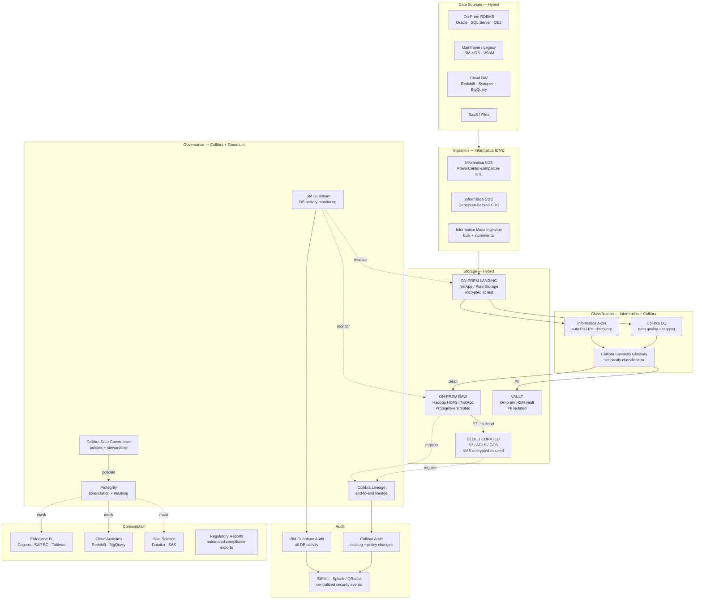
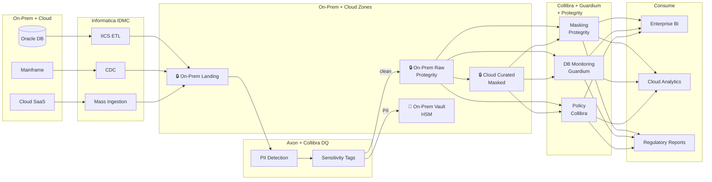
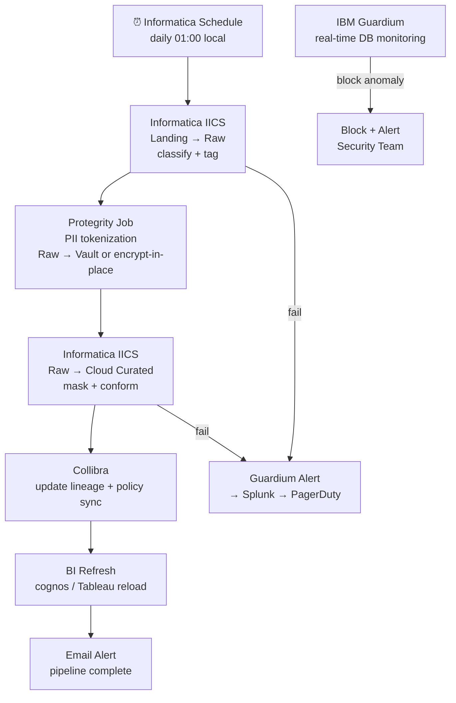

# 9.9 — Governed / Compliance-First · Hybrid Fully Managed (On-Prem + Cloud)

**Stack:** Informatica IDMC · Collibra · IBM Guardium · Protegrity · Cloud KMS
**Processing:** Batch-first · Compliance-driven
**Buy vs Build:** Buy (enterprise SaaS governance on hybrid infra)
**Compliance Targets:** GDPR · HIPAA · PCI DSS · SOX · Basel III

---

## Architecture Overview



---

## Data Flow



---

## Zone Design

```
Hybrid Zone Layout:
│
├── ON-PREM
│   ├── landing/     → NAS / SAN · Protegrity encryption · 7-day retention
│   ├── raw/         → HDFS / NetApp · Protegrity column encryption
│   └── vault/       → Dedicated HSM appliance · PII fields only
│                       IBM Guardium monitors all access
│
└── CLOUD  (S3 / ADLS / GCS)
    ├── curated/     → KMS-encrypted · PII tokenized by Protegrity
    │   └── {domain}/{entity}/year=YYYY/month=MM/
    └── archive/     → Glacier / Archive tier · compliance retention
        └── 7-year retention for SOX / Basel III
```

---

## Security Model

```
┌──────────────────────────────────────────────────────────────────┐
│  Collibra Policy + IBM Guardium + Protegrity                     │
│                                                                  │
│  Role                  Access Level   Zone          Protection   │
│  ──────────────────    ────────────   ──────────    ─────────── │
│  compliance-admin      Read+Write     All           Full         │
│  data-engineer         Read+Write     Raw+Curated   Protegrity   │
│  data-analyst          Read only      Curated       Tokenized    │
│  bi-consumer           Read only      Curated       Tokenized    │
│  auditor               Read only      Audit only    No PII       │
│  vault-access          Read only      Vault         Authorized   │
│  regulator-report      Read only      Curated       Masked       │
│                                                                  │
│  Protegrity     → format-preserving tokenization for PII/PAN   │
│  Guardium       → real-time DB activity monitoring + blocking   │
│  Collibra       → policy enforcement + stewardship workflows    │
│  On-prem HSM    → Thales/SafeNet key management appliance      │
│  Cloud KMS      → CMK for cloud curated zone                   │
│  Network        → MPLS / VPN for on-prem ↔ cloud transit      │
└──────────────────────────────────────────────────────────────────┘
```

---

## Orchestration



---

## Component Map

| Component | Tool / Service | Notes |
|-----------|---------------|-------|
| ETL / Ingestion | Informatica IDMC (IICS) | PowerCenter-compatible; 400+ connectors |
| CDC | Informatica CDC | Log-based CDC for Oracle, SQL Server, DB2 |
| Bulk Ingestion | Informatica Mass Ingestion | Mainframe + file sources |
| PII Discovery | Informatica Axon Data Marketplace | Auto-classifies sensitive data |
| Data Quality | Collibra DQ | Rule-based quality + tagging |
| Schema Catalog | Collibra Data Catalog | End-to-end lineage; stewardship |
| Business Glossary | Collibra | Sensitivity classification + policy terms |
| Access Policies | Collibra Data Governance | Policy definition + stewardship workflow |
| DB Activity Monitor | IBM Guardium | Real-time query monitoring + blocking |
| Tokenization | Protegrity Data Security Platform | FPE tokenization; column-level encryption |
| On-Prem Encryption | Protegrity + on-prem HSM (Thales) | Key management for on-prem zones |
| Cloud Encryption | AWS KMS / Azure Key Vault / Cloud KMS | CMK for cloud curated zone |
| On-Prem Storage | NetApp / HDFS | Protegrity-encrypted landing + raw |
| Cloud Storage | S3 / ADLS / GCS | KMS-encrypted curated + archive |
| BI | Cognos / SAP BusinessObjects / Tableau | Governed via Collibra policies |
| Cloud Analytics | Redshift / BigQuery / Synapse | Governed curated data |
| SIEM | Splunk / IBM QRadar | Guardium + Collibra events |
| Network | MPLS / VPN / ExpressRoute/DirectConnect | Encrypted on-prem ↔ cloud transit |

---

## Compliance Controls Matrix

| Control | Mechanism | Regulation |
|---------|-----------|------------|
| PII discovery | Informatica Axon + Collibra DQ | GDPR, HIPAA |
| Tokenization | Protegrity FPE | HIPAA, PCI DSS |
| Column encryption | Protegrity column-level | PCI DSS |
| DB activity monitoring | IBM Guardium real-time | PCI DSS, SOX, HIPAA |
| Encryption at rest | Protegrity (on-prem) + KMS (cloud) | PCI DSS, HIPAA |
| Encryption in transit | TLS + MPLS / VPN | PCI DSS |
| Audit trail | Guardium + Collibra → SIEM | SOX, HIPAA, Basel III |
| Long-term retention | Cloud archive (7+ years) | SOX, Basel III |
| Stewardship workflow | Collibra approval workflows | Internal + regulatory |
| Right to erasure | Protegrity key deletion + data purge | GDPR |

---

## Comparison vs 9.10 (Hybrid OSS)

| Dimension | 9.9 Hybrid Managed | 9.10 Hybrid OSS |
|-----------|-------------------|-----------------|
| ETL | Informatica IDMC | Spark + Airbyte |
| Catalog | Collibra SaaS | Apache Atlas + OpenMetadata |
| Tokenization | Protegrity | HashiCorp Vault Transit |
| DB Monitoring | IBM Guardium | Apache Ranger + custom audit |
| Mainframe Support | Native (Informatica) | Limited (custom adapters) |
| Ops Overhead | Low-Medium (managed SaaS) | Very High (self-hosted) |
| Cost Model | High license cost | Infra + engineering cost |
| Legacy / Mainframe | Best fit | Difficult |
