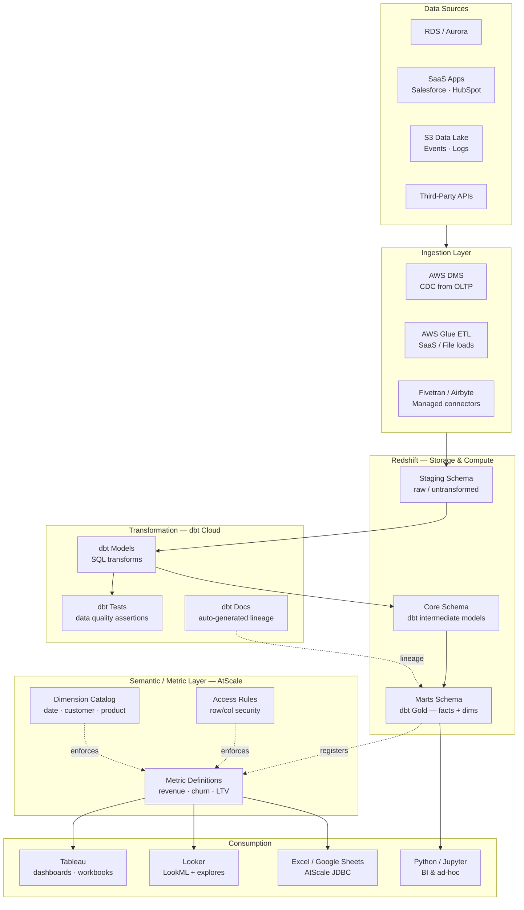
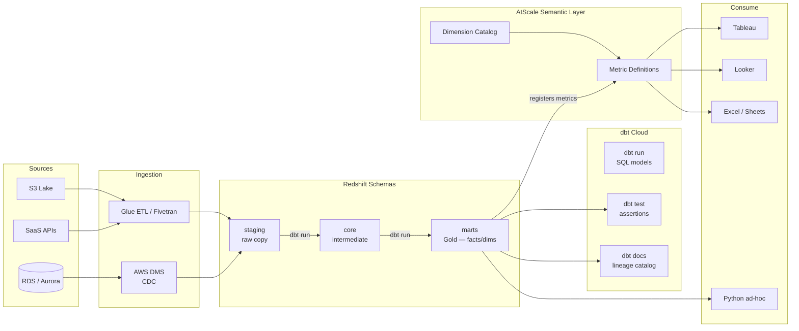
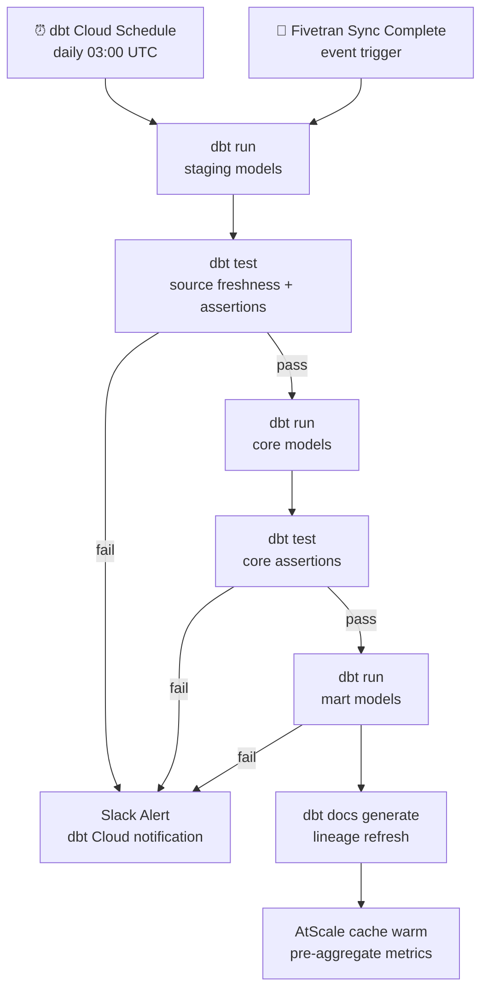

# 10.1 — Self-Serve Analytics Engineering · AWS Fully Managed

**Stack:** Redshift · dbt Cloud · AtScale · Tableau / Looker · AWS Glue Catalog
**Processing:** Batch-first · On-Demand semantic queries
**Buy vs Build:** Buy (fully managed, no infra to operate)

---

## Architecture Overview



---

## Data Flow



---

## Zone Design

```
Redshift Schemas
│
├── staging/
│   └── stg_{source}_{table}    — exact copy, renamed columns only
│
├── core/
│   └── int_{domain}_{entity}   — joins, deduplication, business logic
│
└── marts/
    ├── finance/
    │   └── fct_revenue, dim_customer, dim_date
    ├── marketing/
    │   └── fct_campaigns, dim_channel
    └── product/
        └── fct_events, dim_feature
```

---

## Security Model

```
┌──────────────────────────────────────────────────────┐
│  AtScale + Redshift RBAC                              │
│                                                       │
│  Role               Access Level    Scope             │
│  ────────────────   ────────────    ─────────────     │
│  data-engineer      Read + Write    All schemas       │
│  analytics-eng      Read + Write    core + marts      │
│  bi-developer       Read only       marts only        │
│  business-analyst   Metric API      AtScale only      │
│  exec-viewer        Metric API      filtered metrics  │
│                                                       │
│  Column masking  → PII via Redshift Dynamic Masking  │
│  Row security    → AtScale MDX filter per role        │
│  dbt exposures   → declare who consumes each model    │
└──────────────────────────────────────────────────────┘
```

---

## Orchestration



---

## Component Map

| Component | Tool / Service | Notes |
|-----------|---------------|-------|
| Data Warehouse | Amazon Redshift | RA3 nodes; storage-compute separation |
| DB Ingestion | AWS DMS | CDC from RDS/Aurora |
| SaaS Ingestion | Fivetran / AWS Glue | Fivetran for SaaS; Glue for custom |
| Transformation | dbt Cloud | Managed dbt; CI/CD, schedules, IDE |
| Data Testing | dbt tests + Great Expectations | Schema + business-rule assertions |
| Lineage & Docs | dbt Docs (auto-gen) | Column-level lineage in dbt Cloud |
| Semantic Layer | AtScale (Cube Cloud alt.) | MDX/SQL; connects Tableau + Excel + Looker |
| BI — Dashboard | Tableau Cloud | Live AtScale connection; no extracts needed |
| BI — Explore | Looker | LookML optional; or pure AtScale JDBC |
| Ad-hoc | Python / Jupyter + Redshift | Direct SQL for power users |
| Orchestration | dbt Cloud Scheduler | Job chaining + freshness checks |
| Secrets / Auth | AWS Secrets Manager | Redshift credentials for dbt + Fivetran |
| Monitoring | CloudWatch + dbt Cloud alerts | Query performance + job failures |

---

## Comparison vs 10.2 (AWS OSS)

| Dimension | 10.1 AWS Managed | 10.2 AWS OSS |
|-----------|-----------------|--------------|
| dbt runtime | dbt Cloud (hosted) | dbt Core + Airflow (self-managed) |
| Semantic layer | AtScale SaaS | Cube.js on EC2/ECS |
| BI tool | Tableau Cloud | Apache Superset |
| Infra ops | Near-zero | Moderate (Airflow + Cube.js) |
| Cost model | Subscription per seat | Compute-based; lower per-seat |
| CI/CD for dbt | dbt Cloud native | GitHub Actions + Airflow |
| Lineage UI | dbt Cloud explorer | dbt docs static site |

---

## When to Choose This Implementation

✅ AWS is primary cloud
✅ Business teams need governed self-serve without SQL knowledge
✅ Consistent metrics across Tableau, Excel, and Looker matter
✅ Small central data team; low infra ops budget
✅ dbt Cloud licensing is acceptable

❌ Need sub-second latency → Pattern 7 (Operational Analytics)
❌ Heavy ML feature engineering → Pattern 8 (AI/ML Platform)
❌ Multi-cloud portability required → use 10.7 or 10.8
