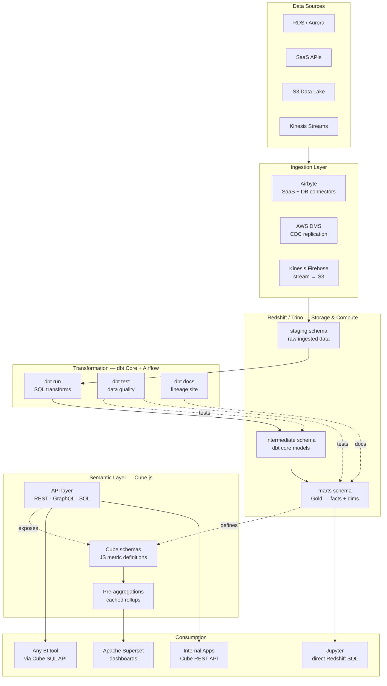
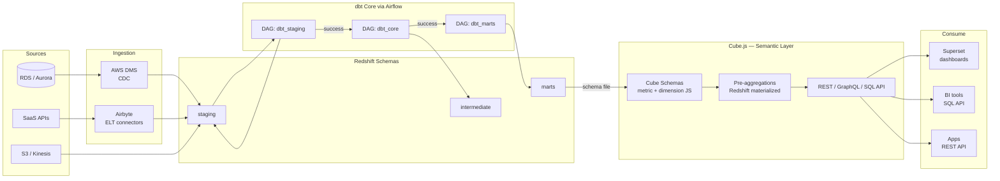
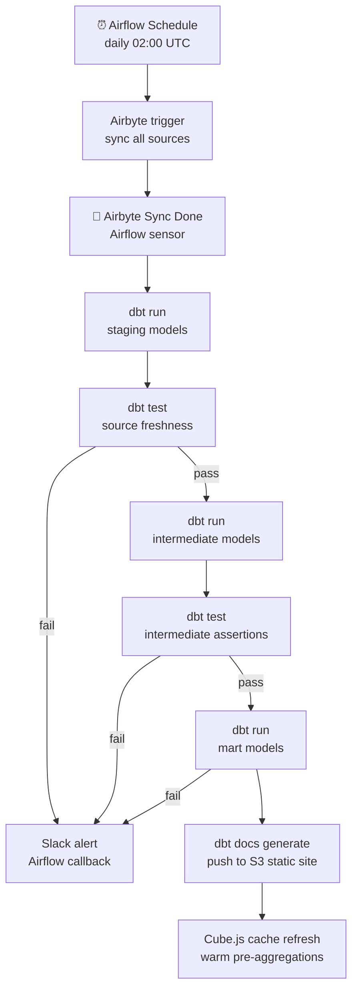

# 10.2 — Self-Serve Analytics Engineering · AWS OSS on Cloud

**Stack:** Redshift / Trino · dbt Core · Cube.js · Apache Superset · Apache Airflow
**Processing:** Batch-first · On-Demand semantic queries
**Buy vs Build:** Build (OSS on cloud infrastructure)

---

## Architecture Overview



---

## Data Flow



---

## Zone Design

```
Redshift Schemas
│
├── staging/
│   └── stg_{source}_{table}       — raw ELT copy, type casts only
│
├── intermediate/
│   └── int_{domain}_{entity}      — joins, business logic, dedupe
│
└── marts/
    ├── finance/
    │   └── fct_revenue, dim_account, dim_date
    ├── growth/
    │   └── fct_signups, dim_campaign
    └── operations/
        └── fct_orders, dim_product, dim_region
```

---

## Security Model

```
┌──────────────────────────────────────────────────────┐
│  Redshift RBAC + Cube.js Role Mapping                 │
│                                                       │
│  Role               Access Level    Scope             │
│  ────────────────   ────────────    ─────────────     │
│  data-engineer      Read + Write    All schemas       │
│  analytics-eng      Read + Write    intermediate +    │
│                                     marts             │
│  bi-developer       Read only       marts only        │
│  business-user      Cube API only   defined cubes     │
│  app-service        REST API        approved endpoints│
│                                                       │
│  Column masking   → Redshift column-level grants      │
│  Row security     → Cube.js queryRewrite filters      │
│  Secret mgmt      → AWS Secrets Manager              │
└──────────────────────────────────────────────────────┘
```

---

## Orchestration



---

## Component Map

| Component | Tool / Service | Notes |
|-----------|---------------|-------|
| Data Warehouse | Amazon Redshift | RA3 nodes; or Trino over S3 for pure ELT |
| Ingestion | Airbyte (self-hosted on ECS) | 300+ connectors; custom via CDK |
| CDC | AWS DMS | RDS/Aurora → Redshift staging |
| Transformation | dbt Core | CLI-based; version-controlled in Git |
| Orchestration | Apache Airflow (MWAA or ECS) | DAG per dbt selector |
| Data Testing | dbt tests + dbt-expectations | Schema + custom SQL assertions |
| Lineage | dbt docs (S3 static site) | Auto-generated HTML lineage graph |
| Semantic Layer | Cube.js (ECS / EC2) | Pre-aggregations; REST + GraphQL + SQL APIs |
| BI | Apache Superset | Connected to Cube SQL API endpoint |
| Ad-hoc | Jupyter + psycopg2 | Direct Redshift for power users |
| Secrets | AWS Secrets Manager | Injected into Airflow + dbt env vars |
| Monitoring | CloudWatch + Airflow alerts | DAG failure → SNS → Slack |

---

## Comparison vs 10.1 (AWS Managed)

| Dimension | 10.2 AWS OSS | 10.1 AWS Managed |
|-----------|-------------|-----------------|
| dbt runtime | dbt Core + Airflow | dbt Cloud (hosted) |
| Semantic layer | Cube.js (self-hosted) | AtScale SaaS |
| BI tool | Apache Superset | Tableau Cloud |
| Infra ops | Moderate (Airflow + Cube.js) | Near-zero |
| Cost at scale | Lower (no per-seat SaaS) | Higher (SaaS subscriptions) |
| Customization | High (code everything) | Limited to SaaS features |
| Time to first metric | Longer setup | Days with connectors |

---

## When to Choose This Implementation

✅ AWS primary cloud, want OSS flexibility
✅ Engineering team comfortable managing Airflow + Cube.js
✅ Per-seat SaaS costs are prohibitive at scale
✅ Need deep customization of semantic layer schemas
✅ Existing Airbyte investment

❌ Small team with no infra ops capacity → use 10.1 (AWS Managed)
❌ Exec mandated Tableau / Power BI → add those atop Cube SQL API
❌ Real-time requirements → Pattern 7
