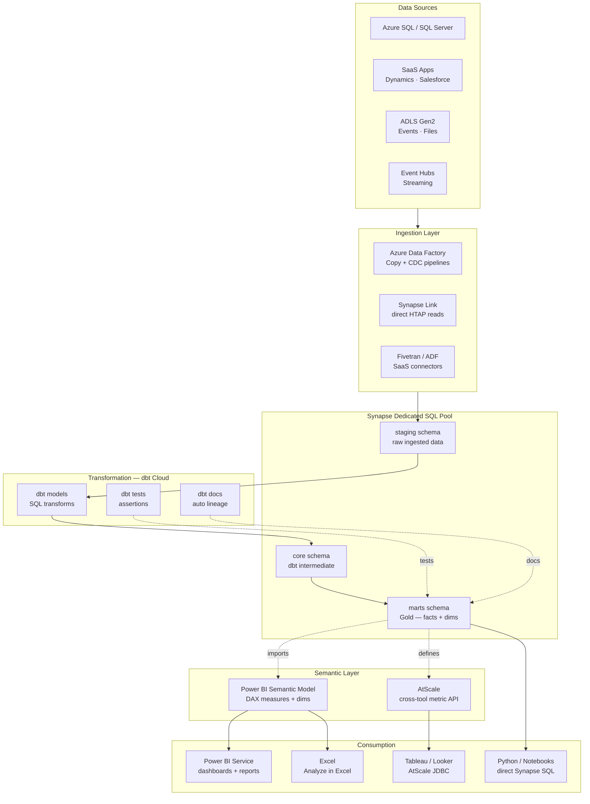
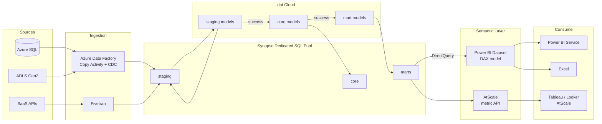
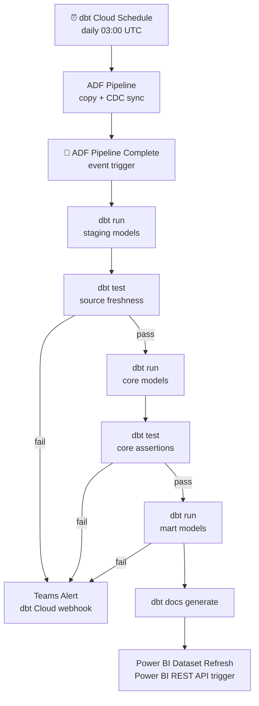

# 10.3 — Self-Serve Analytics Engineering · Azure Fully Managed

**Stack:** Azure Synapse Analytics · dbt Cloud · Power BI (Semantic Model) · AtScale
**Processing:** Batch-first · On-Demand semantic queries
**Buy vs Build:** Buy (fully managed, no infra to operate)

---

## Architecture Overview



---

## Data Flow



---

## Zone Design

```
Synapse Dedicated SQL Pool — Schemas
│
├── staging/
│   └── stg_{source}_{table}      — raw copy, column renames only
│
├── core/
│   └── int_{domain}_{entity}     — business logic, joins, dedupe
│
└── marts/
    ├── finance/
    │   └── fct_revenue, dim_cost_center, dim_date
    ├── sales/
    │   └── fct_opportunities, dim_account, dim_rep
    └── operations/
        └── fct_tickets, dim_product, dim_region
```

---

## Security Model

```
┌──────────────────────────────────────────────────────────┐
│  Synapse RBAC + Power BI Row-Level Security               │
│                                                           │
│  Role                Access Level    Scope                │
│  ─────────────────   ────────────    ──────────────────   │
│  data-engineer       Read + Write    All schemas          │
│  analytics-eng       Read + Write    core + marts         │
│  bi-developer        Read only       marts only           │
│  business-analyst    Power BI RLS    filtered dataset     │
│  exec-viewer         Power BI RLS    summary metrics only │
│                                                           │
│  Column masking    → Synapse Dynamic Data Masking         │
│  Row security      → Power BI RLS DAX filter rules        │
│  AtScale rows      → queryRewrite per role                │
│  Secrets           → Azure Key Vault                      │
└──────────────────────────────────────────────────────────┘
```

---

## Orchestration



---

## Component Map

| Component | Tool / Service | Notes |
|-----------|---------------|-------|
| Data Warehouse | Azure Synapse Dedicated SQL Pool | DWU-based scaling; pause/resume for cost |
| Ingestion — DB | Azure Data Factory | Copy Activity + CDC via Change Tracking |
| Ingestion — SaaS | Fivetran / ADF connectors | Managed connectors to 200+ SaaS sources |
| Synapse Link | Azure Synapse Link | Zero-ETL read from Cosmos DB / Dataverse |
| Transformation | dbt Cloud | Managed runtime; CI/CD + IDE |
| Data Testing | dbt tests | Schema + business-rule assertions |
| Lineage | dbt Docs + dbt Cloud Explorer | Column-level lineage |
| Semantic Layer — MS | Power BI Dataset (DAX) | Native Microsoft ecosystem |
| Semantic Layer — Multi | AtScale | For non-Power BI consumers |
| BI | Power BI Service | Embedded, mobile, paginated reports |
| Cross-tool BI | Tableau / Looker via AtScale | JDBC/SQL API connection |
| Ad-hoc | Synapse Studio SQL editor | Direct SQL for engineers |
| Secrets | Azure Key Vault | Referenced by ADF + dbt |
| Monitoring | Azure Monitor + dbt Cloud alerts | Pipeline failures → Teams |

---

## Comparison vs 10.4 (Azure OSS)

| Dimension | 10.3 Azure Managed | 10.4 Azure OSS |
|-----------|-------------------|---------------|
| dbt runtime | dbt Cloud (hosted) | dbt Core + Airflow on AKS |
| Semantic layer | Power BI Dataset + AtScale | Cube.js on AKS |
| BI | Power BI Service | Apache Superset |
| Microsoft integration | Native (Entra ID, Teams) | Partial |
| Infra ops | Near-zero | Moderate |
| Per-seat cost | Power BI Pro licensing | Lower OSS cost |
| Governance | Purview integration native | Manual tagging |

---

## When to Choose This Implementation

✅ Azure is primary cloud
✅ Microsoft 365 / Teams / Excel deeply embedded in org
✅ Power BI already licensed enterprise-wide
✅ Central data team < 5 engineers; low ops budget
✅ Dynamics 365 / Dataverse as key source (Synapse Link)

❌ Non-Microsoft BI tools mandated → use AtScale or Cube.js
❌ Cross-cloud portability needed → use 10.7 (Snowflake)
❌ Real-time operational analytics → Pattern 7
