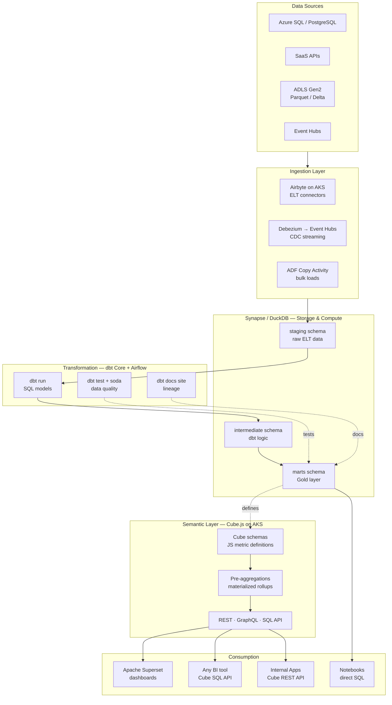
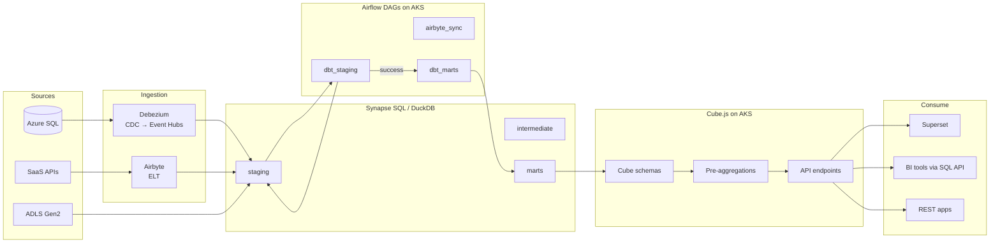
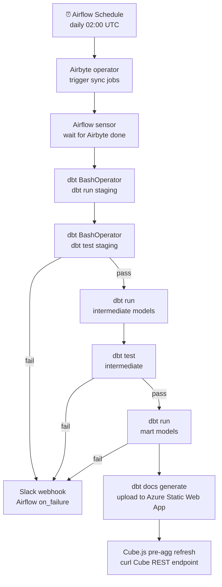

# 10.4 — Self-Serve Analytics Engineering · Azure OSS on Cloud

**Stack:** Synapse Analytics / DuckDB · dbt Core · Cube.js · Apache Superset · Apache Airflow
**Processing:** Batch-first · On-Demand semantic queries
**Buy vs Build:** Build (OSS on Azure infrastructure)

---

## Architecture Overview



---

## Data Flow



---

## Zone Design

```
Synapse Dedicated SQL Pool / DuckDB on ADLS
│
├── staging/
│   └── stg_{source}_{table}      — raw ELT, minimal casts
│
├── intermediate/
│   └── int_{domain}_{entity}     — joins, deduplication, logic
│
└── marts/
    ├── finance/
    │   └── fct_gl_entries, dim_cost_center, dim_date
    ├── customer/
    │   └── fct_interactions, dim_customer, dim_segment
    └── supply_chain/
        └── fct_inventory, dim_sku, dim_warehouse
```

---

## Security Model

```
┌──────────────────────────────────────────────────────┐
│  Synapse RBAC + Cube.js Role Mapping                  │
│                                                       │
│  Role               Access Level    Scope             │
│  ────────────────   ────────────    ─────────────     │
│  data-engineer      Read + Write    All schemas       │
│  analytics-eng      Read + Write    intermediate +    │
│                                     marts             │
│  bi-developer       Read only       marts only        │
│  business-user      Cube API only   defined cubes     │
│  app-service        REST API only   approved endpoints│
│                                                       │
│  Column masking   → Synapse Dynamic Data Masking      │
│  Row filtering    → Cube.js queryRewrite per role     │
│  Secrets          → Azure Key Vault + Airflow vault   │
│  Network          → AKS private cluster + VNet        │
└──────────────────────────────────────────────────────┘
```

---

## Orchestration



---

## Component Map

| Component | Tool / Service | Notes |
|-----------|---------------|-------|
| Data Warehouse | Azure Synapse Dedicated SQL | DWU scaling; pause for cost savings |
| Local / Dev | DuckDB on ADLS Gen2 | Fast local SQL on Parquet for dev/test |
| Ingestion | Airbyte on AKS | 300+ connectors; Helm chart deployment |
| CDC | Debezium → Azure Event Hubs | Kafka-compatible API on Event Hubs |
| Transformation | dbt Core (CLI) | Git-versioned; run via Airflow BashOperator |
| Orchestration | Apache Airflow on AKS | KubernetesExecutor; Helm chart |
| Data Testing | dbt tests + Soda Core | Schema + SQL check assertions |
| Lineage | dbt docs (Azure Static Web App) | Auto-generated HTML served from blob |
| Semantic Layer | Cube.js on AKS | Pre-aggregations; REST + GraphQL + SQL API |
| BI | Apache Superset (AKS) | Connected via Cube SQL API |
| Secrets | Azure Key Vault + Airflow KV backend | All credentials referenced by name |
| Monitoring | Azure Monitor + Airflow callbacks | DAG failures → Slack via webhook |

---

## Comparison vs 10.3 (Azure Managed)

| Dimension | 10.4 Azure OSS | 10.3 Azure Managed |
|-----------|---------------|-------------------|
| dbt runtime | dbt Core + Airflow | dbt Cloud |
| Semantic layer | Cube.js on AKS | Power BI Dataset + AtScale |
| BI | Superset | Power BI Service |
| Microsoft integration | Partial | Native |
| Infra ops | Moderate (AKS workloads) | Near-zero |
| Cost at scale | Lower (no per-seat) | Higher (Power BI Pro × users) |
| Governance tooling | Manual / OpenMetadata | Purview native |

---

## When to Choose This Implementation

✅ Azure primary cloud but want OS flexibility
✅ Engineering team runs AKS workloads already
✅ Power BI licensing cost is prohibitive
✅ Need custom Cube.js schemas + API integrations
✅ Airbyte already deployed for other patterns

❌ Microsoft 365 / Excel self-serve is the primary use case → 10.3
❌ No AKS ops capacity → use 10.3 (managed)
❌ Real-time analytics → Pattern 7
