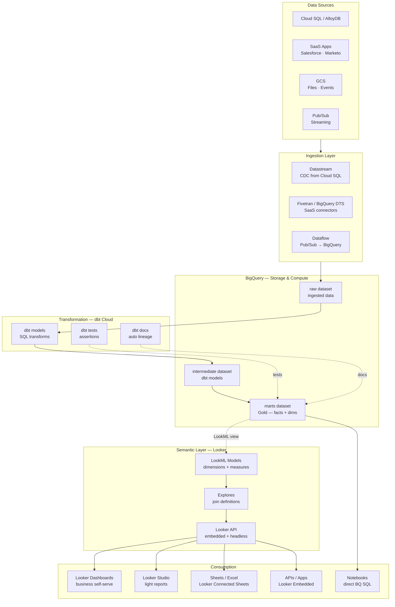
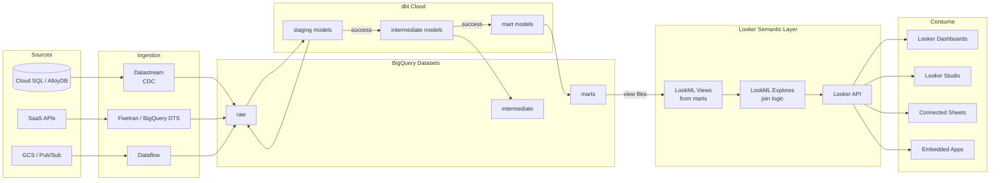
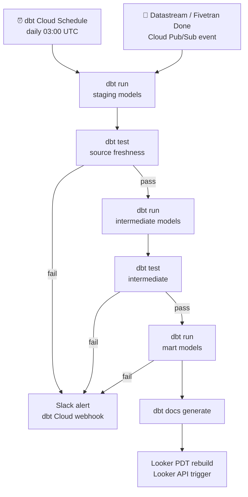

# 10.5 — Self-Serve Analytics Engineering · GCP Fully Managed

**Stack:** BigQuery · dbt Cloud · Looker (LookML semantic layer) · Looker Studio
**Processing:** Batch-first · On-Demand semantic queries
**Buy vs Build:** Buy (fully managed, no infra to operate)

---

## Architecture Overview



---

## Data Flow



---

## Zone Design

```
BigQuery Datasets (per project or dataset isolation)
│
├── raw/
│   └── {source}_{table}           — raw ingested, no transforms
│
├── intermediate/
│   └── int_{domain}_{entity}      — joins, business logic, dedupe
│
└── marts/
    ├── finance/
    │   └── fct_revenue, dim_account, dim_date
    ├── marketing/
    │   └── fct_campaigns, dim_channel, dim_audience
    └── product/
        └── fct_events, dim_feature, dim_user
```

---

## Security Model

```
┌──────────────────────────────────────────────────────────┐
│  BigQuery IAM + Looker Access Controls                    │
│                                                           │
│  Role                Access Level    Scope                │
│  ─────────────────   ────────────    ──────────────────   │
│  data-engineer       Read + Write    All datasets         │
│  analytics-eng       Read + Write    intermediate + marts │
│  bi-developer        Read only       marts only           │
│  business-analyst    Looker access   defined explores     │
│  exec-viewer         Looker access   curated dashboards   │
│                                                           │
│  Column masking    → BigQuery column-level security       │
│  Row filtering     → Looker access_filter in LookML       │
│  Data policies     → BigQuery data policies (tag-based)   │
│  Secrets           → Secret Manager                       │
└──────────────────────────────────────────────────────────┘
```

---

## Orchestration



---

## Component Map

| Component | Tool / Service | Notes |
|-----------|---------------|-------|
| Data Warehouse | BigQuery | Serverless; slot reservations for predictable cost |
| CDC | Datastream | Cloud SQL / AlloyDB → BigQuery direct |
| SaaS Ingestion | Fivetran / BigQuery DTS | DTS for Google products; Fivetran for others |
| Stream Ingestion | Dataflow (Apache Beam) | Pub/Sub → BigQuery streaming insert |
| Transformation | dbt Cloud | BigQuery adapter; partitioned model support |
| Data Testing | dbt tests + re_data | Schema + anomaly detection |
| Lineage | dbt Docs + dbt Cloud Explorer | Column-level lineage |
| Semantic Layer | Looker (LookML) | Native BigQuery integration; PDTs; explores |
| BI — Self-Serve | Looker Dashboards | Business user self-service |
| BI — Light | Looker Studio | Free; embeds in Google Workspace |
| BI — Spreadsheets | Connected Sheets | Google Sheets ↔ BigQuery / Looker |
| Embedded | Looker Embedded API | Customer-facing analytics |
| Orchestration | dbt Cloud Scheduler | Job chaining; dependency graph |
| Secrets | GCP Secret Manager | Referenced by dbt + Datastream |
| Monitoring | Cloud Monitoring + dbt Cloud alerts | Query costs + job failures |

---

## Comparison vs 10.6 (GCP OSS)

| Dimension | 10.5 GCP Managed | 10.6 GCP OSS |
|-----------|-----------------|-------------|
| dbt runtime | dbt Cloud | dbt Core + Airflow on GKE |
| Semantic layer | Looker LookML | Cube.js on GKE |
| BI | Looker + Looker Studio | Apache Superset |
| Google Workspace integration | Native (Sheets, Slides) | None |
| Infra ops | Near-zero | Moderate (GKE) |
| Cost at scale | Looker licensing | Compute-based |
| Embedded analytics | Looker Embedded API | Superset embedded |

---

## When to Choose This Implementation

✅ GCP is primary cloud
✅ Google Workspace (Sheets, Slides, Docs) deeply embedded in org
✅ BigQuery already the central warehouse
✅ Looker licensing is acceptable
✅ Want zero infra ops for transformation + BI

❌ Non-Google BI tools mandated → add AtScale or Cube.js layer
❌ Cross-cloud portability required → use 10.7 (Snowflake)
❌ Real-time operational analytics → Pattern 7
