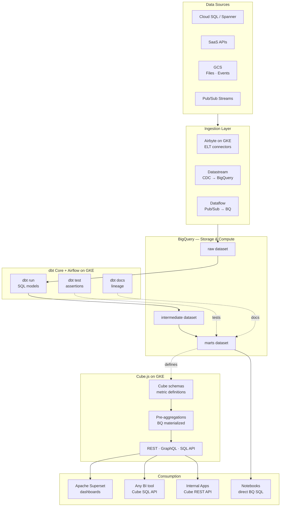
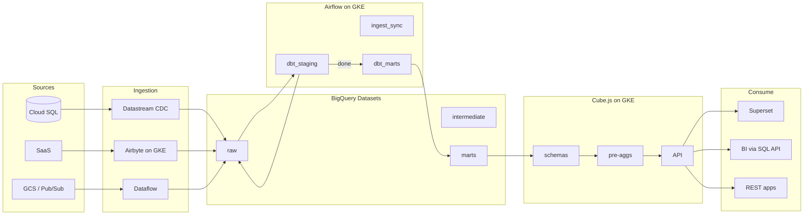
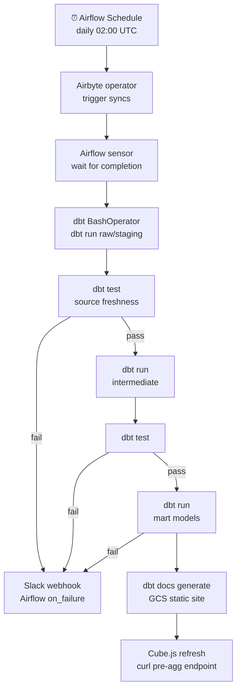

# 10.6 — Self-Serve Analytics Engineering · GCP OSS on Cloud

**Stack:** BigQuery · dbt Core · Cube.js · Apache Superset · Apache Airflow
**Processing:** Batch-first · On-Demand semantic queries
**Buy vs Build:** Build (OSS on GCP infrastructure)

---

## Architecture Overview



---

## Data Flow



---

## Zone Design

```
BigQuery Datasets
│
├── raw/
│   └── {source}_{table}           — raw ELT copy
│
├── intermediate/
│   └── int_{domain}_{entity}      — joins, business logic
│
└── marts/
    ├── finance/
    │   └── fct_revenue, dim_gl_account, dim_date
    ├── growth/
    │   └── fct_signups, dim_campaign, dim_channel
    └── product/
        └── fct_events, dim_user, dim_feature
```

---

## Security Model

```
┌──────────────────────────────────────────────────────┐
│  BigQuery IAM + Cube.js Role Mapping                  │
│                                                       │
│  Role               Access Level    Scope             │
│  ────────────────   ────────────    ─────────────     │
│  data-engineer      Read + Write    All datasets      │
│  analytics-eng      Read + Write    intermediate +    │
│                                     marts             │
│  bi-developer       Read only       marts only        │
│  business-user      Cube API only   defined cubes     │
│  app-service        REST API only   approved endpoints│
│                                                       │
│  Column security  → BQ column-level IAM               │
│  Row filtering    → Cube.js queryRewrite              │
│  Secrets          → GCP Secret Manager + Airflow KV   │
│  Network          → GKE private cluster + VPC         │
└──────────────────────────────────────────────────────┘
```

---

## Orchestration



---

## Component Map

| Component | Tool / Service | Notes |
|-----------|---------------|-------|
| Data Warehouse | BigQuery | Serverless; on-demand or slots |
| CDC | Datastream | Cloud SQL → BigQuery direct |
| SaaS / File Ingestion | Airbyte on GKE | Helm chart; 300+ connectors |
| Stream Ingestion | Dataflow (Apache Beam) | Pub/Sub → BigQuery |
| Transformation | dbt Core | CLI; run via Airflow BashOperator |
| Orchestration | Apache Airflow on GKE | KubernetesExecutor; Helm chart |
| Data Testing | dbt tests + Elementary | Schema + anomaly detection |
| Lineage | dbt docs (GCS static site) | Cloud CDN fronted |
| Semantic Layer | Cube.js on GKE | Pre-aggregations in BQ; REST + SQL API |
| BI | Apache Superset on GKE | Connected to Cube SQL API |
| Ad-hoc | Vertex AI Workbench / Colab | Direct BQ SQL + BigQuery storage API |
| Secrets | GCP Secret Manager | Airflow KV backend |
| Monitoring | Cloud Monitoring + PagerDuty | DAG failures + BQ slot utilization |

---

## Comparison vs 10.5 (GCP Managed)

| Dimension | 10.6 GCP OSS | 10.5 GCP Managed |
|-----------|-------------|-----------------|
| dbt runtime | dbt Core + Airflow | dbt Cloud |
| Semantic layer | Cube.js on GKE | Looker LookML |
| BI | Superset | Looker + Looker Studio |
| Google Workspace integration | None native | Native (Sheets, Slides) |
| Infra ops | Moderate (GKE + Airflow) | Near-zero |
| Cost at scale | Lower (no Looker licensing) | Looker per-seat |
| Customization | High | LookML constraints |

---

## When to Choose This Implementation

✅ GCP primary cloud, want full OSS flexibility
✅ Engineering team already runs GKE workloads
✅ Looker licensing cost is prohibitive
✅ Need custom Cube.js API integrations for product analytics
✅ Airbyte used across other patterns in the estate

❌ Google Workspace self-serve is the primary use case → 10.5
❌ No GKE ops capacity → use 10.5 (managed)
❌ Real-time analytics → Pattern 7
