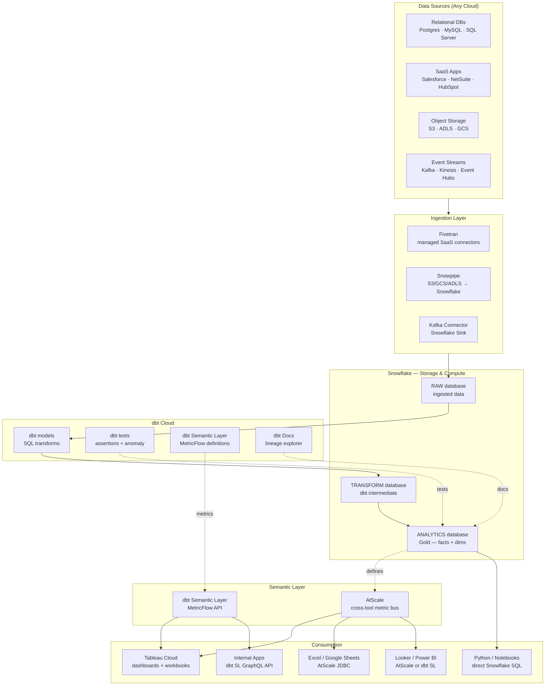
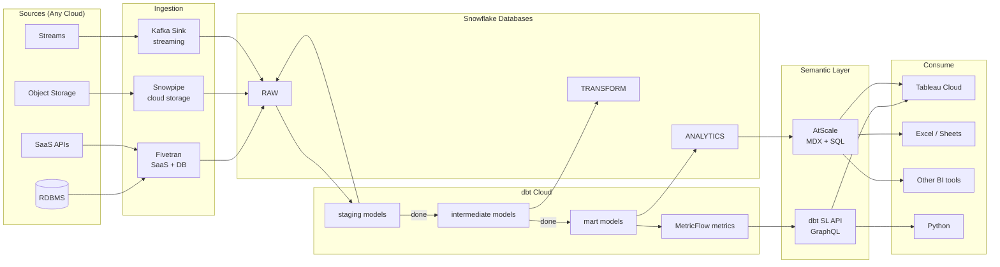
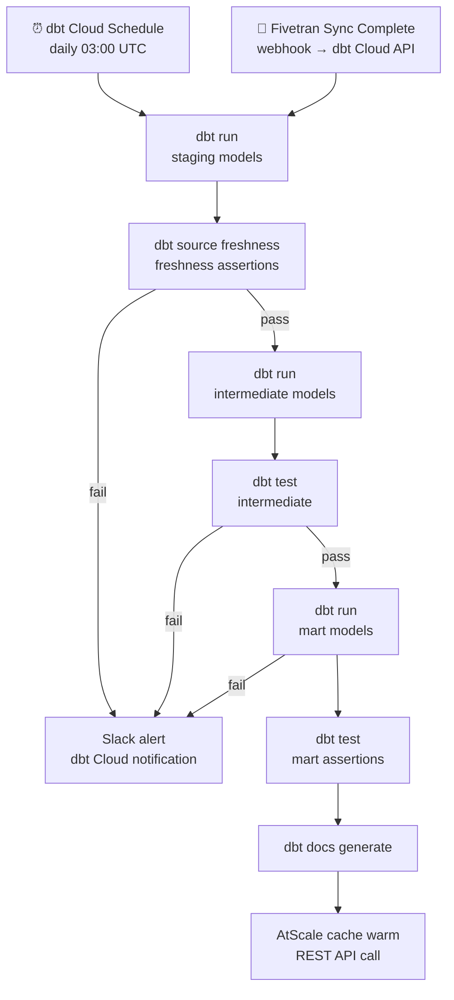

# 10.7 — Self-Serve Analytics Engineering · Multi-Cloud Fully Managed

**Stack:** Snowflake · dbt Cloud · Tableau · AtScale / dbt Semantic Layer
**Processing:** Batch-first · On-Demand semantic queries
**Buy vs Build:** Buy (fully managed SaaS stack, cloud-portable)

---

## Architecture Overview



---

## Data Flow



---

## Zone Design

```
Snowflake Databases
│
├── RAW
│   └── {SOURCE_SCHEMA}.{TABLE}     — exact Fivetran / Snowpipe copy
│
├── TRANSFORM
│   └── {DOMAIN}_INTERMEDIATE
│       └── INT_{ENTITY}            — joins, business logic
│
└── ANALYTICS
    ├── FINANCE
    │   └── FCT_REVENUE, DIM_ACCOUNT, DIM_DATE
    ├── MARKETING
    │   └── FCT_CAMPAIGNS, DIM_CHANNEL, DIM_AUDIENCE
    └── PRODUCT
        └── FCT_EVENTS, DIM_USER, DIM_FEATURE
```

---

## Security Model

```
┌──────────────────────────────────────────────────────────┐
│  Snowflake RBAC + dbt SL / AtScale Role Mapping           │
│                                                           │
│  Role                Access Level    Scope                │
│  ─────────────────   ────────────    ──────────────────   │
│  DATA_ENGINEER       Read + Write    All databases        │
│  ANALYTICS_ENG       Read + Write    TRANSFORM + ANALYTICS│
│  BI_DEVELOPER        Read only       ANALYTICS only       │
│  BUSINESS_ANALYST    Metric API      dbt SL / AtScale     │
│  EXEC_VIEWER         Metric API      curated dashboards   │
│                                                           │
│  Column masking    → Snowflake Dynamic Data Masking       │
│  Row filtering     → Snowflake Row Access Policies        │
│  AtScale rows      → queryRewrite per role                │
│  Network policy    → IP allowlist per service             │
│  Secrets           → Snowflake Secrets + dbt Cloud env    │
└──────────────────────────────────────────────────────────┘
```

---

## Orchestration



---

## Component Map

| Component | Tool / Service | Notes |
|-----------|---------------|-------|
| Data Warehouse | Snowflake | Runs on AWS / Azure / GCP; same SQL everywhere |
| Ingestion — SaaS/DB | Fivetran | 500+ connectors; normalized schemas |
| Ingestion — Files | Snowpipe | S3/ADLS/GCS → Snowflake continuous ingest |
| Ingestion — Streams | Snowflake Kafka Connector | Kafka → Snowflake Sink |
| Transformation | dbt Cloud | Snowflake adapter; CI/CD + dbt Cloud IDE |
| Metrics Definition | dbt Semantic Layer (MetricFlow) | Metric definitions in dbt YAML |
| Data Testing | dbt tests + dbt-expectations | Schema + statistical assertions |
| Lineage | dbt Cloud Explorer | Column-level lineage; impact analysis |
| Semantic Layer — dbt | dbt Semantic Layer GraphQL API | First-class Tableau + Looker integration |
| Semantic Layer — cross | AtScale | MDX/JDBC for Excel, Tableau, other BI |
| BI | Tableau Cloud | Live Snowflake or AtScale connections |
| Ad-hoc | Python + snowflake-connector-python | Direct SQL for engineers |
| Orchestration | dbt Cloud Scheduler | Job chaining; Fivetran webhook trigger |
| Secrets | Snowflake Secrets + dbt Cloud env vars | Zero plaintext credential storage |
| Monitoring | dbt Cloud + Snowflake Query History | Query performance + job failure alerts |

---

## Comparison vs 10.8 (Multi-Cloud OSS)

| Dimension | 10.7 Multi-Cloud Managed | 10.8 Multi-Cloud OSS |
|-----------|------------------------|---------------------|
| Warehouse | Snowflake (SaaS) | DuckDB / Trino (OSS) |
| dbt runtime | dbt Cloud | dbt Core + Airflow |
| Semantic layer | dbt SL + AtScale | Cube.js |
| BI | Tableau Cloud | Apache Superset |
| Infra ops | Near-zero | Moderate to high |
| Cloud portability | Native (Snowflake runs anywhere) | Fully portable |
| Cost model | Snowflake + SaaS subscriptions | Compute + OSS ops |
| Enterprise support | Snowflake + dbt + Fivetran SLAs | Community / self-support |

---

## When to Choose This Implementation

✅ Multi-cloud or cloud-agnostic mandate
✅ Snowflake already licensed and deployed
✅ Need single analytical platform across AWS + Azure + GCP
✅ Fivetran investment already in place
✅ Tableau is the enterprise standard BI tool
✅ Central data team < 10 engineers; low ops budget

❌ Snowflake cost is prohibitive → consider 10.8 (DuckDB/Trino OSS)
❌ Only on one cloud → use cloud-native 10.1, 10.3, or 10.5
❌ Real-time analytics → Pattern 7
