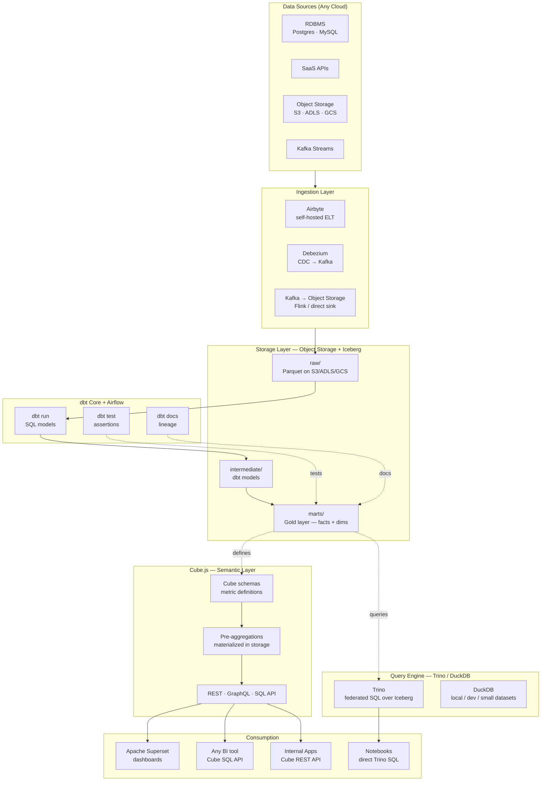
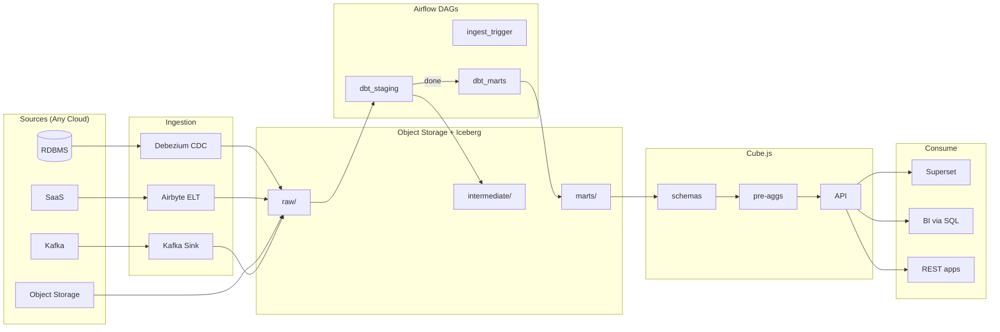
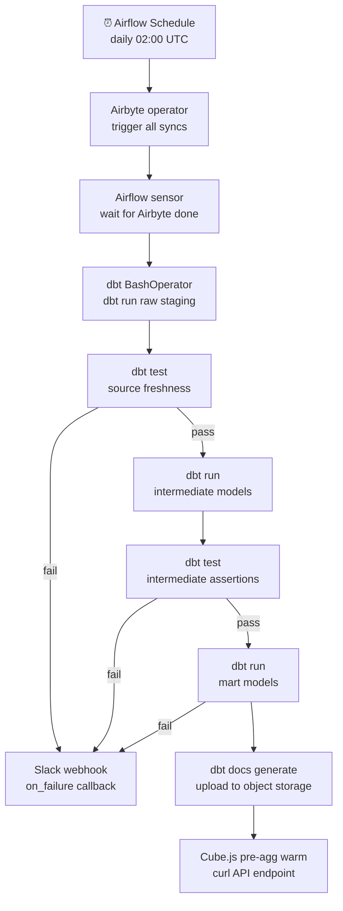

# 10.8 — Self-Serve Analytics Engineering · Multi-Cloud OSS Portable

**Stack:** DuckDB / Trino · dbt Core · Cube.js · Apache Superset · Apache Airflow
**Processing:** Batch-first · On-Demand semantic queries
**Buy vs Build:** Build (fully OSS, runs on any cloud)

---

## Architecture Overview



---

## Data Flow



---

## Zone Design

```
Object Storage (S3 / ADLS / GCS) — Iceberg Tables
│
├── raw/
│   └── {source}/{table}/           — Parquet, Iceberg format, partitioned by date
│
├── intermediate/
│   └── {domain}/{entity}/          — dbt intermediate models, Iceberg
│
└── marts/
    ├── finance/
    │   └── fct_revenue/, dim_account/, dim_date/
    ├── growth/
    │   └── fct_signups/, dim_campaign/
    └── product/
        └── fct_events/, dim_user/, dim_feature/
```

---

## Security Model

```
┌──────────────────────────────────────────────────────┐
│  Trino + Cube.js Role Mapping + Object Storage IAM    │
│                                                       │
│  Role               Access Level    Scope             │
│  ────────────────   ────────────    ─────────────     │
│  data-engineer      Read + Write    All zones         │
│  analytics-eng      Read + Write    intermediate +    │
│                                     marts             │
│  bi-developer       Read only       marts only        │
│  business-user      Cube API only   defined cubes     │
│  app-service        REST API only   approved endpoints│
│                                                       │
│  Column masking   → Trino column masking rules        │
│  Row filtering    → Cube.js queryRewrite per role     │
│  Object ACL       → S3 bucket policies / ADLS RBAC   │
│  Secrets          → HashiCorp Vault / cloud KMS       │
│  Network          → mTLS between services on K8s      │
└──────────────────────────────────────────────────────┘
```

---

## Orchestration



---

## Component Map

| Component | Tool / Service | Notes |
|-----------|---------------|-------|
| Object Storage | S3 / ADLS Gen2 / GCS | Portable; same Parquet + Iceberg everywhere |
| Table Format | Apache Iceberg | ACID, time-travel, schema evolution |
| Query Engine | Trino | Federated SQL over Iceberg; multi-catalog |
| Local / Dev Query | DuckDB | Sub-second on local Parquet; great for CI |
| Ingestion | Airbyte (Helm / Docker) | Self-hosted; 300+ connectors |
| CDC | Debezium → Kafka | Kafka topic per table; Iceberg sink connector |
| Transformation | dbt Core | Trino adapter; Iceberg materialization |
| Orchestration | Apache Airflow | KubernetesExecutor on K8s |
| Data Testing | dbt tests + Great Expectations | Schema + statistical assertions |
| Lineage | dbt docs + OpenLineage / Marquez | Emits lineage events from dbt + Airflow |
| Semantic Layer | Cube.js (Docker / K8s) | Pre-aggs in Iceberg; REST + SQL API |
| BI | Apache Superset | Connected to Cube SQL endpoint |
| Ad-hoc | Trino CLI / Jupyter | Direct SQL on Iceberg tables |
| Secrets | HashiCorp Vault | Dynamic secrets; cloud KMS integration |
| Catalog | Apache Iceberg REST Catalog / Nessie | Git-like branching with Nessie |
| Monitoring | OpenTelemetry → Grafana + Prometheus | All services instrumented |

---

## Comparison vs 10.7 (Multi-Cloud Managed)

| Dimension | 10.8 Multi-Cloud OSS | 10.7 Multi-Cloud Managed |
|-----------|---------------------|------------------------|
| Warehouse | Trino + Iceberg (OSS) | Snowflake (SaaS) |
| dbt runtime | dbt Core + Airflow | dbt Cloud |
| Semantic layer | Cube.js | dbt SL + AtScale |
| BI | Superset | Tableau Cloud |
| Cloud portability | 100% portable | Snowflake-dependent |
| Infra ops | High | Near-zero |
| Cost at scale | Lowest (no SaaS) | SaaS subscriptions |
| Vendor lock-in | None | Snowflake + dbt + Fivetran |

---

## When to Choose This Implementation

✅ Strict cloud-portability or multi-cloud mandate
✅ No SaaS vendor lock-in requirement
✅ Engineering team comfortable with K8s + distributed systems
✅ Very large scale where per-query SaaS costs are prohibitive
✅ Open source data stack as an organizational principle

❌ Small team with limited ops capacity → use 10.7 (managed)
❌ Microsoft 365 deeply embedded → 10.3 or 10.4
❌ Time-to-first-dashboard is critical → managed stacks are faster
