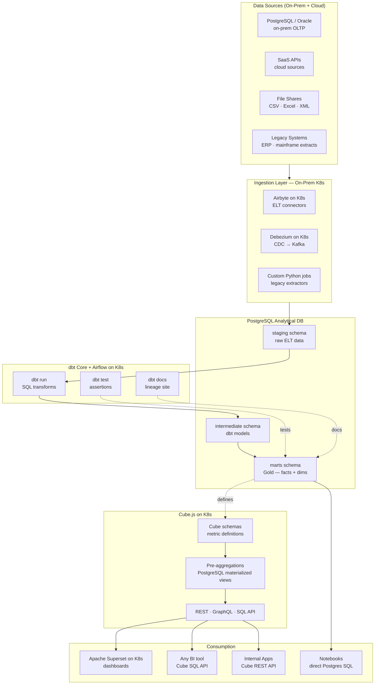
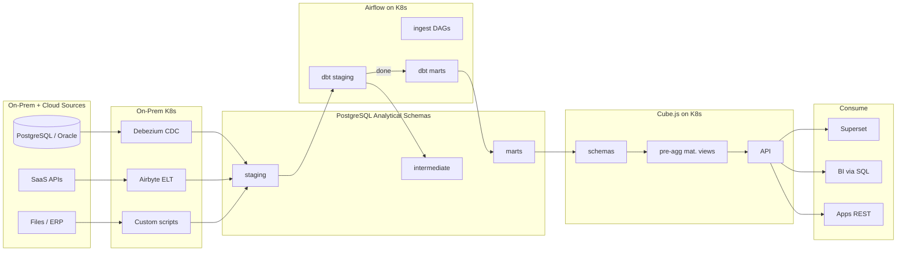
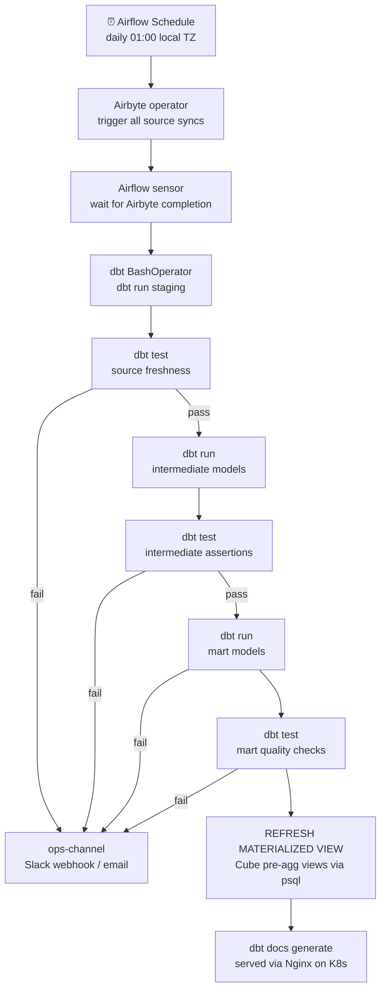

# 10.9 — Self-Serve Analytics Engineering · Hybrid OSS Self-Hosted

**Stack:** PostgreSQL · dbt Core · Cube.js · Apache Superset · Apache Airflow on Kubernetes
**Processing:** Batch-first · On-Demand semantic queries
**Buy vs Build:** Full Build (self-hosted on-prem + cloud; zero SaaS dependency)

---

## Architecture Overview



---

## Data Flow



---

## Zone Design

```
PostgreSQL Analytical Instance — Schemas
│
├── staging/
│   └── stg_{source}_{table}       — raw ELT copy, type casts only
│
├── intermediate/
│   └── int_{domain}_{entity}      — joins, business logic, dedupe
│
└── marts/
    ├── finance/
    │   └── fct_gl_lines, dim_cost_center, dim_date
    ├── hr/
    │   └── fct_headcount, dim_employee, dim_department
    └── operations/
        └── fct_work_orders, dim_asset, dim_location
```

---

## Security Model

```
┌──────────────────────────────────────────────────────┐
│  PostgreSQL Row/Col Security + Cube.js Role Mapping   │
│                                                       │
│  Role               Access Level    Scope             │
│  ────────────────   ────────────    ─────────────     │
│  data_engineer      Read + Write    All schemas       │
│  analytics_eng      Read + Write    intermediate +    │
│                                     marts             │
│  bi_developer       Read only       marts only        │
│  business_user      Cube API only   defined cubes     │
│  app_service        REST API only   approved endpoints│
│                                                       │
│  Column masking   → PostgreSQL column privileges      │
│  Row security     → PostgreSQL RLS policies           │
│  Cube rows        → queryRewrite per role             │
│  mTLS             → all K8s service-to-service        │
│  Secrets          → HashiCorp Vault on K8s            │
│  Audit logging    → pgaudit extension → SIEM          │
└──────────────────────────────────────────────────────┘
```

---

## Orchestration



---

## Component Map

| Component | Tool / Service | Notes |
|-----------|---------------|-------|
| Analytical Database | PostgreSQL 16 | Columnar extension (pg_columnstore / Citus) for larger datasets |
| CDC | Debezium on K8s | Postgres WAL → Kafka → staging schema |
| Ingestion | Airbyte (Helm on K8s) | Self-hosted; 300+ connectors |
| Legacy Extractors | Custom Python on K8s | CronJob pods for ERP / file-based sources |
| Transformation | dbt Core | PostgreSQL adapter; git-versioned |
| Orchestration | Apache Airflow (KubernetesExecutor) | Helm chart; one pod per task |
| Data Testing | dbt tests + dbt-expectations | Schema + custom SQL assertions |
| Pre-aggregations | PostgreSQL Materialized Views | Refreshed by Airflow after dbt run |
| Lineage | dbt docs + OpenLineage/Marquez | dbt + Airflow emit lineage events |
| Semantic Layer | Cube.js (Helm on K8s) | Connects to PostgreSQL; REST + SQL API |
| BI | Apache Superset (Helm on K8s) | SQLAlchemy → Cube SQL endpoint |
| Ad-hoc | psql / pgAdmin / Jupyter | Direct PostgreSQL access for engineers |
| Secrets | HashiCorp Vault on K8s | Dynamic PG credentials; Vault Agent sidecar |
| Monitoring | Prometheus + Grafana + Alertmanager | All services via Prometheus exporters |
| TLS/Auth | cert-manager + mTLS | Certificates for all service-to-service calls |

---

## Comparison vs 10.7 (Multi-Cloud Managed)

| Dimension | 10.9 Hybrid Self-Hosted | 10.7 Multi-Cloud Managed |
|-----------|------------------------|------------------------|
| Warehouse | PostgreSQL (on-prem K8s) | Snowflake (SaaS) |
| dbt runtime | dbt Core + Airflow | dbt Cloud |
| Semantic layer | Cube.js on K8s | dbt SL + AtScale |
| BI | Superset | Tableau Cloud |
| Infra ops | Highest | Near-zero |
| Cost at scale | Lowest (own hardware) | SaaS subscriptions |
| Data residency | 100% on-prem | Cloud-dependent |
| Internet connectivity | Not required | Required |
| Scale ceiling | PostgreSQL limits | Snowflake elastic |

---

## When to Choose This Implementation

✅ Air-gapped or strict data residency requirements
✅ On-prem Kubernetes already operational
✅ No internet connectivity to cloud SaaS providers
✅ Regulated industry where cloud egress is prohibited
✅ Existing PostgreSQL investment; want to maximize it

❌ Data volumes exceed PostgreSQL limits (>10TB analytical) → migrate to Trino + Iceberg (10.8)
❌ Cloud-first mandate → use 10.1, 10.3, or 10.5
❌ Small team with no K8s ops capacity → use a managed cloud offering
❌ Real-time analytics → Pattern 7
