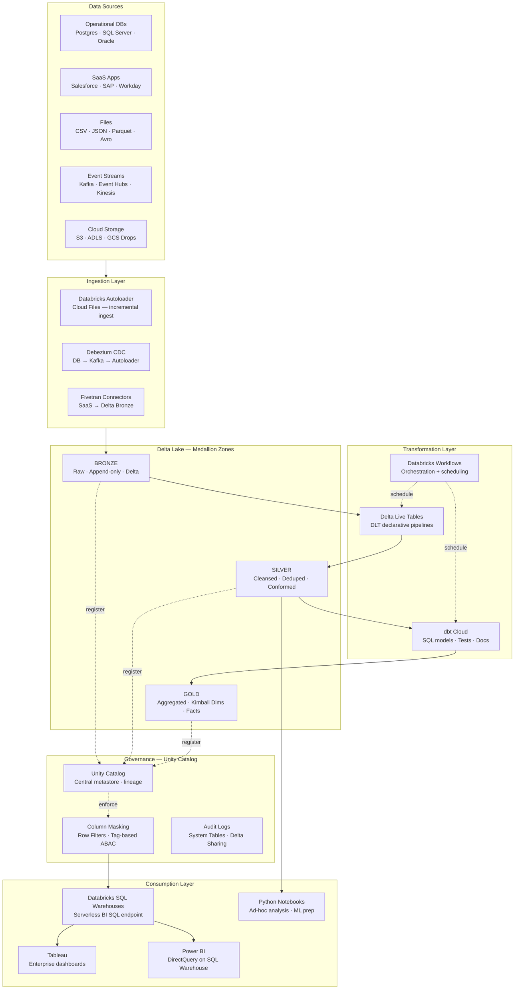
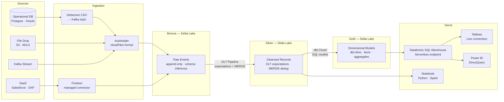

# db.1 — Databricks · Delta Lakehouse

**Stack:** Autoloader · Delta Live Tables · dbt Cloud · Databricks SQL · Tableau
**Processing:** Batch + Streaming · Medallion Architecture
**Buy vs Build:** Buy (managed Databricks) + Build (DLT pipelines, dbt models)

---

## Architecture Overview

---

## Data Flow

---

## Component Breakdown

| Layer | Tool | Role |
|-------|------|------|
| Ingestion | Databricks Autoloader | Incremental cloud-file ingestion with schema inference and evolution |
| CDC Ingestion | Debezium + Kafka | Change-data-capture from operational databases to Kafka topics |
| SaaS Ingestion | Fivetran | Managed connectors for Salesforce, SAP, and 300+ SaaS sources |
| Storage | Delta Lake | ACID table format across all medallion zones on cloud object storage |
| Bronze Transform | Delta Live Tables | Declarative streaming/batch pipeline with built-in quality expectations |
| Silver Transform | Delta Live Tables + dbt Cloud | DLT handles dedup and MERGE; dbt adds tested, documented SQL models |
| Gold Modeling | dbt Cloud | Kimball dimensional models, aggregates, and semantic layer |
| Orchestration | Databricks Workflows | DAG-based scheduling of DLT pipelines and dbt Cloud jobs |
| Governance | Unity Catalog | Unified metastore with column masking, row filters, and lineage |
| BI Endpoint | Databricks SQL Warehouses | Serverless auto-scaling SQL endpoint for Tableau and Power BI |
| Dashboards | Tableau | Enterprise self-serve analytics via live SQL Warehouse connection |
| Monitoring | Databricks System Tables | Pipeline run history, query history, and cost attribution in Delta |

---

## Key Design Decisions

- **Autoloader over COPY INTO:** Autoloader's `cloudFiles` source provides exactly-once incremental ingest with automatic schema evolution — no file tracking table needed, scales to billions of files.
- **DLT for Bronze-to-Silver, dbt for Silver-to-Gold:** Delta Live Tables owns the stateful streaming logic and data quality expectations; dbt owns the business-logic SQL models that analysts can review and test.
- **Unity Catalog as the single metastore:** All three zones are registered under one Unity Catalog, enabling cross-workspace lineage, tag-based access control, and Delta Sharing without extra tooling.
- **Serverless SQL Warehouses for BI:** Serverless warehouses cold-start in under 5 seconds and scale-to-zero, eliminating the need to pre-size clusters for Tableau or Power BI concurrency bursts.
- **dbt Cloud for transformation governance:** dbt's version-controlled SQL models, test suite, and auto-generated documentation give the analytics engineering team an auditable change process separate from Databricks notebooks.

---

## When to Choose This Implementation

- Your organisation already licenses Databricks (or is standardising on it) and wants one unified platform for ingestion, transformation, and BI serving without running separate ETL infrastructure.
- The primary consumption pattern is structured SQL analytics delivered through Tableau or Power BI, where Databricks SQL Warehouses provide a familiar JDBC/ODBC interface.
- Data volume and variety require Delta Lake's ACID guarantees — frequent updates, deletes, and CDC merges that would break plain-Parquet data lake patterns.
- You want analytics engineers to own transformation logic in dbt while data engineers own pipeline reliability in DLT, keeping both workflows in a single orchestration plane (Databricks Workflows).

---

## Trade-offs

| Strength | Limitation |
|----------|------------|
| End-to-end platform: ingest, transform, govern, and serve without leaving Databricks | Vendor lock-in — Delta Lake, DLT, and Unity Catalog are proprietary or tightly coupled to Databricks |
| Autoloader handles schema evolution automatically, reducing pipeline maintenance | Autoloader rescue-on-error behaviour must be explicitly configured to avoid silent data loss |
| Serverless SQL Warehouses deliver sub-second BI query performance at variable cost | Serverless compute is region-limited and not yet available in all Databricks cloud/region combinations |
| Unity Catalog provides column-level lineage and tag-based ABAC out of the box | Unity Catalog requires Databricks Runtime 11.3+ and a workspace-level migration from Hive metastore |
| dbt Cloud integration gives analysts a familiar, testable transformation workflow | Running dbt Cloud alongside DLT adds a second orchestration dependency and potential job-scheduling conflicts |
