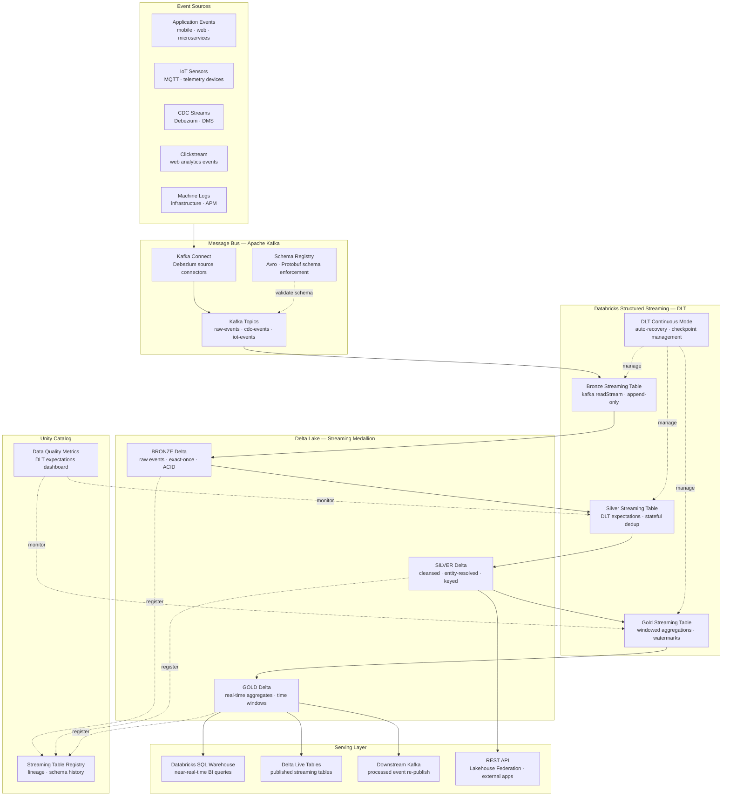
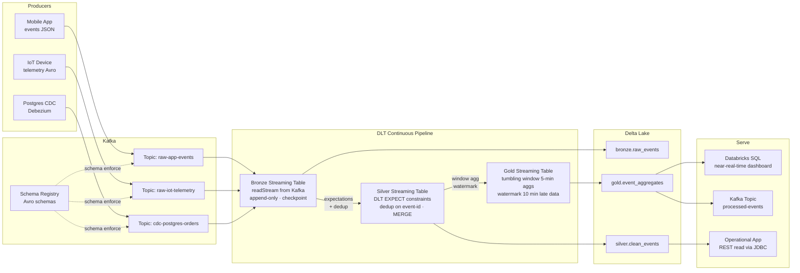

# db.2 — Databricks · Streaming and Real-Time

**Stack:** Kafka · Databricks Structured Streaming · Delta Live Tables · Delta Lake
**Processing:** Real-Time Event-Driven · Sub-Minute Latency · Continuous Pipelines
**Buy vs Build:** Buy (managed Kafka, managed Databricks) + Build (streaming DLT pipelines, custom aggregations)

---

## Architecture Overview

---

## Data Flow

---

## Component Breakdown

| Layer | Tool | Role |
|-------|------|------|
| Event Sources | Application services, IoT, Debezium | Publish events to Kafka topics via producers or CDC connectors |
| Message Bus | Apache Kafka (Confluent Cloud / MSK) | Durable, ordered, partitioned event log; decouples producers from consumers |
| Schema Enforcement | Confluent Schema Registry | Avro / Protobuf schema validation at produce time; prevents schema drift |
| Bronze Streaming | Databricks Structured Streaming + DLT | `readStream` from Kafka; exactly-once write to Delta Bronze with checkpointing |
| Silver Streaming | Delta Live Tables — streaming table | DLT EXPECT constraints; stateful dedup with MERGE on event key |
| Gold Streaming | Delta Live Tables — streaming table | Tumbling and sliding window aggregations with watermark for late data |
| Storage | Delta Lake | ACID streaming writes across all medallion zones; queryable while streaming |
| Pipeline Management | DLT Continuous Mode | Auto-restart on failure, checkpoint recovery, backpressure handling |
| Governance | Unity Catalog | Streaming table registration, schema history, and column-level lineage |
| Data Quality | DLT Expectations Dashboard | Real-time pass / quarantine / fail metrics per constraint per pipeline |
| BI Serving | Databricks SQL Warehouses | Query Gold Delta tables with second-level staleness for dashboards |
| Re-publish | Kafka Sink Connector | Write processed Gold events back to Kafka for downstream microservices |

---

## Key Design Decisions

- **DLT Continuous Mode over manual Structured Streaming jobs:** Delta Live Tables manages checkpointing, auto-recovery, and backpressure automatically — eliminating the operational overhead of hand-managed `StreamingQuery` objects and restart logic.
- **Exactly-once semantics via Delta Lake + idempotent Kafka offsets:** Structured Streaming writes Delta transaction log entries atomically with Kafka offset commits, guaranteeing exactly-once end-to-end without custom deduplication at the Kafka layer.
- **Watermarks for late-arriving data:** Gold aggregations define a watermark (typically 10–30 minutes) to correctly handle out-of-order events from mobile or IoT producers without holding unbounded state in memory.
- **Schema Registry enforcement at ingest:** Validating Avro/Protobuf schemas at produce time prevents malformed events from reaching the Bronze table, where schema corruption is expensive to remediate in streaming pipelines.
- **Separate DLT pipelines per domain:** Running independent DLT pipelines per event domain (user events, IoT, CDC) prevents a single slow or failed stream from stalling unrelated pipelines and allows independent scaling.

---

## When to Choose This Implementation

- Business requirements demand sub-minute data freshness — fraud detection, operational dashboards, IoT alerting, or real-time personalisation where batch-hourly latency is not acceptable.
- The organisation already operates Kafka as an enterprise event bus, and Databricks is the chosen compute platform — avoiding a second streaming engine (Flink, Spark Standalone) reduces operational surface area.
- Event volumes are high and irregular; Structured Streaming's auto-scaling on Databricks handles burst traffic without manual cluster resizing.
- You need streaming and batch in a single pipeline framework — DLT supports both `readStream` and batch reads in the same DAG, enabling a unified Bronze-to-Gold medallion without maintaining two separate codebases.

---

## Trade-offs

| Strength | Limitation |
|----------|------------|
| DLT Continuous Mode provides hands-off checkpoint management and auto-recovery | DLT pipelines are harder to debug than plain Structured Streaming; internal DAG execution is a black box |
| Exactly-once Delta writes eliminate duplicates without application-level dedup logic | Exactly-once requires idempotent Kafka consumers and careful offset management — misconfiguration causes silent data gaps |
| Watermark-based late-data handling keeps Gold aggregations correct without unbounded state | Watermark tuning is workload-specific; too tight loses late events, too loose inflates state memory and delays results |
| Unified medallion architecture works for both streaming and batch — one mental model for all engineers | Streaming Delta tables accumulate many small files; compaction jobs must run alongside continuous pipelines to avoid query performance degradation |
| DLT expectations provide built-in data quality monitoring with zero extra infrastructure | Failed expectation rows are quarantined in a separate table — consumers must be aware of and periodically reconcile quarantine data |
