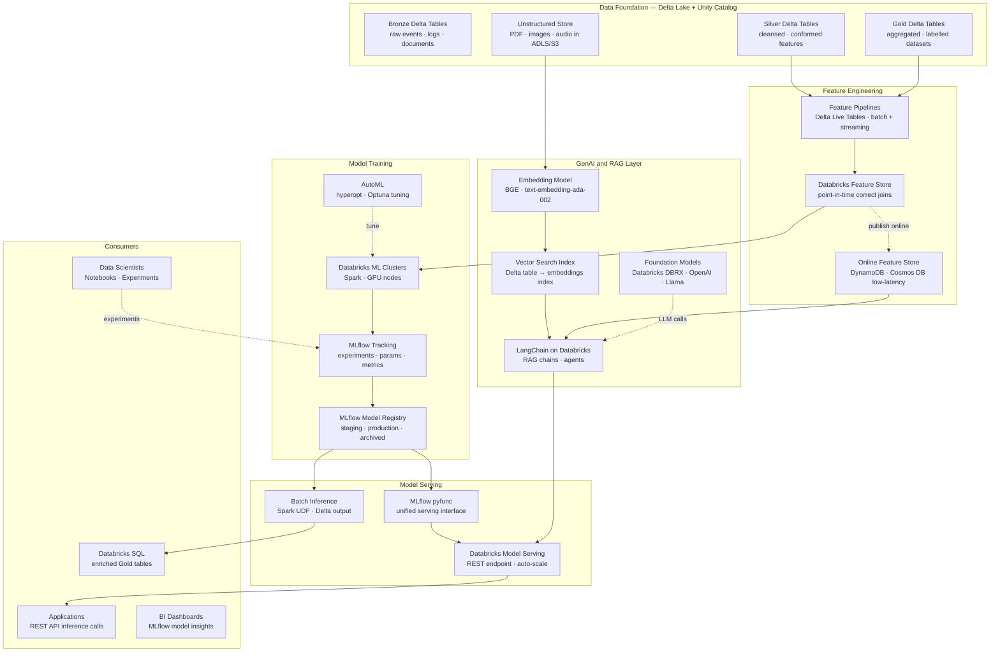
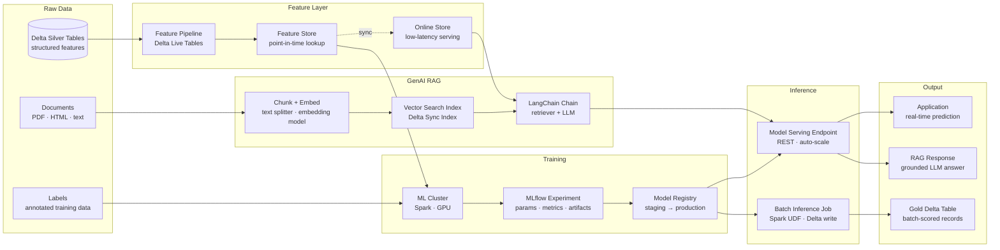

# db.3 — Databricks · AI and ML Platform

**Stack:** Databricks · MLflow · Feature Store · Vector Search · LangChain on Databricks
**Processing:** Batch Training · Real-Time Inference · RAG · GenAI Serving
**Buy vs Build:** Buy (managed Databricks ML, managed MLflow, managed Vector Search) + Build (feature pipelines, model code, LangChain chains)

---

## Architecture Overview

---

## Data Flow

---

## Component Breakdown

| Layer | Tool | Role |
|-------|------|------|
| Data Foundation | Delta Lake + Unity Catalog | Versioned, governed training datasets; point-in-time queries for reproducible feature joins |
| Feature Engineering | Databricks Feature Store | Centralised offline feature store with point-in-time correct joins; prevents training-serving skew |
| Online Features | DynamoDB / Cosmos DB (via Feature Store) | Low-latency feature lookup at inference time for real-time models |
| Model Training | Databricks ML Clusters (CPU + GPU) | Distributed Spark ML training and single-node GPU training for deep learning |
| Experiment Tracking | MLflow Tracking | Logs parameters, metrics, and artefacts for every training run; enables reproducible experiments |
| Model Registry | MLflow Model Registry | Lifecycle management — staging, production, and archived states with approval workflow |
| Hyperparameter Tuning | Databricks AutoML + Hyperopt | Automated baseline model generation and distributed hyperparameter search |
| Document Embedding | BGE / text-embedding-ada-002 | Converts document chunks to dense vectors for semantic retrieval |
| Vector Search | Databricks Vector Search | Managed ANN index synced from a Delta table; no separate vector DB to operate |
| GenAI Orchestration | LangChain on Databricks | RAG chains and agents that combine Vector Search retrieval with foundation model generation |
| Foundation Models | DBRX / OpenAI / Llama via Model Serving | Hosted or external LLMs called by LangChain chains through a unified REST interface |
| Model Serving | Databricks Model Serving | Serverless REST endpoints with auto-scaling; serves both ML models and LangChain chains |
| Batch Inference | Spark UDF + Delta write | Scores entire Delta tables in parallel; results written back as enriched Gold tables |

---

## Key Design Decisions

- **Feature Store as the single source of truth for features:** Centralising feature definitions in the Databricks Feature Store guarantees that training and serving use identical transformations — eliminating the most common source of ML production failures (training-serving skew).
- **MLflow Model Registry as the deployment gate:** All models must pass through Registry staging before production promotion, providing an auditable approval workflow that integrates with CI/CD and satisfies model governance requirements.
- **Vector Search index synced from Delta, not a separate database:** Databricks Vector Search maintains an ANN index that auto-syncs from a Delta table, eliminating a separate vector database and keeping embeddings under Unity Catalog governance and lineage.
- **LangChain chains registered as MLflow pyfunc models:** Wrapping LangChain RAG chains as `pyfunc` models allows them to be versioned in the Model Registry and served through the same Model Serving endpoint infrastructure as traditional ML models.
- **Unified serving endpoint for ML and GenAI:** A single Databricks Model Serving layer handles both regression/classification models and LLM chains, simplifying application integration and centralising latency monitoring and cost attribution.

---

## When to Choose This Implementation

- The organisation wants a single platform for both traditional ML (classification, regression, forecasting) and GenAI (RAG, agents, embeddings) rather than managing separate MLOps and LLMOps stacks.
- Training data already lives in Databricks Delta Lake, making the Feature Store and Vector Search integration low-friction — data does not need to move to an external ML platform.
- Strict model governance is required — regulated industries (finance, healthcare) benefit from MLflow's experiment tracking, model lineage, and Registry approval workflow meeting audit requirements.
- You are building RAG applications over enterprise documents and want to avoid managing a standalone vector database; Databricks Vector Search provides a governed, Delta-synced alternative.

---

## Trade-offs

| Strength | Limitation |
|----------|------------|
| Feature Store eliminates training-serving skew — the leading cause of ML model degradation in production | Feature Store requires discipline to adopt; teams must refactor existing feature code into registered feature functions |
| MLflow is open-source and portable — models can be exported and served outside Databricks if needed | MLflow UI becomes noisy at scale; experiment organisation requires naming conventions enforced by team process |
| Vector Search synced from Delta requires no separate vector DB — one fewer operational dependency | Vector Search index rebuild on large Delta tables is expensive; incremental sync requires Delta Change Data Feed to be enabled |
| Databricks Model Serving auto-scales to zero, eliminating idle inference costs | Cold-start latency (5–15 seconds) makes Model Serving unsuitable for latency-sensitive applications requiring always-warm endpoints |
| LangChain integration is native — Databricks provides a `DatabricksVectorSearch` retriever and `ChatDatabricks` LLM class | LangChain abstractions can obscure token usage and latency; production RAG chains require custom telemetry to track cost per query |
