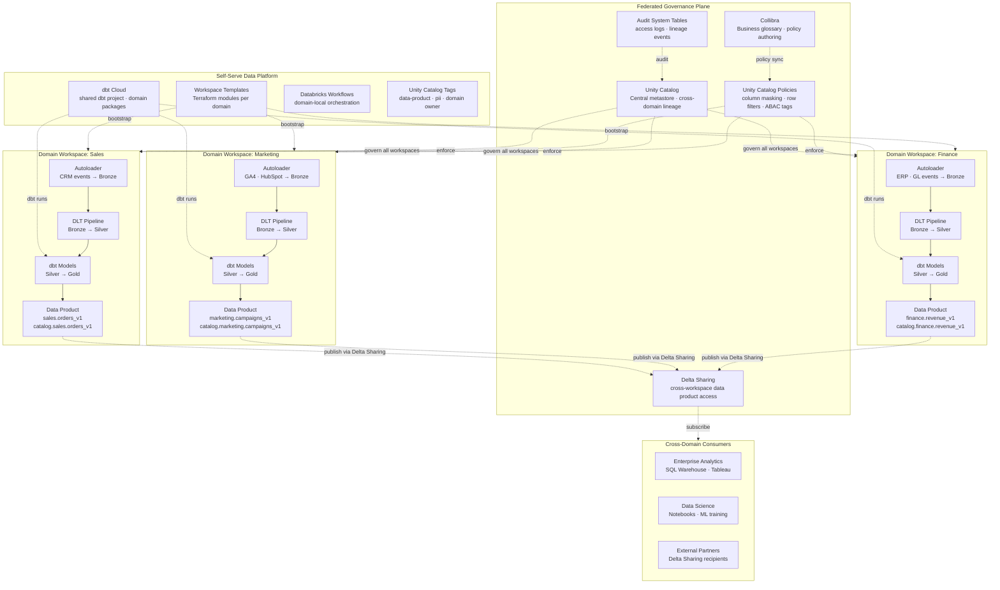
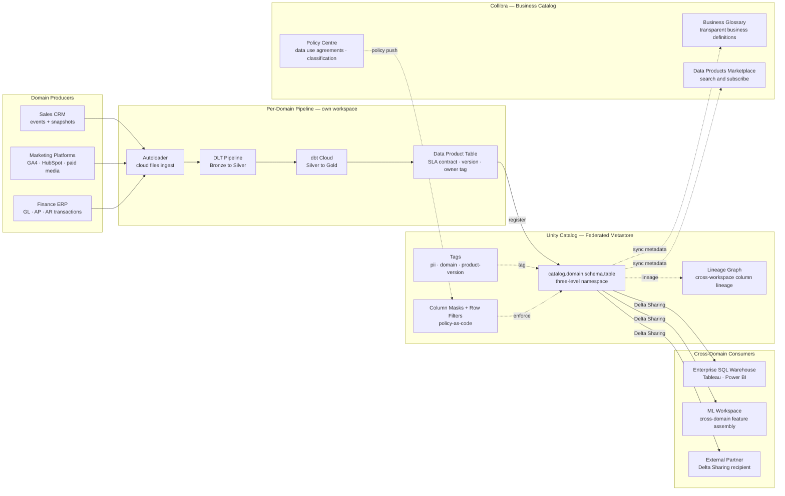

# db.4 — Databricks · Data Mesh with Unity Catalog

**Stack:** Unity Catalog · Domain Workspaces · dbt Cloud · Collibra
**Processing:** Domain-chosen (Batch / Streaming / Hybrid per domain) · Federated Governance
**Buy vs Build:** Buy (managed Databricks, Unity Catalog, Collibra) + Build (domain pipelines, dbt models, data product contracts)

---

## Architecture Overview

---

## Data Flow

---

## Component Breakdown

| Layer | Tool | Role |
|-------|------|------|
| Domain Workspaces | Databricks Workspaces (per domain) | Isolated compute, secrets, and IAM boundary per domain team — enforces domain ownership |
| Workspace Provisioning | Terraform + Workspace Templates | Self-serve domain bootstrap: workspace, Unity Catalog schema, storage credential, and default policies |
| Ingestion | Databricks Autoloader | Per-domain incremental cloud-file ingestion — domain teams own their own Autoloader jobs |
| Bronze-to-Silver | Delta Live Tables (per domain) | Domain-local DLT pipeline with quality expectations; domain team owns SLA and monitoring |
| Silver-to-Gold | dbt Cloud (shared project, domain packages) | Analytics engineering in dbt; domain packages enforce naming contracts; central CI/CD governs merges |
| Data Product Publication | Unity Catalog three-level namespace | `catalog.domain.table` naming makes domain ownership explicit and machine-readable |
| Federated Metastore | Unity Catalog (one metastore, multiple workspaces) | Single metastore attached to all domain workspaces; cross-domain lineage and access without data movement |
| Access Control | Unity Catalog column masks + row filters | Policy-as-code attached to tables; centrally authored in Collibra, pushed to Unity Catalog via API |
| Cross-Domain Sharing | Delta Sharing | Share Gold data product tables to consumers and external partners without copying data |
| Business Catalog | Collibra | Business glossary, data product marketplace, and data use policy authoring; syncs metadata from Unity Catalog |
| Orchestration | Databricks Workflows (per domain) | Domain-local DAGs; no shared orchestrator that creates cross-domain coupling |
| Lineage | Unity Catalog System Tables | Column-level lineage captured automatically across DLT, Spark, and SQL Warehouse queries |
| Audit | Unity Catalog Audit System Tables | All data access events written to Delta system tables for compliance reporting |

---

## Key Design Decisions

- **One Unity Catalog metastore, many domain workspaces:** A single metastore provides cross-domain lineage and a consistent three-level namespace (`catalog.domain.table`) while domain workspaces maintain compute and secret isolation — avoiding the anti-pattern of one workspace per domain with disconnected catalogs.
- **Data products as versioned Unity Catalog tables with SLA tags:** Data products are published as tagged Unity Catalog tables (`data-product=true`, `version=v1`, `owner=sales-team`) rather than as API endpoints — consumers query Delta directly via Delta Sharing, avoiding an extra serving layer.
- **Collibra as the business layer over Unity Catalog:** Collibra syncs table metadata from Unity Catalog via API to provide a business-friendly searchable marketplace; policies authored in Collibra's Policy Centre are pushed back as Unity Catalog column masks and row filters, keeping technical enforcement in Databricks.
- **dbt Cloud with domain packages enforces cross-domain naming contracts:** A shared dbt Cloud project with per-domain sub-packages allows each domain team to own their Gold models while a central platform team gates schema changes through pull-request CI — preventing breaking changes to cross-domain consumers.
- **Domain-local orchestration via Databricks Workflows:** Each domain owns its own Workflow DAGs rather than registering in a shared Airflow or central orchestrator — this decouples domain release cycles and prevents a single domain's pipeline failure from cascading into the shared scheduler.

---

## When to Choose This Implementation

- The organisation has 5 or more distinct data-producing domains (Sales, Finance, Marketing, Supply Chain, etc.) where centralising all pipelines into one team creates an unacceptable bottleneck and slows down domain-led analytics initiatives.
- Enterprise governance requirements are strict enough to require a business data catalog (Collibra) with formal data stewardship, data use agreements, and policy approval workflows — beyond what a purely technical catalog provides.
- Multiple Databricks workspaces already exist across business units and need to be unified under a single governance model without collapsing them into one shared workspace.
- Cross-domain analytics (executive dashboards, ML models that join Sales + Finance + Marketing features) are high-value and currently blocked by data access negotiations — Delta Sharing with Unity Catalog policies resolves cross-domain access without data copying.

---

## Trade-offs

| Strength | Limitation |
|----------|------------|
| Domain autonomy: each team owns its pipeline, SLA, and schema evolution without central team bottlenecks | Federated governance requires strong organisational discipline — domain teams must adhere to naming, tagging, and SLA conventions that are hard to enforce purely technically |
| Unity Catalog provides automatic column-level lineage across all domain workspaces at zero extra cost | Unity Catalog lineage only captures Databricks-native operations; pipelines running outside Databricks (Glue, dbt Core on Spark) produce lineage gaps |
| Delta Sharing enables secure cross-domain and external sharing without data duplication | Delta Sharing recipients receive a read-only snapshot; real-time low-latency sharing is not supported — not suitable for sub-minute freshness requirements |
| Collibra + Unity Catalog integration provides a governed business marketplace for data product discovery | Maintaining bidirectional sync between Collibra and Unity Catalog requires custom integration code or a third-party connector; metadata drift is a known operational risk |
| dbt Cloud domain packages allow domain teams to move independently while platform CI enforces breaking-change detection | Cross-domain dbt package dependency management is complex — circular references and version pinning across packages require careful governance of the dbt project structure |
