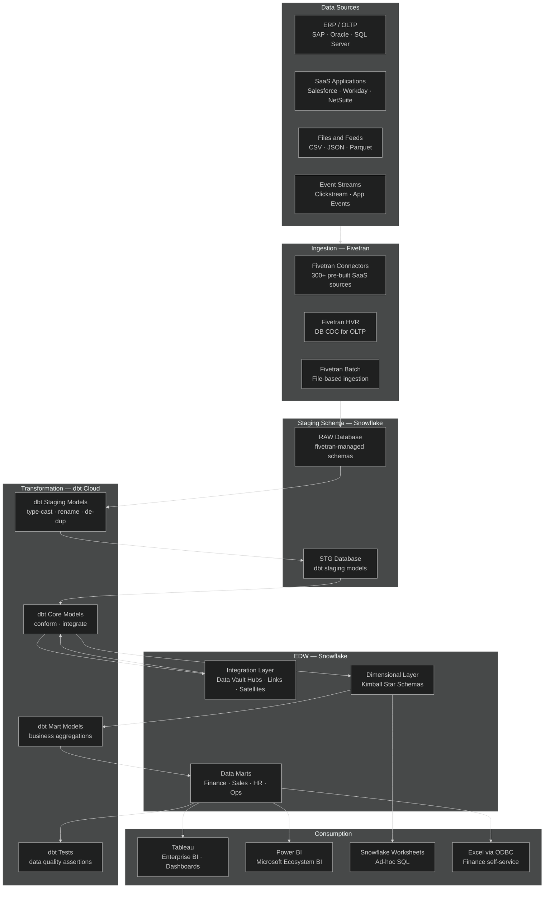
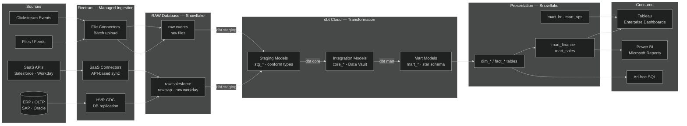

# sf.1 — Snowflake · Classic EDW & BI

**Stack:** Fivetran · Snowflake · dbt Cloud · Tableau / Power BI
**Processing:** Batch-first · Schema-on-Write
**Buy vs Build:** Buy (fully managed SaaS end-to-end)

---

## Architecture Overview

---

## Data Flow

---

## Component Breakdown

| Layer | Tool | Role |
|-------|------|------|
| Ingestion — SaaS | Fivetran | 300+ managed connectors; auto-schema migration; SLA-backed sync |
| Ingestion — DB CDC | Fivetran HVR | Log-based CDC from Oracle, SQL Server, SAP HANA |
| Cloud Data Warehouse | Snowflake | Multi-cluster warehouse; separate compute per workload; zero-copy cloning |
| Staging Layer | Snowflake RAW database | Fivetran-managed schemas; immutable raw copy before any transformation |
| Transformation | dbt Cloud | Managed dbt runs; CI/CD for models; lineage + docs auto-generated |
| Orchestration | dbt Cloud Jobs | Scheduled and event-triggered dbt job runs; Slack + email alerts |
| Data Quality | dbt Tests | Schema tests + custom SQL assertions on every mart build |
| Enterprise BI | Tableau | Live and extract connections to Snowflake; row-level security via groups |
| Microsoft BI | Power BI | DirectQuery or import mode via Snowflake connector |
| Access Control | Snowflake RBAC | Role hierarchy: SYSADMIN → functional roles → analyst roles |
| Monitoring | Snowflake Query History + dbt Cloud | Cost per query, job run history, model freshness |

---

## Key Design Decisions

- **Single copy of raw data.** Fivetran lands data into a dedicated RAW database that dbt reads but never writes to, preserving an auditable source-of-truth before any transformation touches the data.
- **Layered dbt project.** Three-tier model structure (staging → integration → mart) keeps transformation logic composable, testable, and independently deployable per domain.
- **Workload isolation via virtual warehouses.** Ingestion, dbt transformation, and BI queries each run on separate Snowflake warehouses, preventing resource contention and enabling per-workload cost tracking.
- **Schema-on-write discipline.** All tables in the dimensional and mart layers have enforced column types and dbt schema contracts, giving BI tools stable, reliable metadata.
- **dbt Cloud as the sole orchestration surface.** Keeping all transformation scheduling inside dbt Cloud eliminates a separate Airflow deployment and reduces operational complexity for teams without platform engineering resources.

---

## When to Choose This Implementation

- Your organisation is standardising on a fully managed, low-ops analytics stack and wants to minimise infrastructure ownership.
- The majority of data sources are SaaS applications (Salesforce, Workday, NetSuite) where Fivetran's pre-built connectors eliminate custom connector engineering.
- BI consumers are primarily power users working in Tableau or Power BI, requiring a stable, well-modelled dimensional layer rather than raw query access.
- The team has strong SQL and dbt skills but limited platform engineering capacity to operate schedulers, container orchestration, or self-hosted tools.

---

## Trade-offs

| Strength | Limitation |
|----------|------------|
| Fastest time-to-value — Fivetran + dbt Cloud can be production-ready in days | Highest SaaS licensing cost; Fivetran MAR-based pricing escalates with row volume |
| Zero infrastructure to manage; Fivetran and dbt Cloud handle upgrades, scaling, and reliability | Limited customisation of ingestion logic; Fivetran connectors are opinionated and not forkable |
| dbt Cloud lineage, docs, and CI/CD are first-class out of the box | dbt Cloud job scheduling is less flexible than Airflow DAGs for complex cross-system dependencies |
| Snowflake's compute-storage separation means BI queries never compete with ETL loads | Snowflake credit consumption can spike unpredictably without warehouse auto-suspend tuning |
| Strong Tableau and Power BI ecosystem with native Snowflake connectors and SSO support | Near-real-time requirements below 15-minute latency require adding Snowpipe or a separate streaming path |
