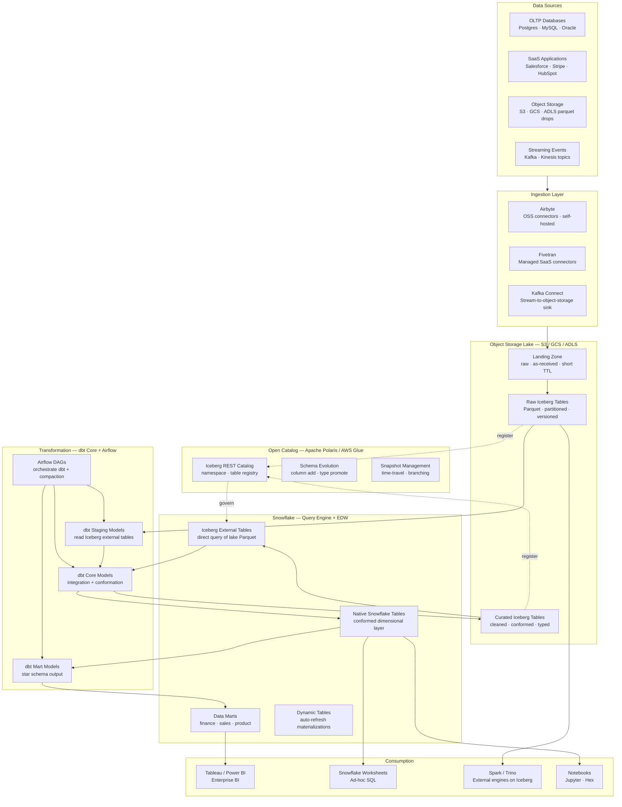
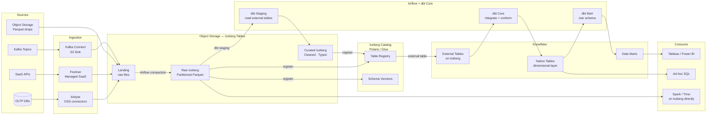

# sf.2 — Snowflake · Lakehouse with Iceberg

**Stack:** Airbyte / Fivetran · Snowflake · Apache Iceberg External Tables · dbt Core · Apache Airflow
**Processing:** Batch + micro-batch · Schema-on-Read for lake · Schema-on-Write for warehouse
**Buy vs Build:** Hybrid (managed Snowflake + self-hosted OSS orchestration)

---

## Architecture Overview

---

## Data Flow

---

## Component Breakdown

| Layer | Tool | Role |
|-------|------|------|
| Ingestion — OSS | Airbyte (self-hosted) | 300+ OSS connectors; custom connector SDK; Kubernetes-deployable |
| Ingestion — Managed | Fivetran | High-reliability SaaS connectors for critical business systems |
| Stream Ingestion | Kafka Connect S3/GCS Sink | Micro-batch event landing into object storage as Parquet |
| Object Storage | S3 / GCS / ADLS | Open lake storage; vendor-neutral; Iceberg table format on top |
| Open Table Format | Apache Iceberg | ACID transactions, schema evolution, time-travel on object storage |
| Iceberg Catalog | Apache Polaris or AWS Glue | REST Catalog API; table registry for multi-engine access |
| Query Engine | Snowflake External Tables | Query Iceberg Parquet directly without data movement or duplication |
| Native Warehouse | Snowflake Native Tables | Conformed dimensional and mart layers for BI performance |
| Transformation | dbt Core | Open-source dbt; models target both Iceberg and Snowflake native |
| Orchestration | Apache Airflow | DAGs for ingestion scheduling, dbt runs, Iceberg compaction jobs |
| BI | Tableau / Power BI | Connect to Snowflake native mart layer for governed BI |
| Alternative Engines | Apache Spark / Trino | Direct Iceberg table access for ML feature engineering or heavy transforms |

---

## Key Design Decisions

- **Iceberg as the canonical storage format.** Writing raw and curated data as Iceberg tables in object storage means any compute engine (Snowflake, Spark, Trino, Flink) can read the same data without copying or format conversion, avoiding vendor lock-in at the storage layer.
- **Two-tier query strategy.** Snowflake External Tables give analysts immediate SQL access to all Iceberg data; Native Snowflake Tables hold only the conformed dimensional layer where query performance and cost predictability matter most for BI workloads.
- **Airflow as the orchestration backbone.** Unlike the managed sf.1 stack, this pattern uses Airflow to coordinate cross-system dependencies — ingestion completion, Iceberg compaction, dbt runs, and data quality gates — giving full control over DAG logic and retry behaviour.
- **Schema evolution via Iceberg.** Airbyte and Kafka Connect land schema changes as Iceberg column additions without breaking downstream consumers, eliminating the brittle schema migration scripts common in traditional EDW pipelines.
- **Airbyte for breadth, Fivetran for reliability.** Airbyte's OSS connector library covers long-tail sources and custom APIs; Fivetran remains for tier-1 business systems (ERP, CRM) where connector reliability SLAs are non-negotiable.

---

## When to Choose This Implementation

- The organisation needs to support multiple query engines on the same data — Snowflake for BI, Spark for ML, Trino for federated analytics — and cannot afford to maintain separate copies per engine.
- Avoiding cloud vendor lock-in at the storage layer is a strategic requirement; Iceberg tables on object storage ensure portability across clouds and warehouse vendors.
- The platform team has engineering capacity to operate Airflow and Airbyte on Kubernetes and prefers OSS tooling with full customisation over fully managed SaaS.
- Data volumes or variety (semi-structured JSON, nested arrays, rapidly evolving schemas) exceed what a traditional Snowflake-only warehouse handles efficiently without high VARIANT storage costs.

---

## Trade-offs

| Strength | Limitation |
|----------|------------|
| True multi-engine access — Snowflake, Spark, Trino, and Flink all read the same Iceberg tables without data duplication | Higher operational complexity — Airflow, Airbyte, and Iceberg catalog all require platform engineering to operate and maintain |
| Vendor-neutral object storage layer prevents warehouse vendor lock-in | Iceberg External Tables in Snowflake have higher query latency than native tables; performance-critical BI still needs materialisation into native tables |
| Iceberg schema evolution and time-travel reduce data pipeline fragility significantly | Iceberg compaction and snapshot expiry must be scheduled explicitly; poorly tuned compaction leads to small-file performance degradation |
| OSS ingestion via Airbyte significantly reduces connector licensing costs at scale | Airbyte connector reliability and maintenance burden falls on the internal team rather than a vendor SLA |
| Full auditability — Iceberg snapshots provide point-in-time data reconstruction without separate backup infrastructure | Two-tier architecture (Iceberg + Snowflake native) increases data modelling complexity and requires teams to understand both layers |
