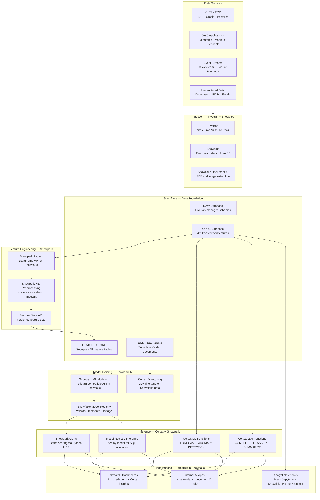
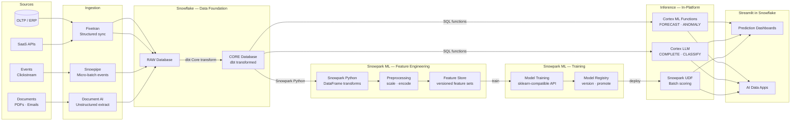

# sf.3 — Snowflake · AI / ML with Snowpark and Cortex

**Stack:** Fivetran · Snowflake · Snowpark ML · Cortex AI · Streamlit in Snowflake
**Processing:** Batch training · Real-time inference · In-platform ML
**Buy vs Build:** Buy (fully managed in-platform ML; no external ML infrastructure)

---

## Architecture Overview

---

## Data Flow

---

## Component Breakdown

| Layer | Tool | Role |
|-------|------|------|
| Ingestion — Structured | Fivetran | Managed connectors for ERP, CRM, SaaS sources into RAW database |
| Ingestion — Events | Snowpipe | Continuous micro-batch loading from S3/GCS event landing zones |
| Ingestion — Unstructured | Snowflake Document AI | Extract structured data from PDFs, images, and forms into Snowflake tables |
| Data Foundation | Snowflake + dbt | RAW → CORE transformation; conformed tables as ML input |
| Feature Engineering | Snowpark Python | Pandas-compatible DataFrame API executing natively inside Snowflake compute |
| Preprocessing | Snowpark ML Preprocessing | Scalers, encoders, and imputers that run on Snowflake warehouses |
| Feature Store | Snowpark ML Feature Store | Versioned, reusable feature sets with lineage and point-in-time lookups |
| Model Training | Snowpark ML Modeling | scikit-learn compatible estimators trained entirely inside Snowflake |
| Model Registry | Snowflake Model Registry | Version, tag, and promote models; stores metrics and signatures |
| ML Inference Functions | Cortex ML Functions | No-code FORECAST, ANOMALY DETECTION, CLASSIFICATION via SQL |
| LLM Inference | Cortex LLM Functions | COMPLETE, CLASSIFY, SUMMARIZE, TRANSLATE powered by hosted LLMs |
| Batch Scoring | Snowpark UDFs | Deploy registered models as SQL-callable Python UDFs |
| Applications | Streamlit in Snowflake | First-class Streamlit runtime inside Snowflake; no external hosting needed |

---

## Key Design Decisions

- **Zero data movement for ML.** Snowpark executes Python code inside Snowflake's compute engine directly on warehouse data, eliminating the extract-to-notebook-to-S3 pattern and the security and reproducibility problems it creates.
- **Cortex ML Functions as the default for common patterns.** FORECAST and ANOMALY DETECTION cover the majority of business ML use cases (demand forecasting, churn signals, spend anomalies) with no model training required, dramatically reducing time-to-value.
- **Snowflake Model Registry as the governance layer.** All trained models are registered with version metadata, evaluation metrics, and promotion status, creating a single auditable record of which model version is serving production predictions.
- **Streamlit in Snowflake for application delivery.** Deploying Streamlit apps directly inside Snowflake means business users access ML predictions through a governed, access-controlled application without any data leaving the platform or requiring external web infrastructure.
- **LLM access via Cortex to avoid shadow AI.** Routing document analysis, summarisation, and classification through Cortex LLM Functions keeps unstructured data inside the Snowflake security perimeter rather than sending sensitive content to external LLM APIs.

---

## When to Choose This Implementation

- The organisation wants to operationalise ML and AI on existing Snowflake data without standing up a separate MLOps platform (SageMaker, Vertex AI, Azure ML), reducing infrastructure sprawl and security surface area.
- The primary ML workloads are tabular — forecasting, classification, anomaly detection, regression — where Snowpark ML and Cortex ML Functions cover the full model lifecycle without custom deep learning infrastructure.
- Business teams need interactive AI applications (document Q&A, prediction explorers, data chatbots) built on governed enterprise data, and Streamlit in Snowflake provides a faster, more secure delivery path than external web application hosting.
- Compliance requirements make it unacceptable to exfiltrate training data to external cloud ML services; keeping all computation inside Snowflake satisfies data residency and access control requirements without additional controls.

---

## Trade-offs

| Strength | Limitation |
|----------|------------|
| No data ever leaves Snowflake — security perimeter, governance, and access control apply uniformly to ML workloads | Snowpark ML supports scikit-learn compatible algorithms only; deep learning, graph neural networks, or custom PyTorch/TensorFlow training require an external compute tier |
| Cortex ML Functions deliver production forecasting and anomaly detection with a single SQL call and no model training expertise required | Cortex LLM models are Snowflake-hosted; organisations requiring specific model versions or open-weight LLMs (Llama fine-tunes) have limited control over the underlying model |
| Snowflake Model Registry provides built-in model governance, versioning, and promotion workflows out of the box | Snowpark warehouse compute for ML training is billed in Snowflake credits, which can become expensive for large-scale iterative training jobs compared to dedicated GPU instances |
| Streamlit in Snowflake eliminates the need for external application hosting, authentication integration, and data API layers | Streamlit in Snowflake is less customisable than a standalone web application; complex UI requirements or mobile-first experiences still require external hosting |
| Feature Store with point-in-time lookups prevents training-serving skew without additional infrastructure | Snowflake is not a real-time inference server; sub-100ms online inference latency requires exporting models to an external serving layer |
