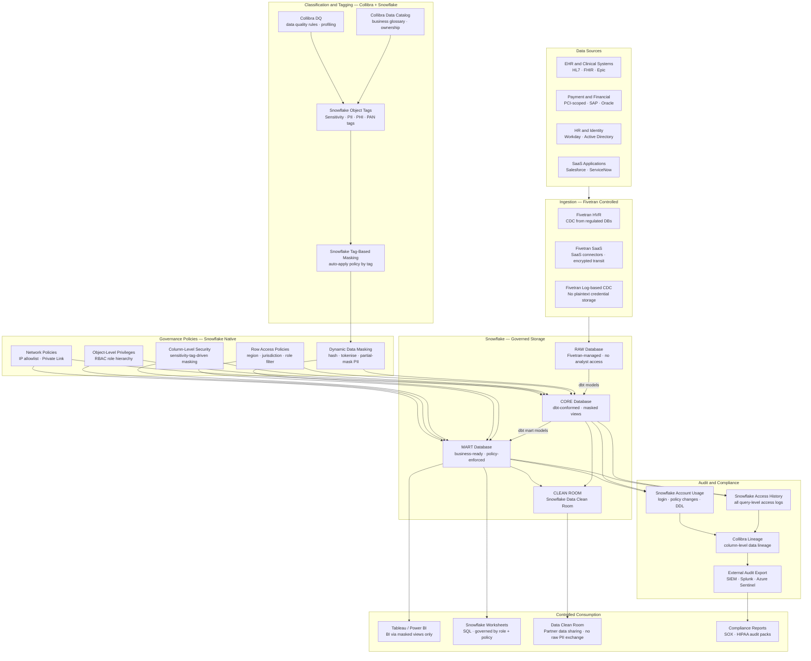
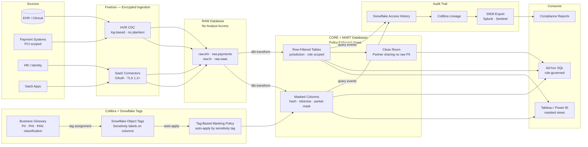

# sf.4 — Snowflake · Governed and Compliance-First

**Stack:** Fivetran · Snowflake · Dynamic Data Masking · Row Access Policies · Data Clean Room · Collibra
**Processing:** Batch-first · Compliance-driven · Policy-enforced at query time
**Buy vs Build:** Buy (fully managed Snowflake governance + Collibra SaaS)
**Compliance Targets:** HIPAA · PCI DSS · SOX · GDPR · CCPA

---

## Architecture Overview

---

## Data Flow

---

## Component Breakdown

| Layer | Tool | Role |
|-------|------|------|
| Ingestion | Fivetran HVR | Log-based CDC from EHR, ERP, and payment systems; no stored plaintext credentials; encrypted transit |
| Raw Storage | Snowflake RAW Database | Fivetran-managed landing zone; access restricted to data engineering role only; no direct analyst access |
| Data Catalog | Collibra Data Intelligence Cloud | Business glossary, data ownership, policy authoring, and compliance dashboards |
| Data Quality | Collibra DQ | Automated profiling and quality rules; quality scores surfaced in Snowflake metadata |
| Sensitivity Classification | Snowflake Object Tags | Column-level PII, PHI, PAN, and sensitivity tags propagated from Collibra via API |
| Dynamic Data Masking | Snowflake DDM Policies | Tag-driven masking at query time — hash, partial mask, tokenise — without altering stored data |
| Row Access Policies | Snowflake RAP | Filter rows by jurisdiction, region, or business unit based on the querying user's role attributes |
| Role-Based Access | Snowflake RBAC | Strict role hierarchy: SYSADMIN → domain owner → functional role → analyst; no direct grants to users |
| Network Control | Snowflake Network Policies + Private Link | IP allowlist enforcement; PrivateLink for in-VPC access from BI tools; external access blocked |
| Transformation | dbt Cloud | Staging and mart models enforce sensitivity classifications via dbt meta tags and column documentation |
| Data Clean Room | Snowflake Data Clean Room | Controlled partner data sharing and joint analysis without exposing raw PII to counterparty |
| Audit Trail | Snowflake Access History + Account Usage | Immutable query-level access logs; policy change history; exported to SIEM |
| Lineage | Collibra Lineage + dbt Artifacts | Column-level lineage from source system to dashboard field |
| SIEM Integration | Splunk / Azure Sentinel | Real-time streaming of Snowflake audit logs for SOC alerting and compliance reporting |

---

## Key Design Decisions

- **Policy enforcement at query time, not storage time.** Dynamic Data Masking and Row Access Policies apply at the moment a query executes based on the caller's role, eliminating the need to maintain multiple physical copies of data at different sensitivity levels.
- **Tag-driven policy inheritance via Collibra.** Sensitivity classifications authored in Collibra are pushed to Snowflake Object Tags via API, and Snowflake's tag-based masking automatically applies the correct masking policy to any column carrying that tag — including columns added in the future.
- **RAW database as an isolated security zone.** The Fivetran-managed RAW database is inaccessible to all analyst and BI roles; only the dbt service account can read it. This ensures no unmasked PHI or PAN data is ever directly queryable by downstream consumers.
- **Data Clean Room for partner collaboration.** Regulated industries frequently need joint analysis with partners (insurers, health systems, retailers) without raw data exchange. Snowflake Data Clean Rooms provide cryptographically enforced query restrictions on shared datasets.
- **Immutable audit export to external SIEM.** Snowflake Access History is continuously streamed to Splunk or Azure Sentinel, ensuring audit logs are tamper-evident and available even in the event of a Snowflake account incident — a requirement for SOX and HIPAA audit programmes.

---

## When to Choose This Implementation

- The organisation operates in a regulated industry — healthcare, financial services, insurance, pharmaceuticals — where HIPAA, PCI DSS, SOX, or GDPR compliance is audited externally and requires demonstrable technical controls.
- Data sharing with external partners (joint ventures, insurers, research consortia) is required but raw PII or PHI exchange is legally prohibited; Snowflake Data Clean Rooms provide the controlled collaboration layer.
- The data governance programme requires a business-facing data catalog (Collibra) with workflow-driven data ownership, policy approval, and certification processes that go beyond what native Snowflake metadata tooling provides.
- The security team requires real-time visibility into who accessed which data field, when, and from what IP — driving the need for Snowflake Access History export to a centralised SIEM platform.

---

## Trade-offs

| Strength | Limitation |
|----------|------------|
| Policy enforcement at query time via DDM and RAP means zero copies of sensitive data at different classification levels; single source of truth with contextual access | Row Access Policies and Dynamic Data Masking add query overhead; complex policy joins can materially increase query latency for large fact tables if not indexed correctly |
| Tag-based masking propagates automatically to new columns that inherit a sensitivity tag, eliminating manual policy wiring as schemas evolve | Collibra integration requires ongoing API synchronisation; tag drift between Collibra classifications and Snowflake object tags must be monitored and reconciled |
| Snowflake Data Clean Rooms enable partner analytics without raw data exchange, satisfying legal and regulatory constraints on data sharing agreements | Clean Room query restrictions are enforced by Snowflake's framework; highly bespoke joint analysis use cases may require custom clean room templates with significant development effort |
| Snowflake Access History provides query-level audit logs natively without additional tooling, covering the HIPAA audit control requirements out of the box | Access History data volume can be very large in high-query environments; SIEM ingestion costs for streaming full Access History must be budgeted explicitly |
| Collibra provides business-user-facing governance workflows (data ownership approval, certification, policy request) that Snowflake native tooling does not offer | Collibra is a significant additional SaaS investment on top of Snowflake licensing; total cost of ownership is the highest of the four Snowflake implementation patterns |
